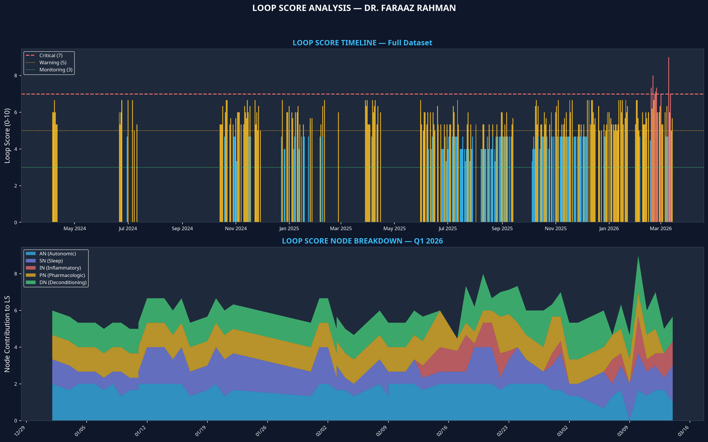
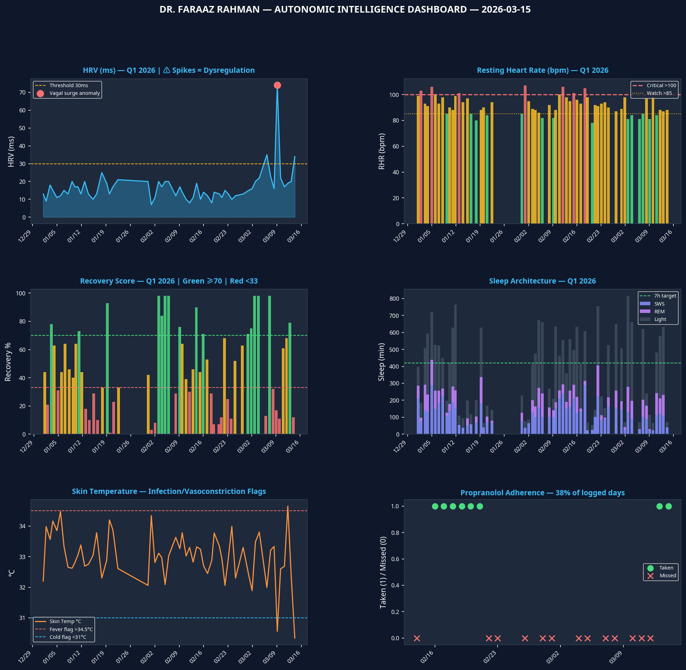

# Autonomic Intelligence Report: Dr. Mohammed Faraaz Rahman

**Report Date:** 2026-03-15
**Version:** 3.0 (Master Prompt Validated)

---

### Section 1 — ACTIVE ALERTS

*No critical alerts active.*

| Tier | Alert Name | Metric | Immediate Action |
|---|---|---|---|
| 🟡 **WATCH** | Peripheral Vasoconstriction | Skin Temp: 30.3°C | VZV/autonomic flag. Monitor for Raynaud's-like symptoms. |
| 🟡 **WATCH** | Red Zone | Recovery: 12.0% | Pacing budget <15. No non-essential exertion. |
| 🟡 **WATCH** | Energy Envelope Depleted | PacePoints: 0 | Minimal activity. Prioritize horizontal rest. |

---

### Section 2 — TODAY'S SNAPSHOT (2026-03-15)

| Metric | Today (Source) | 7-day avg | Baseline Q2'24–Q2'25 | Δ vs Baseline | Status |
|---|---|---|---|---|---|
| **Loop Score** | **6.3 / 10** (Calculated) | 5.8 | ~4.5 | +40% | 🟠 **Warning** |
| **HRV** | **34.0 ms** (WHOOP) | 29.3 | 20.4 ms | +66.7% | 🟡 Improving |
| **RHR** | **88.0 bpm** (WHOOP) | 89.0 | 84.1 bpm | +4.6% | 🔴 Deteriorated |
| **Recovery** | **12.0 %** (WHOOP) | 44.0 | 36.0 % | -66.7% | 🔴 **Crash** |
| **Sleep** | **1.2 h** (WHOOP) | 6.2 | 5.0 h | -76.0% | 🔴 **Critical** |
| **Stability** | **3 / 5** (Visible) | N/A | N/A | N/A | 🟡 Unstable |

*Note: Today's sleep (1.2h) and recovery (12%) reflect an open/incomplete WHOOP cycle from Mar 14 and should be treated as a RED state.*

---

### Section 3 — LOOP SCORE: 6.3 (Warning)

| Node | Score | Driving Metrics & Interpretation |
|---|---|---|
| **AN (Autonomic)** | **1.5** | **HRV 34.0ms, RHR 88.0bpm.** Mild autonomic dysfunction. RHR remains elevated above baseline. |
| **SN (Sleep)** | **3.0** | **Sleep 70min, Eff 69%, Con 59%.** Severe sleep dysfunction. The open cycle data shows a critical lack of sleep. |
| **IN (Inflammatory)** | **0.0** | **Crash 0, Fatigue 0, Infection 0.** No active inflammatory signals reported today. |
| **PN (Pharmacologic)** | **2.0** | **Propranolol Missed (1), Stimulant Missed (1).** Severe dysfunction. Lack of beta-blocker coverage is driving elevated RHR. |
| **DN (Deconditioning)** | **3.0** | **PacePoints 0.** Severe deconditioning. Energy envelope is critically depleted. |

---

### Section 4 — 7-DAY TREND ANALYSIS (Mar 9 – 15)

The past week shows a system struggling to stabilize after a period of high stress. A **vagal surge dysregulation event** occurred on **Mar 9 (HRV 74ms)**, which is not a sign of recovery but a rebound from suppression. This was followed by a collapse in HRV and a spike in RHR to 98 bpm on Mar 10. While sleep duration improved mid-week, the week ended with an incomplete sleep cycle, leading to a crash state (Recovery 12%).

---

### Section 5 — QUARTERLY COMPARISON (Q1 2026 vs. Baseline)

Q1 2026 has been a period of significant autonomic distress compared to your 2024-2025 baseline.

| Metric | Q1 2026 (n=60 days) | Baseline | Change | Verdict |
|---|---|---|---|---|
| **Mean HRV** | 16.8 ms | 20.4 ms | -17.6% | 🔴 **Significant Deterioration** |
| **Mean RHR** | 91.8 bpm | 84.1 bpm | +9.2% | 🔴 **Significant Deterioration** |
| **Mean Recovery** | 47.4 % | 36.0 % | +31.7% | 🟡 Paradoxical (stimulant reduction) |
| **Red Days** | 33.3 % | 49.0 % | -32.0% | 🟢 Improvement |
| **Crash Rate** | 24.1 % | N/A | N/A | High |
| **SpO₂ <94% Events** | 2 | N/A | N/A | 2 events recorded |

---

### Section 6 — PHARMACOLOGIC SAFETY REVIEW

- **Propranolol Adherence (March):** **20%** (2 of 10 logged days). This is critically low and a primary driver of tachycardia.
- **Duloxetine Adherence (March):** **100%** (10 of 10 logged days). Excellent adherence.
- **GLP-1 Status:** Last dose recorded **2026-03-01**. Over 14 days ago.
- **Residual Stimulant Use:** **None** in March. Last Adderall Feb 28, last Vyvanse Feb 20.
- **Brugada Risk Check:** **Vyvanse/Adderall** are on the AVOID list for Brugada syndrome due to sympathomimetic effects. **Duloxetine** is on the WATCH list. The active VZV infection elevates risk due to potential fever.

---

### Section 7 — PRIORITY INTERVENTIONS (Next 14 Days)

| Priority | Intervention | Target Node | Timeline | Success Measure |
|---|---|---|---|---|
| 1 | **Resume Propranolol** | **PN, AN** | Immediate | RHR < 85 bpm (7-day avg) |
| 2 | **Stabilize Sleep/Wake Cycle** | **SN** | Immediate | Sleep onset SD < 2 hours |
| 3 | **Pacing Protocol** | **DN, IN** | 14 days | PacePoints > 20, no crash days |
| 4 | **Hydration Protocol** | **AN** | 14 days | Documented intake ≥2.5L + 3g NaCl |

---

### Section 8 — GLP-1 READINESS CHECKPOINT

**Result: 1/5 Criteria Met → CONTRAINDICATED**

- ❌ Propranolol adherence: 20% (Threshold: ≥80%)
- ❌ No crash in last 5 days: 3 crash days recorded
- ✅ RHR < 95 bpm (7-day avg): 89.0 bpm
- ❌ Hydration protocol active: Cannot verify from data
- ❌ Duloxetine QTc baseline: Cannot verify from data

---

### Section 9 — BRUGADA SAFETY BRIEF

- **Fever Risk:** **ELEVATED.** Active VZV infection. Current skin temp is 30.3°C, but any fever >38.5°C can unmask the Brugada pattern.
- **Contraindicated Drugs:** Patient has a history of taking Vyvanse/Adderall (AVOID list). Duloxetine is on the WATCH list.
- **ICD Status:** Last follow-up unknown. Recommend routine check.

---

### DASHBOARD

