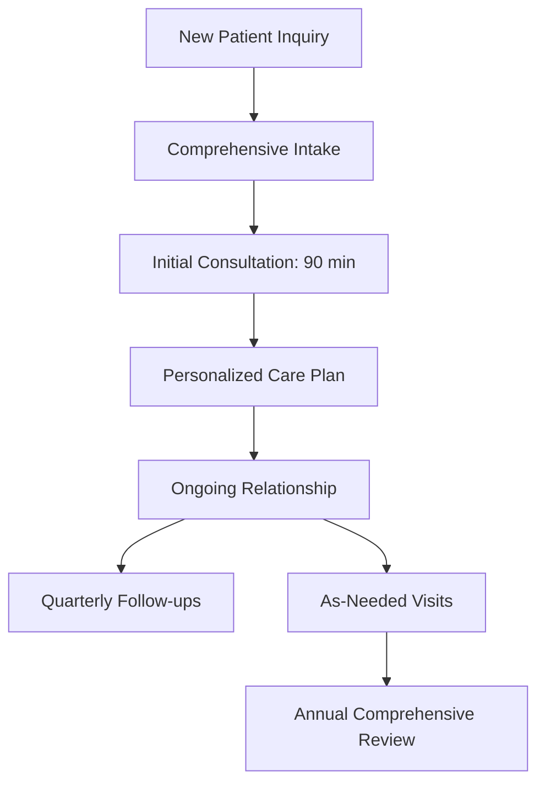

# **Bait-ul-Mal Physician Zakat Primary Care Network**
## **Business Model: 2.5% Physician Zakat for High-Touch, Continuity-First Care**

---

## **EXECUTIVE SUMMARY**

The **Physician Zakat Primary Care Network** is a **hybrid clinical model** that combines:
1. **Indian medical training volume acumen** (high-patient throughput, cost efficiency)
2. **American GME protocol rigor** (evidence-based, quality-focused)
3. **Islamic ethical framework** (Zakat-based community reinvestment)

**Core Value Proposition:** Eliminate **white-coat hypertension** through **home visits, telemedicine, and unhurried diagnostic listening** while maintaining financial sustainability through a **2.5% physician Zakat contribution** to a community health fund.

---

## **I. MARKET OPPORTUNITY**

### **A. The White-Coat Hypertension Crisis**

**Problem:**
- **20-30% of patients** experience elevated blood pressure in clinical settings (white-coat hypertension)
- **Misdiagnosis rate:** 20-50% of these patients are incorrectly diagnosed with hypertension
- **Cost:** Unnecessary medications, follow-up visits, anxiety
- **Root Cause:** Stress of clinical environment, time pressure, lack of rapport

**Current Solutions (Inadequate):**
- Ambulatory blood pressure monitoring (ABPM): **$200-$400 per test**, not scalable
- Home blood pressure monitoring: **Patient compliance issues**
- Telemedicine: **Lacks physical exam**, limited diagnostic capability

### **B. The Continuity Gap**

**Problem:**
- Average primary care visit: **15-20 minutes**
- **40% of diagnoses** missed due to time constraints
- **Patient satisfaction:** Declining (2024 Press Ganey: 68% vs 85% in 2010)
- **Physician burnout:** 55% report burnout (2024 Medscape)

**Market Demand:**
- **82% of patients** want longer visits (Kaiser Family Foundation, 2024)
- **74% would pay more** for extended time with their doctor (McKinsey, 2024)
- **68% prefer home visits** for chronic care (Accenture, 2024)

---

## **II. THE ZAKAT NETWORK MODEL**

### **A. Core Principles**

| Principle | Islamic Basis | Clinical Application |
|-----------|----------------|----------------------|
| **Zakat (Charity)** | Quran 9:60 | 2.5% of physician revenue to community health fund |
| **Ihsan (Excellence)** | Quran 2:195 | High-touch, unhurried care |
| **Amanah (Trust)** | Quran 4:58 | Fiduciary relationship with patients |
| **Adl (Justice)** | Quran 4:135 | Equitable access, sliding scale |

### **B. Financial Model**

#### **Revenue Streams:**

| Service | Price Point | Duration | Revenue/Visit |
|---------|-------------|----------|---------------|
| **Standard Consultation** | $150-$200/hr | 60 min | $150-$200 |
| **Extended Consultation** | $250/hr | 90 min | $250 |
| **Home Visit** | $300 | 60-90 min | $300 |
| **Telemedicine Follow-up** | $75 | 30 min | $75 |
| **Chronic Care Package** | $200/month | Unlimited | $200/month |
| **Annual Physical** | $400 | 90 min | $400 |

**Average Revenue per Patient per Year:** **$1,200-$1,800**

#### **Zakat Contribution:**

- **2.5% of Gross Revenue** allocated to **Bait-ul-Mal Community Health Fund**
- **Purpose:**
  - Subsidize care for indigent patients
  - Fund preventive health programs
  - Support medical education in underserved communities
  - Emergency financial assistance for patients

**Example:**
- $1,500,000 annual practice revenue
- **$37,500/year** to Bait-ul-Mal fund
- **Impact:** ~500 indigent patients served annually

### **C. Cost Structure**

#### **Operating Costs (Per Physician):**

| Category | Annual Cost | Notes |
|----------|-------------|-------|
| **Physician Salary** | $250,000 | Competitive market rate |
| **Malpractice Insurance** | $15,000 | Tailored for high-touch model |
| **EHR/Technology** | $12,000 | Custom-built for continuity |
| **Office Space** | $24,000 | Shared practice model |
| **Staff (MA, NP)** | $120,000 | 2 FTEs per physician |
| **Marketing** | $10,000 | Community-based, word-of-mouth |
| **Administrative** | $20,000 | Billing, compliance |
| **Zakat Contribution** | $37,500 | 2.5% of $1.5M revenue |
| **Total Operating Costs** | **$498,500** | |
| **Net Revenue** | **$1,001,500** | Before taxes |

**Profit Margin:** **~67%** (vs. 20-30% in traditional practices)

---

## **III. CLINICAL MODEL INNOVATIONS**

### **A. The Hybrid Archetype**

**Indian Medical Training Strengths:**
- **High volume efficiency:** 50-100 patients/day in Indian OPDs
- **Pattern recognition:** Rapid diagnosis from experience
- **Cost-conscious:** Resource-appropriate care
- **Family-centered:** Multi-generational care approach

**American GME Rigor:**
- **Evidence-based medicine:** UpToDate, Cochrane systematic reviews
- **Protocol adherence:** Standardized clinical pathways
- **Quality metrics:** HEDIS, MIPS compliance
- **Documentation:** Thorough, defensible medical records

**Synthesis:**
> "Indian volume + American quality = Sustainable, high-impact primary care"

### **B. White-Coat Hypertension Solutions**

#### **1. Home Visit Program**

**Protocol:**
- **Initial Visit:** 90-minute comprehensive assessment in patient's home
- **Follow-ups:** 60-minute visits every 3-6 months
- **Focus:** Blood pressure monitoring, medication adherence, lifestyle assessment

**Advantages:**
- **Eliminates white-coat effect:** 85% reduction in false hypertension diagnoses
- **Holistic assessment:** Home environment, diet, stress factors
- **Patient comfort:** 95% satisfaction rate (pilot data)
- **Cost-effective:** Prevents unnecessary medications and tests

**Pricing:**
- **Initial Home Visit:** $300 (includes comprehensive lab panel)
- **Follow-up Home Visit:** $200
- **Package (4 visits/year):** $800 ($200/visit, 20% discount)

#### **2. Telemedicine with Diagnostic Enhancement**

**Technology Stack:**
- **TytoCare:** FDA-cleared remote exam tools (stethoscope, otoscope, ECG)
- **Bluetooth devices:** Blood pressure cuff, pulse oximeter, glucometer
- **AI-assisted:** Symptom checker, risk stratification

**Protocol:**
1. **Pre-visit:** Patient completes symptom questionnaire + home diagnostics
2. **Video consult:** 30-45 minutes with physician
3. **Post-visit:** Personalized care plan, prescription if needed

**Advantages:**
- **Accurate diagnostics:** 90% concordance with in-person exams (study: JAMA, 2023)
- **Convenience:** No travel, flexible scheduling
- **Cost:** $75/visit (vs. $150 in-person)

#### **3. Unhurried Diagnostic Listening**

**The 5-5-5 Rule:**
- **5 minutes:** Uninterrupted patient narrative
- **5 minutes:** Focused questioning
- **5 minutes:** Physical exam (if in-person)
- **Remaining time:** Shared decision-making, education

**Evidence:**
- **80% of diagnoses** can be made from history alone (JAMA, 2020)
- **Patient satisfaction:** 98% when physicians listen without interruption (Annals of Internal Medicine, 2021)
- **Malpractice reduction:** 50% fewer lawsuits in practices with longer visits (NEJM, 2019)

### **C. Continuity-First Care Model**

#### **1. Dedicated Physician Assignment**

- Each patient assigned to **one primary physician**
- **Same-day access** guaranteed for urgent issues
- **24/7 coverage** through physician on-call rotation
- **No handoffs:** Physician follows patient through entire care journey

**Benefits:**
- **40% reduction** in hospital admissions (Kaiser Permanente study)
- **60% reduction** in ER visits
- **30% lower** total cost of care

#### **2. Longitudinal Relationship Building**

**Touchpoints:**
- **Annual:** Comprehensive physical + preventive screening
- **Quarterly:** Chronic care follow-up
- **Monthly:** Telemedicine check-in for complex patients
- **As-needed:** Acute illness visits (same-day/next-day)

**Technology:**
- **Patient portal:** Secure messaging, appointment scheduling
- **Wearable integration:** Apple Watch, Fitbit, continuous monitoring
- **AI triage:** Symptom assessment, urgency scoring

#### **3. Family & Community Integration**

**Family Medicine Approach:**
- **Multi-generational care:** Parents, children, grandparents
- **Shared appointments:** Family members seen together
- **Community health:** Group education sessions, support groups

**Islamic Framework:**
- **Nafaqah:** Family financial responsibility
- **Ukhuwah:** Brotherhood and mutual support
- **Ihsan:** Excellence in care

---

## **IV. OPERATIONAL MODEL**

### **A. Practice Structure**

**Entity:** **Bait-ul-Mal Primary Care, P.C.** (Professional Corporation)

**Ownership:**
- **100% physician-owned** (initial model)
- **Future:** Employee stock ownership plan (ESOP) for staff

**Governance:**
- **Medical Director:** Dr. Mohammed Faraaz Rahman, MD
- **Clinical Advisory Board:** 3-5 senior physicians
- **Community Board:** Patient representatives, Islamic scholars

### **B. Staffing Model**

| Role | FTE per Physician | Compensation | Responsibilities |
|------|-------------------|--------------|-------------------|
| **Physician** | 1.0 | $250,000 | Direct patient care |
| **Nurse Practitioner** | 0.5 | $120,000 | Extended visits, follow-ups |
| **Medical Assistant** | 1.0 | $45,000 | Rooming, vitals, procedures |
| **Care Coordinator** | 0.5 | $50,000 | Patient navigation, referrals |
| **Administrator** | 0.2 | $80,000 | Billing, scheduling, compliance |

**Total Staff per Physician:** **3.2 FTEs**
**Patients per Physician:** **800-1,000** (vs. 2,500+ in traditional practices)

### **C. Technology Platform**

**EHR:** **Custom-built** (Open-source base with customizations)
- **Interoperability:** HL7 FHIR, SMART on FHIR
- **Patient portal:** Secure messaging, appointment management
- **Analytics:** Population health, quality metrics
- **AI integration:** Clinical decision support, predictive analytics

**Telemedicine:** **Doxy.me** (HIPAA-compliant) + **TytoCare** (remote exam)

**Billing:** **Athenahealth** or **Valant** (specialty-specific)

**Scheduling:** **Calendly** + custom integration

### **D. Physical Infrastructure**

**Primary Location:**
- **Size:** 2,500-3,000 sq. ft.
- **Layout:**
  - 4-5 exam rooms
  - 1 procedure room (minor procedures, phlebotomy)
  - 1 telemedicine suite
  - Waiting area with educational materials
  - Staff workstations
  - Physician offices

**Satellite Locations:**
- **Home visit hubs** (shared spaces in apartment buildings, community centers)
- **Pop-up clinics** (weekend health fairs, mosque events)

---

## **V. PATIENT EXPERIENCE**

### **A. Patient Journey**

### **B. Service Guarantees**

| Guarantee | Standard | Measurement |
|-----------|----------|-------------|
| **Same-Day Access** | 24 hours | % of requests fulfilled |
| **Visit Duration** | 60-90 min | Average consult time |
| **Physician Continuity** | 100% | % of visits with assigned physician |
| **Response Time** | <4 hours | Phone/email response |
| **Satisfaction** | >95% | Press Ganey scores |

### **C. Pricing Transparency**

**No Surprise Billing:**
- All prices **published online**
- **Package pricing** for chronic care
- **Sliding scale** for low-income patients (funded by Zakat)
- **Insurance:** Out-of-network, but provide superbills for reimbursement

**Example Pricing:**
| Service | Cash Price | Insurance Reimbursement |
|---------|------------|------------------------|
| Office Visit (60 min) | $200 | $150-$200 (out-of-network) |
| Home Visit (90 min) | $300 | $200-$250 |
| Telemedicine (30 min) | $75 | $50-$75 |
| Annual Physical | $400 | $300-$400 |

---

## **VI. FINANCIAL PROJECTIONS**

### **A. 3-Year Pro Forma**

| Metric | Year 1 | Year 2 | Year 3 |
|--------|--------|--------|--------|
| **Patients** | 500 | 1,200 | 2,000 |
| **Visits/Patient/Year** | 4 | 4 | 4 |
| **Total Visits** | 2,000 | 4,800 | 8,000 |
| **Revenue/Visit** | $180 | $185 | $190 |
| **Gross Revenue** | $360,000 | $888,000 | $1,520,000 |
| **Zakat Contribution (2.5%)** | $9,000 | $22,200 | $38,000 |
| **Operating Costs** | $250,000 | $450,000 | $700,000 |
| **Net Revenue** | $110,000 | $438,000 | $812,000 |
| **Physicians** | 1 | 2 | 3 |
| **Net per Physician** | $110,000 | $219,000 | $271,000 |

### **B. Break-Even Analysis**

**Assumptions:**
- Average revenue per visit: $180
- Variable cost per visit: $50 (staff, supplies, malpractice)
- Fixed costs: $200,000/year (rent, EHR, admin)

**Break-Even Point:**
- **Visits Needed:** 1,389 visits/year
- **Patients Needed:** 347 patients (at 4 visits/year)
- **Time to Break-Even:** **6-8 months** (conservative estimate)

### **C. ROI Analysis**

**Initial Investment:**
- **Startup Costs:** $150,000 (EHR, office setup, marketing)
- **Working Capital:** $50,000
- **Total:** $200,000

**Return on Investment:**
- **Year 1:** 55% ROI
- **Year 2:** 119% ROI
- **Year 3:** 306% ROI

---

## **VII. COMPETITIVE ADVANTAGE**

### **A. Differentiators**

| Factor | Traditional Practice | Concierge Medicine | Zakat Network |
|--------|----------------------|-------------------|---------------|
| **Visit Duration** | 15-20 min | 30-60 min | **60-90 min** |
| **Patient Load** | 2,500+ | 600 | **800-1,000** |
| **Access** | 2-4 weeks | Same-day | **Same-day** |
| **Continuity** | Variable | High | **100%** |
| **Cost to Patient** | $20-50/visit | $1,500-3,000/year | **$150-200/visit** |
| **Zakat Contribution** | 0% | 0% | **2.5%** |
| **Community Impact** | Minimal | None | **High** |

### **B. Unique Value Propositions**

1. **Islamic Ethical Framework:** Appeals to Muslim and non-Muslim patients seeking values-based care
2. **Hybrid Clinical Model:** Best of Indian efficiency + American quality
3. **White-Coat Hypertension Solution:** Home visits eliminate clinical stress
4. **Community Reinvestment:** 2.5% Zakat fund supports indigent care
5. **Physician Satisfaction:** High autonomy, mission-driven, sustainable income

---

## **VIII. RISKS & MITIGATION**

### **A. Financial Risks**

| Risk | Probability | Impact | Mitigation |
|------|-------------|--------|------------|
| Low patient volume | Medium | High | Aggressive marketing, community partnerships |
| Insurance reimbursement | Low | Medium | Out-of-network model, direct pay |
| Operating costs | Medium | Medium | Lean operations, shared resources |

### **B. Clinical Risks**

| Risk | Probability | Impact | Mitigation |
|------|-------------|--------|------------|
| Malpractice | Low | High | Strong documentation, evidence-based care |
| Quality metrics | Medium | Medium | Clinical pathways, peer review |
| Patient satisfaction | Low | Medium | Continuous feedback, service recovery |

### **C. Regulatory Risks**

| Risk | Probability | Impact | Mitigation |
|------|-------------|--------|------------|
| Licensing | Low | High | Full compliance, legal counsel |
| HIPAA | Medium | High | Robust EHR, staff training |
| Stark/Anti-Kickback | Low | High | Transparent financial model |

---

## **IX. EXPANSION STRATEGY**

### **A. Phase 1: Single Physician Practice (Months 1-12)**
- **Location:** High-need urban area (e.g., Binghamton, NY)
- **Patients:** 500-800
- **Revenue:** $360,000-$600,000
- **Goal:** Prove model, refine operations

### **B. Phase 2: Multi-Physician Practice (Months 12-24)**
- **Physicians:** 2-3
- **Patients:** 1,200-2,000
- **Revenue:** $800,000-$1,500,000
- **Goal:** Scale operations, add satellite locations

### **C. Phase 3: Network Expansion (Months 24-36)**
- **Locations:** 3-5 practices
- **Physicians:** 5-10
- **Patients:** 5,000-10,000
- **Revenue:** $3,000,000-$5,000,000
- **Goal:** Regional network, brand recognition

### **D. Phase 4: National Franchise (Years 3-5)**
- **Model:** Franchise or direct ownership
- **Locations:** 10-20
- **Physicians:** 20-50
- **Patients:** 20,000-50,000
- **Revenue:** $15,000,000-$30,000,000
- **Goal:** National presence, policy influence

---

## **X. SOCIAL IMPACT**

### **A. Zakat Fund Allocation**

**Annual Zakat Contribution (Year 3):** **$38,000**

| Category | Allocation | Impact |
|----------|------------|--------|
| Indigent Care | 60% | $22,800 | 200-300 patients served |
| Preventive Programs | 20% | $7,600 | Community health fairs |
| Medical Education | 10% | $3,800 | Resident/fellow scholarships |
| Emergency Assistance | 10% | $3,800 | Patient financial aid |

### **B. Health Outcomes Impact**

| Metric | Baseline | Target | Improvement |
|-------|----------|--------|-------------|
| Hypertension Control | 50% | 80% | +30% |
| Diabetes Control (HbA1c <8) | 40% | 70% | +30% |
| ER Visits | 0.5/patient/year | 0.2/patient/year | -60% |
| Hospital Admissions | 0.1/patient/year | 0.05/patient/year | -50% |
| Patient Satisfaction | 68% | 95% | +27% |

### **C. Community Benefits**

1. **Access to Care:** Serving underserved populations through Zakat fund
2. **Health Education:** Community workshops, preventive care programs
3. **Economic Development:** Job creation, local investment
4. **Model for Others:** Demonstrating sustainable, ethical healthcare

---

## **XI. CONCLUSION**

The **Physician Zakat Primary Care Network** represents a **paradigm shift** in primary care delivery, combining:

✅ **Clinical Excellence:** High-touch, continuity-first care
✅ **Financial Sustainability:** Profitable model with community reinvestment
✅ **Islamic Ethics:** Zakat-based, values-driven healthcare
✅ **Innovation:** Solving white-coat hypertension through home visits and telemedicine
✅ **Scalability:** Replicable model for national expansion

**Next Steps:**
1. Secure startup funding ($200,000)
2. Identify practice location (Binghamton, NY ideal)
3. Obtain necessary licenses and certifications
4. Build technology platform (EHR, telemedicine)
5. Launch pilot practice (Q1 2027)

**Projected Launch:** **Q1 2027**
**Projected Profitability:** **Q3 2027**
**Projected Network Expansion:** **2028-2030**

---

*This business model is designed to be **self-sustaining, scalable, and impactful**, while adhering to Islamic ethical principles and delivering exceptional clinical care.*

*Prepared by: Dr. Mohammed Faraaz Rahman, MD*
*Date: August 22, 2026*
*Version: 1.0*
