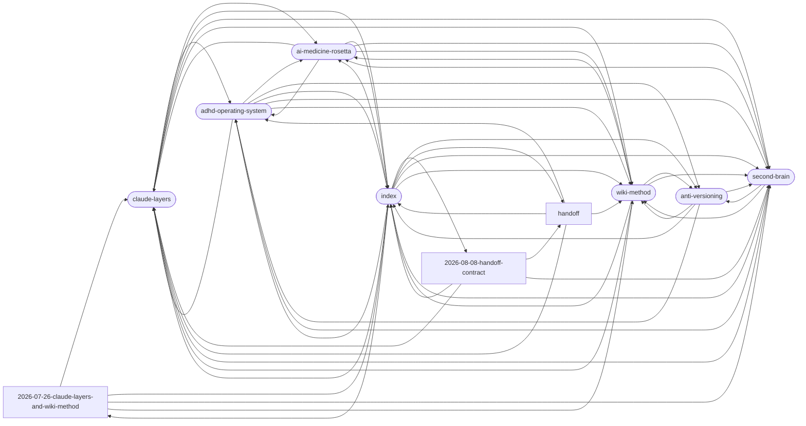

# Brain link graph

*Auto-generated by `tools/wiki_lint.py`. Rounded nodes have 3+ inbound links —
those are the concepts everything else hangs off.*

```mermaid
graph LR
  2026_07_26_claude_layers_and_wiki_method["2026-07-26-claude-layers-and-wiki-method"]
  2026_08_08_handoff_contract["2026-08-08-handoff-contract"]
  adhd_operating_system(["adhd-operating-system"])
  ai_medicine_rosetta(["ai-medicine-rosetta"])
  anti_versioning(["anti-versioning"])
  claude_layers(["claude-layers"])
  handoff["handoff"]
  index(["index"])
  second_brain(["second-brain"])
  wiki_method(["wiki-method"])
  2026_07_26_claude_layers_and_wiki_method --> claude_layers
  2026_07_26_claude_layers_and_wiki_method --> index
  2026_07_26_claude_layers_and_wiki_method --> second_brain
  2026_07_26_claude_layers_and_wiki_method --> wiki_method
  2026_08_08_handoff_contract --> claude_layers
  2026_08_08_handoff_contract --> handoff
  2026_08_08_handoff_contract --> index
  2026_08_08_handoff_contract --> second_brain
  adhd_operating_system --> ai_medicine_rosetta
  adhd_operating_system --> anti_versioning
  adhd_operating_system --> claude_layers
  adhd_operating_system --> index
  adhd_operating_system --> second_brain
  adhd_operating_system --> wiki_method
  ai_medicine_rosetta --> adhd_operating_system
  ai_medicine_rosetta --> claude_layers
  ai_medicine_rosetta --> index
  ai_medicine_rosetta --> second_brain
  ai_medicine_rosetta --> wiki_method
  anti_versioning --> adhd_operating_system
  anti_versioning --> index
  anti_versioning --> second_brain
  anti_versioning --> wiki_method
  claude_layers --> adhd_operating_system
  claude_layers --> ai_medicine_rosetta
  claude_layers --> index
  claude_layers --> second_brain
  claude_layers --> wiki_method
  handoff --> adhd_operating_system
  handoff --> claude_layers
  handoff --> index
  handoff --> wiki_method
  index --> 2026_07_26_claude_layers_and_wiki_method
  index --> 2026_08_08_handoff_contract
  index --> adhd_operating_system
  index --> ai_medicine_rosetta
  index --> anti_versioning
  index --> claude_layers
  index --> handoff
  index --> second_brain
  index --> wiki_method
  second_brain --> adhd_operating_system
  second_brain --> ai_medicine_rosetta
  second_brain --> anti_versioning
  second_brain --> claude_layers
  second_brain --> index
  second_brain --> wiki_method
  wiki_method --> ai_medicine_rosetta
  wiki_method --> anti_versioning
  wiki_method --> claude_layers
  wiki_method --> index
  wiki_method --> second_brain
```
