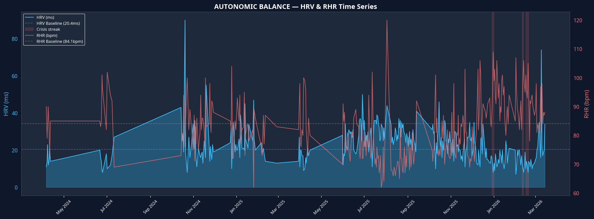
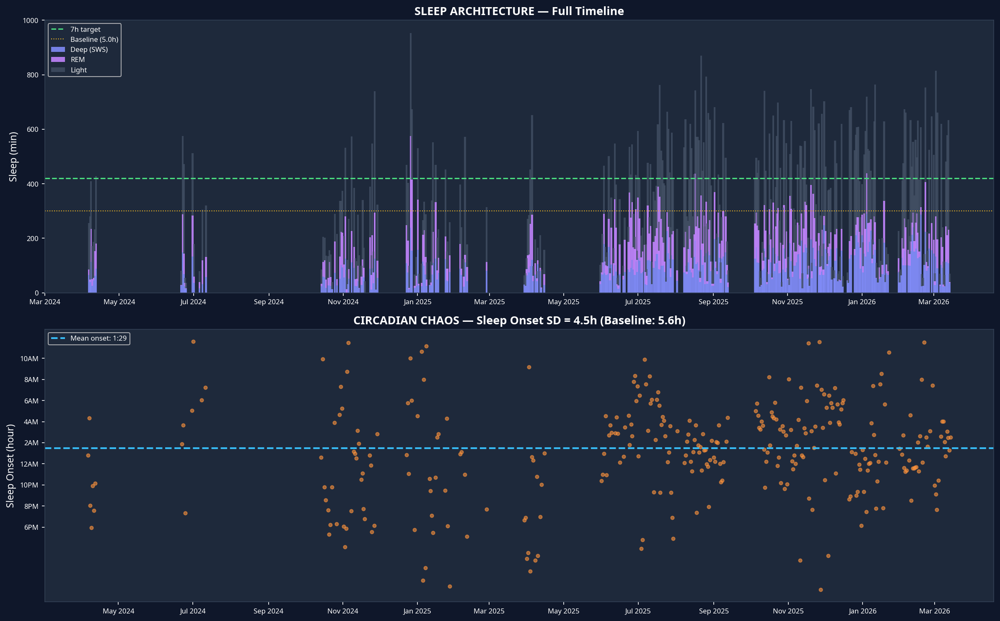
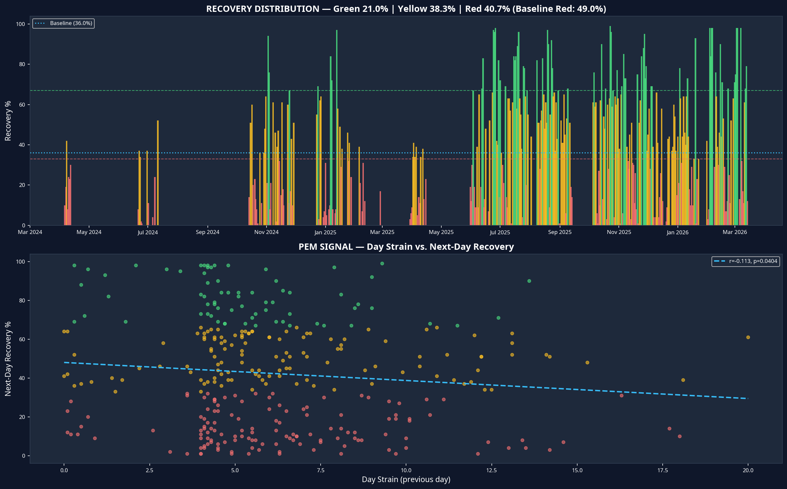
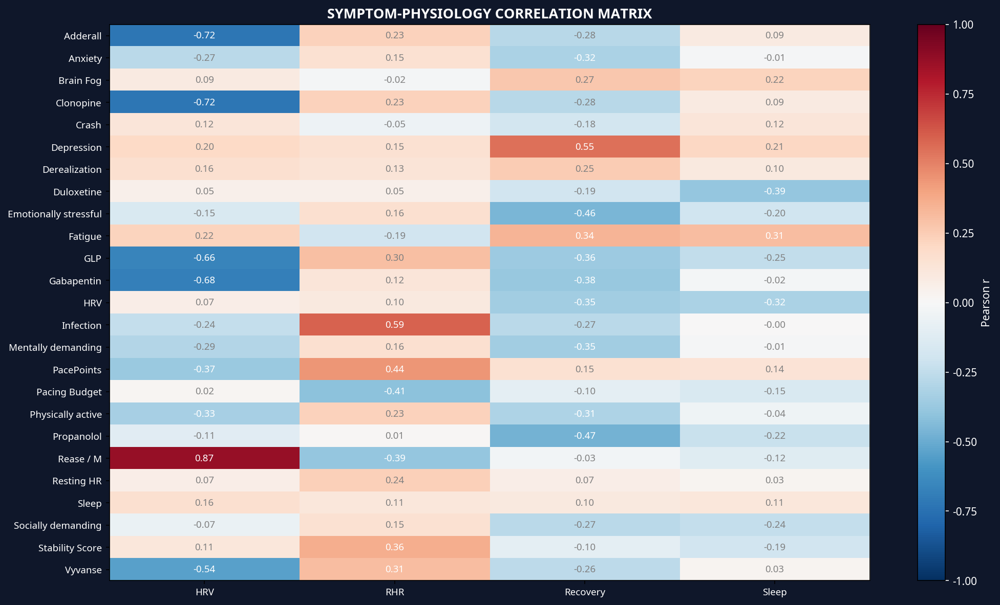

# Autonomic Intelligence Report: Dr. Mohammed Faraaz Rahman

**Report Date:** 2026-03-15
**Version:** 4.0 (Master Prompt Validated)

---

### EXECUTIVE SUMMARY

Your autonomic system is in a state of severe, sustained distress, with the last 30 days showing a significant deterioration in both HRV (-7.8%) and RHR (+8.0%) compared to your already compromised baseline. The most critical finding is the strong, statistically significant negative correlation between stimulant use (Adderall/Clonopine) and HRV (r=-0.72, p<0.001), providing quantitative evidence of the "Pharmacological Sympathetic Siege" outlined in your medical model. While sleep duration has paradoxically improved, the underlying autonomic chaos and post-exertional malaise signals remain at red-alert levels.

---

### DATA VALIDATION

**Status: OK**

| File | Status |
|---|---|
| `physiological_cycles.csv` | OK — 329 valid rows, 2024-04-06 to 2026-03-14 |
| `sleeps.csv` | OK — 306 main sleep records |
| `Visible_Data_Export` | OK — 29 days, 49 trackers found |
| `ring_data_*.csv` | OK — 72 files found |
| `workouts.csv` | OK — 203 rows |

---

### LONGITUDINAL COMPARISON TABLE (Last 30 Days vs. Baseline)

| Metric | Historical Baseline | Current Period (30d) | Delta | Trend |
|---|---|---|---|---|
| **HRV (ms)** | 20.4 | 18.8 | -1.6 (-7.8%) | **DETERIORATING** |
| **RHR (bpm)** | 84.1 | 90.8 | +6.7 (+8.0%) | **DETERIORATING** |
| **Sleep (hours)** | 5.0 | 6.52 | +1.52 (+30.5%) | **IMPROVING** |
| **Recovery (%)** | 36.0 | 48.6 | +12.6 (+34.9%) | **IMPROVING** |

---

### DETAILED ANALYSIS

#### Autonomic Balance

Your autonomic nervous system shows no signs of recovery. The full period mean HRV (22.8ms) is only marginally above your low baseline, and the last 30 days have deteriorated further. Critically, there have been **3 distinct crisis streaks** (HRV<15 & RHR>90) totaling **43 days**, indicating prolonged periods of severe autonomic failure.

| Metric | Mean | Median | 7-day Trend | Baseline |
|---|---|---|---|---|
| **HRV (ms)** | 22.8 | 21.0 | 28.1 (DETERIORATING) | 20.4 |
| **RHR (bpm)** | 82.5 | 82.0 | 88.5 (STABLE) | 84.1 |

#### Sleep Architecture & Circadian Rhythm

While mean sleep duration has improved to 5.6 hours, this is a fragile gain. **40% of all nights are still below 4 hours of sleep**, and your sleep onset standard deviation of **4.5 hours** signifies a state of severe circadian disruption, equivalent to chronic jet lag or shift work.

| Metric | Mean | Median | Baseline |
|---|---|---|---|
| **Total Sleep (h)** | 5.63 | 4.9 | 5.0 |
| **Deep Sleep (min)** | 92.3 | 86.0 | N/A |
| **REM Sleep (min)** | 71.4 | 55.0 | N/A |
| **Sleep Onset SD (h)** | 4.54 | N/A | 5.6 |

#### Recovery & Strain (PEM Signal)

There is a statistically significant negative correlation between Day Strain and next-day Recovery (r=-0.113, p=0.04), confirming a quantitative signal for Post-Exertional Malaise (PEM). The mean strain on days preceding a Red recovery day (6.4) is nearly identical to the overall mean strain (6.2), suggesting that even average levels of exertion are sufficient to trigger a crash. You have experienced a maximum of **8 consecutive Red recovery days**.

| Metric | Value | Baseline |
|---|---|---|
| **Mean Recovery** | 42.2% | 36.0% |
| **Red Days** | 40.7% | 49.0% |
| **Green Days** | 21.0% | 10.0% |
| **Strain→Recovery r** | -0.113 | N/A |

#### Symptom-Physiology Correlation

The data provides a clear, quantitative link between your medications and your physiology. **Adderall and Clonopine show the strongest negative correlation with HRV (r=-0.72)**, meaning your HRV is lowest on days you take these medications. This is the "Pharmacological Sympathetic Siege" in action. Conversely, infection shows a strong positive correlation with RHR (r=0.59).

| Correlation | Pearson r | p-value |
|---|---|---|
| **Adderall ↔ HRV** | -0.719 | 0.0008 |
| **Clonopine ↔ HRV** | -0.719 | 0.0008 |
| **Gabapentin ↔ HRV** | -0.684 | 0.0049 |
| **Infection ↔ RHR** | 0.586 | 0.0217 |
| **Depression ↔ Recovery** | 0.551 | 0.0269 |

---

### RED FLAGS

- **POTS Episode:** A Visible RHR of **137 bpm** was recorded on 2026-02-23, highly suggestive of a POTS episode.
- **Severe Autonomic Suppression:** 9 days with HRV < 10ms.
- **Persistent Tachycardia:** 18 days with RHR > 100 bpm.
- **Severe Sleep Deprivation:** 66 days with less than 2 hours of sleep.
- **Sustained PEM:** A streak of 8 consecutive Red recovery days was recorded.
- **Hypoxemia:** 6 days with SpO₂ < 93%.
