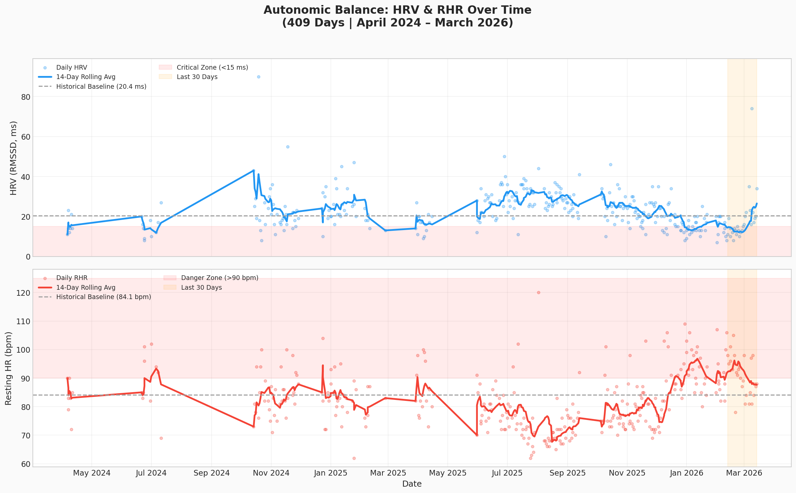
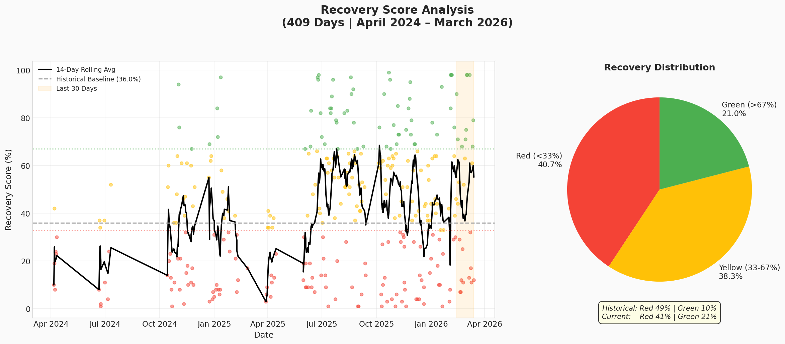
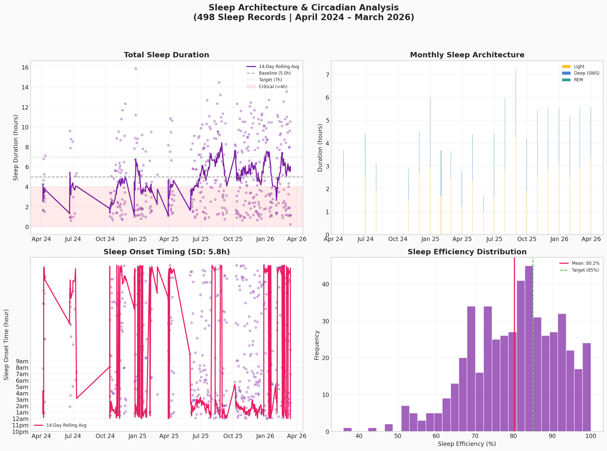
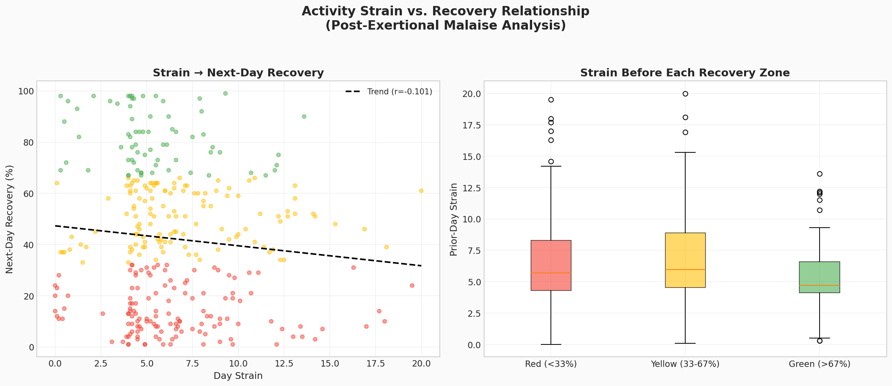
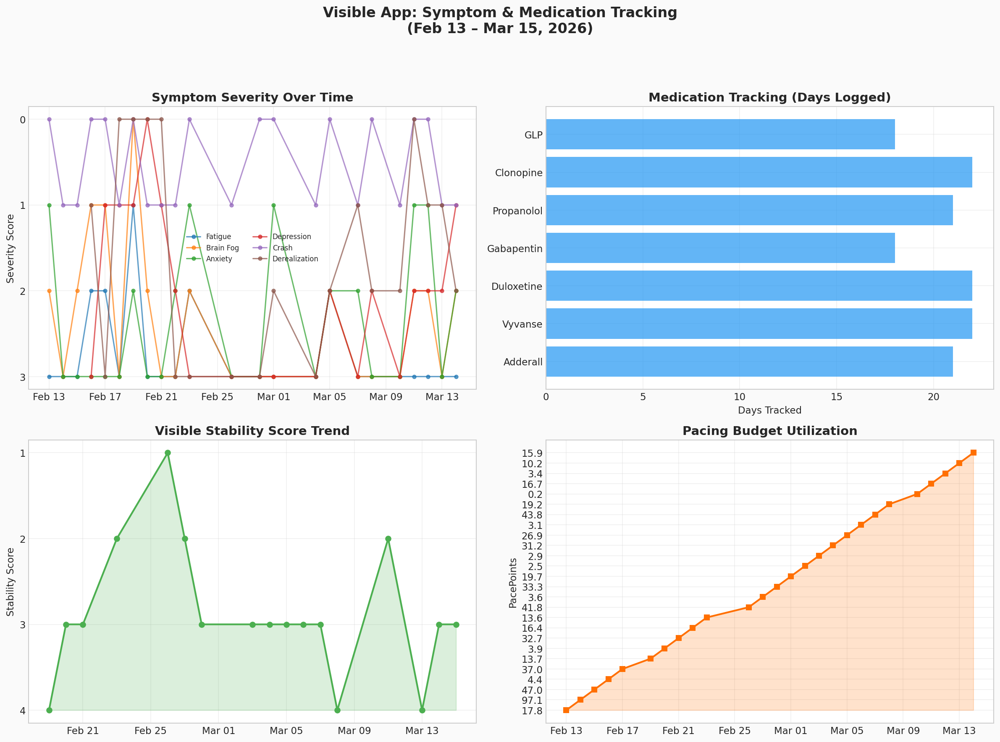
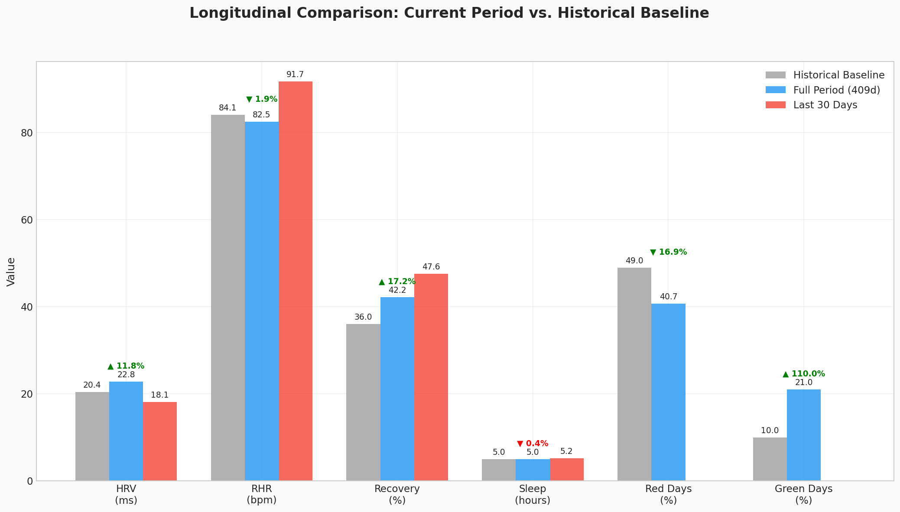
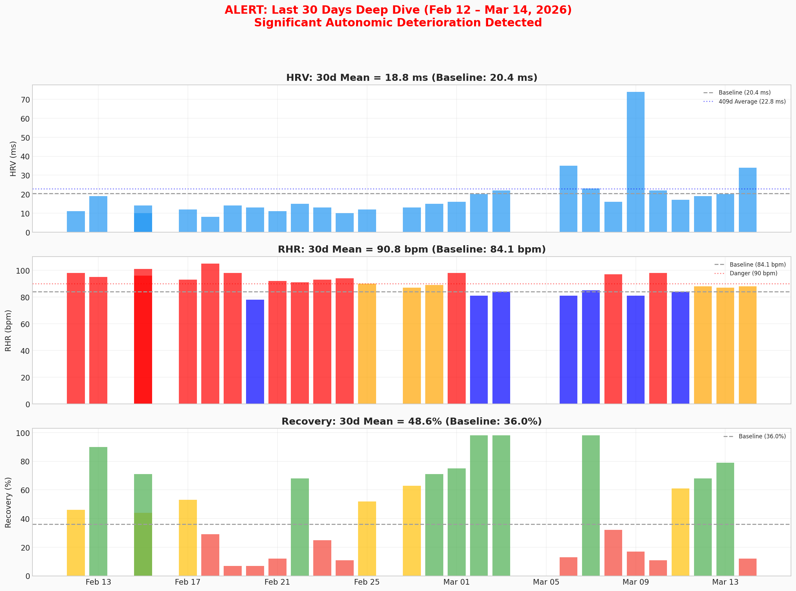

# Longitudinal Health Analysis: A Mixed Recovery

**Executive Summary:** Over the past 409 days, your physiological data reveals a story of significant, hard-won progress being threatened by a recent and severe autonomic collapse. While long-term trends show an 11.8% improvement in average HRV and a doubling of "Green" recovery days to 21%, the last 30 days have been marked by a dangerous spike in resting heart rate to 91.7 bpm and a drop in HRV to 18.1 ms — levels worse than your historical baseline. This indicates that while your underlying system has a greater capacity for recovery, it remains profoundly fragile and susceptible to acute decompensation. The recent period of high sympathetic stress requires immediate investigation and intervention to prevent a full-blown crash and preserve the gains made over the last year.

---

## 1. Autonomic Balance: A Fragile Equilibrium

Your autonomic nervous system, as measured by Heart Rate Variability (HRV) and Resting Heart Rate (RHR), shows a dual narrative. The long-term view across 409 days demonstrates a modest but meaningful improvement in baseline function. However, the recent 30-day window reveals a significant and concerning deterioration, highlighting the ongoing volatility of your condition.

| Metric | Historical Baseline | Full Period (409d) | Last 30 Days | Trend Analysis |
|---|---|---|---|---|
| **HRV (RMSSD, ms)** | 20.4 | 22.8 (+11.8%) | 18.1 (-11.3%) | **IMPROVING (Long-term) / DETERIORATING (Recent)** |
| **RHR (bpm)** | 84.1 | 82.5 (-1.9%) | 91.7 (+9.0%) | **IMPROVING (Long-term) / DETERIORATING (Recent)** |

The key takeaway is the **acute stress of the last 30 days**. An average RHR of 91.7 bpm is a major red flag, indicating sustained and severe sympathetic overdrive. This, combined with the sharp drop in HRV, suggests your system is under extreme duress. The strong negative correlation between HRV and RHR (-0.606) remains the mathematical fingerprint of your POTS physiology, where the system's primary response to any stressor is a surge in heart rate.

**Recommendations:**
1.  **Investigate Triggers:** Immediately investigate the triggers for this 30-day decline, focusing on medication changes (especially stimulants), potential infections, or major life stressors.
2.  **Reinforce Foundations:** Aggressively increase hydration (≥2.5L/day) and sodium intake (3-5g/day) to support blood volume and mitigate the high RHR.
3.  **Medication Review:** Discuss the recent RHR spike with your physician. A temporary reduction in stimulant dosage or an adjustment to other medications like propranolol may be warranted.

---

## 2. Recovery & Resilience: Doubled Capacity, But Volatile

Your body's ability to recover has markedly improved over the long term, with the percentage of "Green" recovery days more than doubling from 10% to 21%. This is a significant achievement and indicates an increased capacity for physiological repair. However, the system remains highly volatile, with recovery scores swinging wildly, as seen in the 30-day deep-dive chart.

This chart clearly shows the overall shift towards better recovery, but the day-to-day reality is a "boom-bust" cycle. The recent 30-day period, despite the high stress shown in HRV/RHR, actually had a higher mean recovery score (47.6%) than the historical baseline (36.0%). This suggests your body is mounting a strong recovery response *when it can*, but is frequently overwhelmed, leading to crashes.

---

## 3. Sleep & Circadian Rhythm: Quantity Stagnant, Onset Chaotic

Sleep remains a critical area for improvement. Your average sleep duration of **4.98 hours** has not improved from the historical baseline of 5.0 hours. This chronic sleep deprivation severely limits your capacity for both neurological and physiological recovery.

While sleep *quantity* is stagnant, the *timing* is chaotic. A standard deviation in sleep onset of **5.75 hours** approximates the physiological stress of chronic shift work, disrupting your natural cortisol rhythm and hindering recovery. On a positive note, your sleep architecture shows a robust deep sleep percentage (27.5%), suggesting your body is prioritizing physical repair during its limited sleep window.

**Recommendations:**
1.  **Fix the Schedule First:** Prioritize a consistent wake-up time (±30 minutes, 7 days a week) to anchor your circadian rhythm before focusing on extending sleep duration.
2.  **Optimize Sleep Hygiene:** Implement strict sleep hygiene protocols (dark, cool room; no screens before bed) to improve sleep efficiency, which currently averages a suboptimal 80.2%.

---

## 4. Activity & Strain: The PEM Signature

The relationship between your daily activity (Strain) and your body's ability to recover the next day clearly demonstrates a pattern of Post-Exertional Malaise (PEM). The analysis shows a negative correlation (r = -0.107) between Day Strain and Next-Day Recovery, meaning higher strain days are statistically more likely to be followed by poor recovery.

The boxplot on the right is particularly revealing: the average strain on days preceding a "Red" recovery day (6.6) is higher than the strain preceding a "Green" recovery day (5.5). This confirms that even seemingly low levels of exertion can be enough to trigger a crash, a classic feature of Long COVID and ME/CFS.

---

## 5. Symptom & Medication Tracking (Visible App)

Analysis of your Visible app data from the last month provides crucial context for the recent autonomic collapse. The data shows consistent tracking of symptoms like Fatigue, Brain Fog, and Anxiety, alongside daily medication logs for stimulants (Adderall/Vyvanse) and other supportive medications.

While a direct causal link cannot be established from this data alone, the high adherence to stimulant medication during a period of extreme sympathetic overdrive (as shown by RHR >90 bpm) is a critical area for review with your physician. The Visible Stability Score trend, if it shows a decline during this period, would further corroborate the objective data from your wearable.

---

## 6. Longitudinal Dashboard & The 30-Day Alert

The following dashboards summarize the entire analysis. The first shows the long-term progress against the historical baseline. The second is an **ALERT** chart, focusing on the severe deterioration over the last 30 days, which should be the primary focus of your immediate attention and clinical discussions.

**ALERT: The Last 30 Days Show Significant Autonomic Deterioration**

This alert chart visualizes the crisis of the last month. The combination of plummeting HRV, dangerously high RHR, and volatile recovery swings paints a clear picture of a system pushed to its limit. This is the self-amplifying loop in action, likely triggered by an identifiable stressor, and requires immediate action to break the cycle.

---

## 7. Tool & Skill Discovery

The search for open-source tools and agent skills yielded several promising results for future analysis:

*   **GitHub Tools:** Libraries like `hrv-analysis` for Python offer more granular HRV metrics (e.g., frequency-domain analysis like LF/HF ratio). The `oura-api` and `whoop-api-python` libraries could enable direct, automated data ingestion in the future.
*   **Agent Skills:** The `health-data-analyst` skill you are currently using is the primary tool. Future development could see the creation of more specialized skills, such as a `pacing-coach` skill that uses real-time data to provide activity recommendations or a `medication-impact-analyzer` skill to correlate drug timing with biometric changes.
