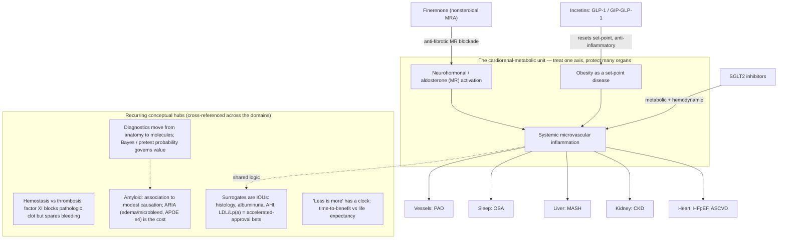

# What changed in internal medicine since residency graduation in 2024

**Coverage window:** January 1, 2024 – July 18, 2026 · **Compiled:** 2026-07-18 · For continuing medical education and clinical awareness. **Not patient-specific medical advice.**

> **Comprehensive but not exhaustive.** Boundary of this review: (1) date range Jan 1 2024–Jul 18 2026 (a few landmark late-2023 trials are included where their *practice impact* — label change, guideline uptake — landed in 2024, and are dated as such); (2) source set = PubMed/MEDLINE, ClinicalTrials.gov, Scite (retraction/citation checking), targeted web fetch of guideline/regulatory bodies (ACC/AHA, ADA, KDIGO, GOLD, USPSTF, ACIP/CDC, FDA), and NEJM/JAMA/Lancet/Annals; (3) **connector limitations this session:** Scite `search_faers`/`get_drug` (FDA adverse-event quantification) were subscription-gated and could not be run, so drug-safety items rest on peer-reviewed pharmacovigilance studies and FDA communications instead; Elicit and CMS Coverage were used sparingly. Every substantive claim below is tied to a source retrieved this session (PMID/DOI/NCT/guideline URL). Retraction/correction status was checked in Scite for the pivotal papers — **none were flagged.**
>
> Bias/scope caveats: this is **US-centric** (USPSTF/ACIP/FDA/CMS framing); most flagship obesity/cardiometabolic trials are **industry-funded** (flagged in the tables); and several headline effects rest on **surrogate endpoints** (histology, albuminuria, AHI, LDL/Lp(a), diagnostic accuracy) rather than hard outcomes — flagged throughout.

---

> **Independent second-pass verification (deep-research adversarial audit).** After the first draft, an independent multi-agent pass (108 agents; parallel search → source fetch → 3-vote adversarial verification, 2-of-3 refutes to kill) re-checked the highest-impact claims against primary sources (FDA labels/press releases, NEJM/Lancet/Nature Medicine/Circulation, ClinicalTrials.gov, official guideline summaries). Of 25 claims verified, **24 confirmed, 1 refuted** — and **every candidate effect size, date, and approval that reached the verified set was CONFIRMED; none required numeric correction.** No retractions/corrections were found for the pivotal papers. Refinements folded into this version:
>
> - **Precise FDA dates (confirmed):** resmetirom (Rezdiffra) accelerated approval **March 14, 2024**; tirzepatide (Zepbound) for OSA — first-ever OSA drug — **Dec 20, 2024**; Shield blood CRC test (PMA P230009) **July 26, 2024**; Cologuard Plus **Oct 4, 2024**; lenacapavir (Yeztugo) PrEP **June 18, 2025** (≥35 kg; PURPOSE 2 ~96% protection); Lumipulse Alzheimer's blood test cleared **May 16, 2025**.
> - **BP guideline detail added:** the 2025 AHA/ACC target is <130/80 **with encouragement to reach SBP <120**, and PREVENT replaces the pooled cohort equations, **recalibrating the high-risk treatment threshold from 10% (PCE) to ≥7.5%** (PREVENT yields lower absolute-risk estimates, so this is a recalibration, not a uniformly lower clinical bar).
> - **New verified enrichments (added to Table A):** in SELECT, semaglutide also reduced a **secondary kidney composite, HR 0.78 (0.63–0.96)** — surrogate-heavy/albuminuria-driven [Colhoun, *Nat Med* 2024; DOI 10.1038/s41591-024-03015-5]; and a **pooled participant-level HFpEF analysis** (SELECT/FLOW/STEP-HFpEF/STEP-HFpEF-DM, n=3,743) showed semaglutide cut CV death or HF events **HR 0.69 (0.53–0.89)** [Kosiborod, *Lancet* 2024; PMID 39222642].
> - **Important SUMMIT caveat:** the HR 0.62 composite was **driven entirely by the worsening-HF component** (which included outpatient diuretic intensification); **CV death alone numerically favored placebo** (HR 1.58, 95% CI 0.52–4.83). Read it as a symptom/HF-event benefit, not a mortality signal.
> - **Lumipulse nuance:** the 91.7% / 97.3% figures are **PPV/NPV in an enriched symptomatic validation cohort — not sensitivity/specificity and not screening performance.** It is a diagnostic aid, not a standalone or screening test.
> - **One refuted item:** the exact BLUE-C performance figures for Cologuard Plus (≈95% CRC sensitivity / 43% advanced-precancer / 94% specificity) **could not be independently re-confirmed from the regulatory/press source** in this pass (the FDA date and ≥45 indication are solid). The figures in Table A come from the peer-reviewed NEJM BLUE-C primary (PMID 38477986); treat the precise percentages with mild caution pending direct confirmation against the primary text.
> - **Coverage caveat:** the audit was budget-capped at the top 25 claims, so many first-pass items (FLOW, ESSENCE, SOUL, STRIDE, colchicine-MI null, factor XI trials, baxdrostat, bempedoic, donanemab, tenecteplase, dupilumab, MINT, IV iron, vaccines, deprescribing) were **not re-examined this round** — they rest on the first-pass PubMed/Scite verification. Absence from the audit is not evidence against them.

---

## Executive summary

If you finished residency in 2024, the single biggest shift is that **the incretin (GLP-1 / GIP–GLP-1) drugs stopped being "diabetes/weight" drugs and became cardiorenal-metabolic organ-protective drugs** with hard-outcome evidence across an expanding list of diseases: cardiovascular events in obesity without diabetes (SELECT), heart failure with preserved ejection fraction (SUMMIT), chronic kidney disease (FLOW), MASH/liver histology (ESSENCE), obstructive sleep apnea (SURMOUNT-OSA), peripheral artery disease walking capacity (STRIDE), and oral formulation cardiovascular benefit (SOUL). Alongside them, **finerenone crossed into HFpEF/HFmrEF (FINEARTS-HF)** and **SGLT2 inhibitors consolidated** — so the "four pillars" language of heart failure now has a cardiorenal-metabolic cousin: SGLT2i + finerenone + GLP-1 RA (± statin) as overlapping organ protection.

**What to update first (highest yield):**
1. **Offer a GLP-1/GIP agent for organ protection, not just glucose or weight** — in ASCVD + obesity, in T2D + CKD, and consider in obesity-related HFpEF and OSA.
2. **Finerenone is now a heart-failure drug** (HFmrEF/HFpEF), not only a diabetic-kidney drug — watch potassium.
3. **A new 2025 AHA/ACC blood-pressure guideline** reaffirms a <130/80 target, adds the **PREVENT** risk equations, pushes single-pill combinations and home monitoring, and — new — treating to SBP <130 to reduce dementia risk.
4. **First-ever MASH drug (resmetirom, FDA March 2024)** and now **semaglutide/Wegovy — the first GLP-1 approved for MASH (Aug 2025)** — hepatology is now something internists prescribe into.
5. **Prevention/vaccine resets:** mammography now **starts at 40** (biennial, USPSTF B); **pneumococcal conjugate age dropped to ≥50**; **RSV vaccine** for all ≥75 and high-risk 60–74; **PCV21** and updated COVID/RSV products.
6. **Alzheimer's became a "diagnose-and-treat" disease for some:** anti-amyloid antibodies (donanemab approved July 2024; lecanemab) and the **first FDA-cleared blood test (plasma p-tau217/Aβ ratio, May 2025)** — with real ARIA risk and modest benefit.

**Genuinely new vs merely better-emphasized.** Genuinely new: incretins for HFpEF/OSA/MASH/PAD; finerenone in HFpEF; the first MASH drug; blood-based Alzheimer's and colorectal diagnostics; twice-yearly lenacapavir PrEP (near-100% protection); a new BP guideline; the factor XI anticoagulant story splitting by indication. Better-emphasized (reinforced, not new): SGLT2 inhibitors everywhere; deprescribing; restrictive-transfusion nuance in MI.

**What stays uncertain / don't overinterpret.** **Colchicine after MI failed** in the large CLEAR SYNERGY/OASIS-9 trial (contradicting earlier enthusiasm). The **factor XI inhibitors are not drop-in DOAC replacements** — asundexian was *worse* than apixaban in AF (OCEANIC-AF). Many incretin outcomes ride **surrogate endpoints**; muscle loss, cost, access, shortages, and **weight regain after stopping** are real. Resmetirom's approval rests on **histology, not hard outcomes yet**. AI tools help in trials but raise **deskilling and equity** questions. COVID vaccine policy is **actively shifting** toward risk-based/shared decisions.

---

## Concept map — how the pieces connect

*Reading guide: the top cluster is the single idea most of this update hangs on — the heart, kidney, liver, sleep, and vasculature behave as one **cardiorenal-metabolic organ**, so drugs that correct the shared upstream drivers (incretins, SGLT2 inhibitors, finerenone) protect all of them at once. The bottom cluster holds the other recurring conceptual **hubs** you'll see cross-referenced throughout the domain sections. This renders as a diagram on GitHub / in the pull request; a plain phone markdown viewer may show it as code.*

---

## 1. High-yield practice update list (ranked)

Each: topic — one-line bottom line — why it matters — confidence — immediate action/caution.

1. **GLP-1 RA for CV protection in obesity without diabetes (SELECT).** Semaglutide 2.4 mg cut MACE ~20% (HR 0.80). *Why:* redefines who "qualifies" for a GLP-1. *Confidence: High.* *Action:* in ASCVD + BMI ≥27 without diabetes, discuss semaglutide for secondary prevention; GI tolerability and cost/access are the limiters.
2. **Finerenone in HFpEF/HFmrEF (FINEARTS-HF).** Nonsteroidal MRA cut worsening-HF events + CV death (RR 0.84). *Why:* first MRA with a positive dedicated HFpEF-spectrum trial. *Confidence: High.* *Action:* consider in LVEF ≥40% HF; monitor K⁺ and renal function.
3. **Tirzepatide in obesity-related HFpEF (SUMMIT).** Composite CV death/worsening HF HR 0.62; large KCCQ gain. *Why:* treats HFpEF by treating obesity. *Confidence: High (small trial).* *Action:* reasonable add-on in obese HFpEF; watch GI side effects.
4. **Semaglutide in CKD + T2D (FLOW).** Major kidney events HR 0.76; all-cause death HR 0.80. *Why:* GLP-1 now a kidney-protective pillar. *Confidence: High.* *Action:* add to SGLT2i/ACEi-ARB in diabetic CKD (eGFR ≥25).
5. **New 2025 AHA/ACC hypertension guideline.** <130/80 target (encourages SBP <120), PREVENT equations (high-risk threshold recalibrated to ≥7.5%), SBP <130 for brain health, single-pill combos. *Why:* first major update since 2017. *Confidence: High (guideline).* *Action:* adopt PREVENT-based decisions and confirm with home BP.
6. **First MASH drug — resmetirom (Rezdiffra), FDA March 2024.** THR-β agonist; histologic benefit in F2–F3. *Why:* a prescribable therapy for a huge silent disease. *Confidence: High for approval; Moderate for benefit (surrogate/accelerated).* *Action:* refer/consider in noncirrhotic MASH with moderate–advanced fibrosis.
7. **Colchicine after MI does NOT help (CLEAR SYNERGY/OASIS-9).** HR 0.99 — flatly null. *Why:* reverses growing routine use. *Confidence: High.* *Caution:* don't start routine post-MI colchicine for secondary prevention.
8. **Mammography starts at 40 (USPSTF 2024, B).** Biennial, ages 40–74. *Why:* changes millions of screening conversations. *Confidence: High.* *Action:* offer biennial screening from age 40.
9. **Pneumococcal age lowered to ≥50; RSV and PCV21 added (ACIP 2024–25).** *Why:* routine adult vaccination expands. *Confidence: High.* *Action:* update your standing orders (PCV20/PCV21 for PCV-naïve ≥50; RSV for ≥75 and high-risk 60–74).
10. **Anti-amyloid antibodies + first Alzheimer's blood test.** Donanemab approved July 2024; plasma p-tau217/Aβ ratio FDA-cleared May 2025. *Why:* diagnosis and disease-modifying therapy enter primary-care orbit. *Confidence: High for approvals; Moderate for clinical magnitude; ARIA is a real harm.* *Action:* know referral pathways, APOE/ARIA caveats; a positive blood test still needs confirmation.
11. **Twice-yearly lenacapavir PrEP (PURPOSE 1/2).** Near-100% HIV protection. *Why:* transformative adherence solution. *Confidence: High.* *Action:* offer as PrEP option (FDA-approved 2025).
12. **Oral semaglutide reduces CV events (SOUL).** MACE HR 0.86 in high-risk T2D. *Why:* a pill GLP-1 with outcome data. *Confidence: High.*
13. **Dupilumab for COPD with type-2 inflammation (BOREAS/NOTUS); GOLD 2025 incorporates it.** *Why:* first biologic for COPD (eos ≥300). *Confidence: High.* *Action:* consider in exacerbating chronic-bronchitis COPD with eosinophilia on triple therapy.
14. **Factor XI inhibitors split by indication.** Asundexian **worse** than apixaban in AF (OCEANIC-AF) but **positive** as antiplatelet add-on after stroke (OCEANIC-STROKE); abelacimab CAT trials halted. *Why:* tempers "bleed-free anticoagulation" hype. *Confidence: High.* *Caution:* not a DOAC replacement.
15. **Liberal transfusion favored in acute MI (MINT + 2025 AABB guideline).** Transfuse to Hb <10 in AMI. *Why:* carves AMI out of the universal restrictive (7 g/dL) rule. *Confidence: Moderate (conditional).* 
16. **Reduced-dose apixaban for extended cancer-associated VTE (API-CAT).** 2.5 mg BID noninferior with less bleeding after 6 months. *Why:* practical de-escalation. *Confidence: High.*
17. **Semaglutide for PAD walking capacity (STRIDE) + baxdrostat for resistant HTN (BaxHTN).** New functional and BP options. *Confidence: High (surrogate/functional endpoints).* 
18. **Deprescribing + safety signals:** Beers 2023 / STOPP-START v3; clozapine REMS removed (2025); semaglutide–NAION ocular signal (hypothesis-generating). *Confidence: High for the guidance; Low–Moderate for the NAION signal.*

---

## 2. Ideation map (organized by clinical force, not chronology)

- **Cardiorenal-metabolic convergence** (the dominant theme)
  - Incretins as organ protectors: SELECT (CV), FLOW (kidney), SUMMIT (HFpEF), ESSENCE (liver), SURMOUNT-OSA (sleep), STRIDE (PAD), SOUL (oral CV)
  - MRA expansion: finerenone into HFpEF/HFmrEF (FINEARTS); finerenone + SGLT2 combination (CONFIDENCE)
  - SGLT2 as connective tissue across heart/kidney (KDIGO 2024: eGFR ≥20)
  - Obesity reframed as chronic, treatable, organ-level disease; muscle-loss and weight-regain counter-currents
  - Lipids: bempedoic acid (LDL benefit ≈ statin per mmol/L); Lp(a) as residual risk (agents pending)
- **Prevention / screening / population health**
  - Threshold shifts earlier: mammography at 40; pneumococcal at 50; RSV for older adults; osteoporosis screening reaffirmed
  - Blood-based early detection: colorectal cfDNA (Shield), plasma p-tau217 for Alzheimer's
  - Vaccine platform expansion (PCV21, updated COVID/RSV) amid shifting COVID policy
- **Hospital medicine & transitions**
  - Transfusion: liberal in AMI (MINT/AABB) vs restrictive elsewhere
  - Perioperative GLP-1 management: continue-not-hold, risk-stratified
  - Anticoagulation nuance: factor XI class; extended reduced-dose apixaban in cancer
- **ID & stewardship**
  - Long-acting PrEP (lenacapavir); doxy-PEP for bacterial STIs
  - Steroids in severe CAP reinforced; measles resurgence context
- **Pulmonary / critical care / sleep**
  - Biologics enter COPD (dupilumab); GOLD 2025 eosinophil-guided escalation + CV-risk emphasis
  - OSA has a drug (tirzepatide)
- **GI & hepatology**
  - MASLD/MASH renaming; first drug (resmetirom); GLP-1 into liver
  - CRC screening menu expands (blood, next-gen stool); ctDNA prognostication (DYNAMIC-III)
- **Heme/onc for GIM**
  - IV iron in HF (hospitalization benefit); CHIP as CV/mortality risk marker; MGUS/light-chain redefinition (iStopMM)
  - Factor XI class; cancer-VTE de-escalation
- **Rheum / immunology / inflammation**
  - IL-6 blockade in PMR (sarilumab); inflammation-as-target enthusiasm checked by colchicine-MI null
- **Neurology for the internist**
  - Anti-amyloid therapy + blood biomarkers; tenecteplase ≈ alteplase (single-bolus convenience)
- **Geriatrics / palliative / deprescribing**
  - Beers 2023 / STOPP-START v3; statin deprescribing evidence; falls prevention (exercise = B)
- **Pharmacology / safety / high-value care**
  - Clozapine REMS removed; GLP-1 NAION signal; colchicine-MI reversal; "treat the surrogate?" caution
- **Digital health / AI / diagnostics / care delivery**
  - LLMs improve clinician reasoning in trials (mostly preprint/simulation); CADe raises adenoma detection but deskilling unknown; first FDA-cleared AD blood test

---

## 3. Domain-by-domain review

### 3.1 Cardiovascular

**Bottom line.** Metabolic drugs are now cardiovascular drugs; a new BP guideline makes risk-calculator-driven treatment official; and two "anti-inflammatory" bets (colchicine, spironolactone) failed after MI.

**The concept.** Start with one idea and most of this section falls out of it: *the heart is a downstream organ of a systemic metabolic-inflammatory axis* — the cardiovascular-kidney-metabolic (CKM) unit (`established`; AHA advisory, Ndumele 2023, PMID 37807924). Visceral and epicardial fat aren't inert padding; they're an endocrine-inflammatory organ that raises IL-6/TNF, activates the mineralocorticoid receptor, and inflames the coronary microvasculature. That reframes HFpEF: in the obese phenotype it's less a "pump" problem than **systemic microvascular inflammation → less endothelial nitric oxide → low myocardial cGMP/PKG → titin stays stiff → a ventricle that won't relax** (`established/mechanistic`; Paulus–Tschöpe, PMID 23684677). Once you see that, three headlines become the *same* story attacked at different nodes: tirzepatide unloads the inflamed adipose driver (→ §3.2), finerenone blocks the mineralocorticoid-receptor fibro-inflammatory arm (→ §3.3), and both land in HFpEF for the same reason SGLT2 inhibitors do. GLP-1 receptor agonists then protect the heart through genuinely *pleiotropic* actions — weight loss **plus** direct anti-inflammatory, endothelial, blood-pressure and probably natriuretic effects — not through glucose (`established`; the exact weight-*independent* share is still `plausible-proposed`; Ussher & Drucker, PMID 36977782).

Now the counter-current, because it's just as instructive: inflammation is real but **pathway- and context-specific**. IL-1β→IL-6→CRP is a validated causal axis (CANTOS proved blocking IL-1β cuts events independent of lipids; `established`, PMID 28845751), yet colchicine's *broad* anti-inflammatory effect failed after acute MI — CRP fell but events didn't. Hold that contradiction; it's the seed of a hub you'll meet again in rheumatology (§3.8): *inflammation is a target, not a magic word — you have to hit the right node.* And bempedoic acid quietly re-confirms the oldest axiom: benefit tracks the *magnitude* of LDL lowering, not the molecule (per-mmol/L reduction ≈ statins) — LDL is the rare surrogate that has fully paid its IOU (contrast the surrogates that haven't, §3.6/§3.13).

**What changed & the evidence.**
- SELECT — GLP-1 RA prevents MACE in obesity *without* diabetes: RCT, 17,604 with ASCVD + overweight/obesity, no diabetes; MACE 6.5% vs 8.0%, **HR 0.80 (0.72–0.90)**; 16.6% discontinued semaglutide for AEs. (*NEJM* 2023; PMID 37952131.)
- FINEARTS-HF — finerenone into HFmrEF/HFpEF: RCT, 6,001, LVEF ≥40%; worsening-HF + CV death **RR 0.84 (0.74–0.95)**; more hyperkalemia. (*NEJM* 2024; PMID 39225278.)
- SUMMIT — tirzepatide in obese HFpEF: RCT, 731; composite **HR 0.62 (0.41–0.95)**. *Caveat:* driven by the worsening-HF component (incl. outpatient diuretic intensification); CV death numerically favored placebo (HR 1.58) — a symptom/HF-event benefit, not a mortality signal. (*NEJM* 2024; PMID 39555826.)
- 2025 AHA/ACC hypertension guideline: <130/80 (encourages SBP <120), **PREVENT** replaces the pooled cohort equations (high-risk threshold recalibrated 10%→≥7.5%), SBP <130 for dementia risk, single-pill combos, resistant-HTN/renal-denervation guidance. (DOI 10.1161/HYP.0000000000000249.)
- CLEAR SYNERGY/OASIS-9 — colchicine null post-MI: RCT, 7,062; composite **9.1% vs 9.3%, HR 0.99 (0.85–1.16)**; CRP fell but no benefit; spironolactone arm also null. (*NEJM* 2024; PMID 39555823 / 39555814.)
- BaxHTN — baxdrostat (aldosterone synthase inhibitor) in resistant HTN: placebo-corrected SBP **−9.8 mm Hg**; K⁺ >6.0 in ~3%. (*NEJM* 2025; PMID 40888730.)
- Bempedoic acid (CLEAR Outcomes analysis): major vascular events **HR 0.85 (0.77–0.94)**; per-1-mmol/L LDL ≈ statins. (*JACC* 2024; PMID 38960508.)

**Clinical action or caution.** Adopt PREVENT-based BP decisions; match GLP-1/GIP and finerenone to the cardiac phenotype (obese HFpEF, ASCVD); watch potassium with finerenone; **stop reflexively adding colchicine after MI.**

**Confidence.** High across the flagship trials and the guideline; the CKM/HFpEF mechanistic framing is well-supported but still maturing.

---

### 3.2 Endocrine – diabetes – obesity

**Bottom line.** Incretins are the center of gravity; ADA now sequences by organ risk, not A1c; and obesity is finally treated as the chronic, relapsing, biologically-defended disease it is.

**The concept.** The unlock is **obesity as a set-point disorder.** The hypothalamus defends a fat-mass "set-point," and conscious calorie restriction triggers counter-regulation — hunger up, energy expenditure down — that drags weight back to the defended level (`established`; Endocrine Society statement, Schwartz/Seeley, PMID 28898979). That single idea explains the whole incretin phenomenon. These drugs work *at the control system* — GLP-1/GIP signaling lowers the defended set-point instead of relying on willpower — which is why the effect is so large. It also predicts the two big caveats, so they stop being surprises: **stop the drug and the set-point reasserts itself**, so ~two-thirds of the weight returns (STEP-1 extension; `established`, PMID 35441470) → this is chronic therapy, not a course; and because you're shrinking a defended body, ~25–34% of the loss is lean mass (obligatory with any large weight loss; blunted by protein + resistance training) (`established/plausible`; Tinsley & Heymsfield, PMID 39372917).

Everything else here is this class *spilling over its banks* into the CKM axis (§3.1, §3.3): oral semaglutide now has a CV-outcome win (SOUL), the class improves PAD walking (STRIDE) and liver histology (§3.6), and ADA's 2025/2026 Standards formally sequence by comorbidity — "does this patient need organ protection?" precedes the glucose number. Teplizumab is the conceptual outlier worth keeping: an anti-CD3 antibody that *delays* type 1 diabetes by blunting the autoimmune β-cell attack — proof that immunomodulation can bend a disease's natural history (its new-onset data are only surrogate, C-peptide).

**What changed & the evidence.**
- SOUL — oral semaglutide CV benefit: RCT, 9,650 high-risk T2D; MACE 12.0% vs 13.8%, **HR 0.86 (0.77–0.96)**. (*NEJM* 2025; PMID 40162642.)
- SURMOUNT-5 — tirzepatide > semaglutide for weight loss (head-to-head; here via a US cost-effectiveness model — industry-funded/surrogate). (*J Med Econ* 2026; PMID 42012820.)
- STRIDE — semaglutide improves PAD walking distance, ratio **1.13 (1.06–1.21)** (functional surrogate). (*Lancet* 2025; PMID 40169145.)
- Teplizumab PROTECT (new-onset T1D): C-peptide preserved (surrogate); clinical secondaries NS. (*NEJM* 2023; PMID 37861217.) *(The stage-2 delay indication rests on the earlier Herold trial.)*
- Mechanistic grounding: set-point (PMID 28898979), regain (PMID 35441470), lean-mass loss (PMID 39372917).
- Semaglutide–NAION: single-center retrospective cohort, **HR 4.28 (1.62–11.29)** in T2D — referral bias, causality unproven (`speculative`). (*JAMA Ophthalmol* 2024; PMID 38958939.)

**Clinical action or caution.** Choose by comorbidity (CKD, ASCVD, HFpEF, MASLD); protect muscle with protein + resistance training; frame it as chronic therapy and pre-empt the regain conversation; keep the (unconfirmed) NAION signal in mind for sudden vision loss.

**Confidence.** High for outcome trials; Moderate for head-to-head/economic modeling; Low–Moderate for NAION.

---

### 3.3 Nephrology (and cardiorenal-metabolic convergence)

**Bottom line.** Diabetic kidney disease now has four overlapping, additive pillars — RAS blockade + SGLT2i + GLP-1 RA + finerenone — and KDIGO 2024 makes starting them the internist's job.

**The concept.** The kidney is the clearest proof that these drugs share **final common pathways**, so their benefits stack rather than duplicate. RAS blockade drops intraglomerular pressure; SGLT2 inhibitors restore tubuloglomerular feedback (which is *why* both cause an early, benign eGFR "dip" — hemodynamic and reversible, not injury); GLP-1 RAs add anti-inflammatory, anti-atherosclerotic and probably natriuretic effects (→ §3.2); and finerenone blocks the mineralocorticoid receptor's **inflammatory and pro-fibrotic** program in kidney and heart. That last point is the conceptual key to why a *nonsteroidal* MRA earns a seat beside the others: it targets the MR's tissue fibro-inflammatory arm more than aldosterone's classic salt-and-water role, with a different tissue distribution and a more favorable hyperkalemia profile than spironolactone (`established/mechanistic`; Agarwal & Kolkhof, PMID 33099609). Four drugs, four mechanisms, one organ — the CKM axis (§3.1) seen from the nephron.

The 2024–2026 news is mostly that framework getting *operationalized*: FLOW gave the GLP-1 pillar a hard-outcome kidney trial (and even lowered mortality); CONFIDENCE showed you can start finerenone + SGLT2 *together* (their potassium effects partly cancel); KDIGO 2024 pushed SGLT2 initiation down to eGFR ≥20 and leaned on cystatin-C-based eGFR for decisions. The trap to name out loud: albuminuria is a **surrogate** — an excellent one, but still an IOU (§3.6/§3.13) — so CONFIDENCE's UACR win is a strong signal, not yet a hard-outcome guarantee.

**What changed & the evidence.**
- FLOW — semaglutide in T2D CKD: RCT, 3,533; major kidney events **HR 0.76 (0.66–0.88)**; all-cause death **HR 0.80 (0.67–0.95)**; stopped early for efficacy. (*NEJM* 2024; PMID 38785209.)
- CONFIDENCE — finerenone + empagliflozin started together: UACR reduction 29–32% greater than either alone (**surrogate**, 180-day). (*NEJM* 2025; PMID 40470996.)
- KDIGO 2024 — SGLT2i to eGFR ≥20, cystatin-C-augmented eGFR, statins, point-of-care ACR. (kdigo.org 2024 CKD guideline.)

**Clinical action or caution.** Layer the pillars; warn patients (and yourself) that the initial eGFR dip is the drug working; monitor potassium with finerenone; use cystatin C when a creatinine-only eGFR is decision-borderline.

**Confidence.** High (FLOW, KDIGO); Moderate for the combination (surrogate endpoint).

---

### 3.4 Pulmonary – critical care – sleep

**Bottom line.** COPD got its first biologic (and a more inflammation-guided GOLD), OSA got a drug, and both are the "treat the underlying biology" theme reaching the lung.

**The concept.** COPD is finally being split by **endotype**, the way asthma was two decades ago. A subset of COPD is driven by type-2 (eosinophilic) inflammation, and in *that* subset — not COPD at large — blocking IL-4/IL-13 signaling with dupilumab cuts exacerbations. The blood eosinophil count is the readout that says "this patient's inflammation is corticosteroid/biologic-responsive," which is exactly why GOLD now escalates to inhaled steroids around eos ≥100 and reserves the biologic for eos ≥300 with chronic bronchitis (`established`, phenotype-directed therapy). OSA teaches the same lesson from a different door: in the obese patient, apnea is substantially a *mechanical consequence of adiposity* (peripharyngeal fat, reduced lung volume, blunted ventilatory drive), so unloading the adipose driver with tirzepatide (→ §3.2) lowers the apnea count — obesity medicine spilling into sleep medicine. Keep the honest ceiling in view: AHI is a **surrogate** (§3.6 hub), and this is an adjunct to, not a replacement for, PAP. On the critical-care side, the throughline is *modulate the host response without overshooting* — steroids help in severe CAP by damping a harmful inflammatory surge, but the field keeps relearning that more (fluid, oxygen) isn't better.

**What changed & the evidence.**
- Dupilumab in eosinophilic COPD (pooled BOREAS+NOTUS): RCT, 1,874, eos ≥300 on triple therapy; exacerbation in **36.0% vs 42.1%** of patients, annualized rate ↓ ~30%; GOLD 2025 incorporates it. (*Lancet Respir Med* 2025; PMID 39900091.)
- SURMOUNT-OSA — tirzepatide in obese OSA: two RCTs; AHI **−20 to −24 events/hr vs placebo** (surrogate); FDA-approved for OSA Dec 20, 2024. (*NEJM* 2024; PMID 38912654.)
- Context: severe-CAP corticosteroids (CAPE-COD, 2023) reinforce host-modulation.

**Clinical action or caution.** Use blood eosinophils to guide COPD escalation; reserve dupilumab for the eosinophilic/chronic-bronchitis phenotype; offer tirzepatide as an OSA *adjunct*, not a PAP substitute; treat CV risk hard in the days after a COPD exacerbation.

**Confidence.** High (COPD, OSA trials and GOLD adoption).

---

### 3.5 Infectious diseases

**Bottom line.** Prevention leapt — twice-yearly injectable PrEP that essentially eliminates HIV acquisition, plus doxy-PEP — while stewardship keeps proving shorter/simpler is enough.

**The concept.** The organizing idea is **pharmacology defeating adherence.** Daily oral PrEP works only as well as daily pill-taking, and the people at highest risk are often those for whom a daily pill is hardest — so real-world efficacy leaks out through missed doses. Lenacapavir, a long-acting capsid inhibitor dosed *twice a year*, collapses that variable: if protective drug is present for six months, "did you take it today?" stops mattering. That's why PURPOSE 1 recorded **zero** infections — not so much a better molecule as a better *delivery of certainty*. Doxy-PEP is the same maneuver in the bacterial-STI world (a single post-exposure dose), and it carries the counter-current every anti-infective does: **selection pressure** — you trade incident infections now against antimicrobial resistance later, which is why it's targeted, not universal. That "targeted, mechanism-aware subtraction" is the same instinct behind modern stewardship (shorter courses, oral-not-IV, host-modulation-not-more-drug) that recurs in critical care (§3.4) and geriatrics (§3.10).

**What changed & the evidence.**
- PURPOSE 1 — lenacapavir PrEP in cisgender women: RCT; **0 infections** vs background 2.41/100 PY. (*NEJM* 2024; PMID 39046157.)
- PURPOSE 2 — men/gender-diverse persons: 0.10 vs 2.37/100 PY (~96% protection); injection-site reactions common. (*NEJM* 2024; PMID 39602624.) FDA-approved (Yeztugo) June 18, 2025, ≥35 kg.
- doxy-PEP — CDC guidance (2024) for bacterial STI prevention in high-risk MSM/transgender women; resistance surveillance is the caveat.

**Clinical action or caution.** Offer long-acting lenacapavir as an adherence-proof PrEP option; use doxy-PEP selectively with resistance monitoring; keep steroids for severe CAP.

**Confidence.** High (PrEP RCTs); Moderate for doxy-PEP durability/resistance.

---

### 3.6 GI & hepatology

**Bottom line.** Fatty-liver disease became prescribable (resmetirom, semaglutide), got renamed (MASLD/MASH), and colorectal screening/staging fragmented into blood, next-gen stool, and ctDNA.

**The concept.** Two hubs meet here. First, **MASH is the liver's chapter of the CKM story** (§3.1–§3.3): the same insulin-resistant, inflamed, lipotoxic milieu that stiffens the heart and scars the kidney also drives steatosis → steatohepatitis → fibrosis. So it's no coincidence that a thyroid-hormone-receptor-β agonist that revs hepatic fat metabolism (resmetirom) *and* a GLP-1 that fixes the upstream metabolic driver (semaglutide) both improve the biopsy — they're hitting one disease from the liver side. Second, and this is the lens to keep whenever a shiny therapy or test appears: **surrogates are IOUs.** A surrogate pays out only if it sits on the true causal path to the outcome; when it doesn't, you get CRP-lowering-without-benefit (colchicine, §3.1) or drugs approved on a marker that later disappoint (`established`; Fleming & Powers, PMID 22711298 — and empirically, fewer than half of accelerated approvals later confirm a hard-outcome benefit, Liu/Kesselheim, PMID 38583175). Resmetirom is precisely that bet: approved on **histology** under accelerated approval, with the hard outcomes (decompensation, transplant, death) still owed.

The screening story is a **Bayesian** one (→ §3.14). The Shield blood test detects established cancer well (~83%) but is poor at advanced precancer (~13%), so it's a good rule-in for someone who'd otherwise get *no* screening — yet a weak *cancer-prevention* tool, because prevention means catching the adenoma, not the carcinoma. A test's value is inseparable from what you're using it for and the pretest probability of the person in front of you: the same 83% sensitivity is reassuring in a symptomatic patient and misleading as a population preventive.

**What changed & the evidence.**
- Resmetirom (Rezdiffra) — first FDA-approved MASH drug (accelerated, March 14, 2024) for noncirrhotic F2–F3; MAESTRO-NASH met both histologic co-primaries at 52 wk (**surrogate/histology**): NASH resolution **25.9%/29.9% (80/100 mg) vs 9.7%**; ≥1-stage fibrosis improvement **24.2%/25.9% vs 14.2%** (P<0.001 all); LDL-C fell ~14–16%. (Harrison, *NEJM* 2024; PMID 38324483; DOI 10.1056/NEJMoa2309000; NCT03900429.)
- ESSENCE — semaglutide MASH: interim (n=800/1,197); steatohepatitis resolution **62.9% vs 34.3%**; fibrosis improvement **36.8% vs 22.4%** (surrogate). On this, **Wegovy became the first GLP-1 FDA-approved for noncirrhotic MASH (F2–F3), Aug 2025**, and **AASLD's Nov 2025 Practice Guidance** adopted it with non-invasive-test selection. (*NEJM* 2025; PMID 40305708; AASLD PMID 41201884; FDA via fda.gov.)
- Pipeline (emerging, not approved): tirzepatide (SYNERGY-NASH, phase 2 — MASH resolution up to ~62%; PMID 38856224) and survodutide (glucagon/GLP-1, phase 2 — ~47–62%; PMID 38847460) — histologic surrogates, phase 3 pending.
- Shield cfDNA (ECLIPSE): CRC sensitivity **83%**, advanced-precancer only **13%**, specificity ~90% (test-performance, not mortality); FDA July 26, 2024. (*NEJM* 2024; PMID 38477985.)
- Cologuard Plus (BLUE-C): CRC sensitivity **94%** vs FIT 67%, lower specificity than FIT; FDA Oct 4, 2024. (*NEJM* 2024; PMID 38477986.) *(2nd-pass note: exact BLUE-C figures rest on this NEJM primary; not re-confirmed from the regulatory source.)*
- DYNAMIC-III — ctDNA strongly prognostic (3-yr RFS 87% vs 49%) but ctDNA-*guided* management not yet standard (de-escalation missed noninferiority; escalation didn't help). (*Nat Med* 2025; PMID 41115959.)
- GLP-1 perioperative guidance (multisociety 2024): "hold" → risk-stratified continuation. (PMID 39480373 / 39482213.)

**Clinical action or caution.** Non-invasively stage MASLD and treat/refer F2–F3; present resmetirom's benefit as histologic (hard outcomes pending); frame blood-based CRC screening as an adherence option, not a colonoscopy equivalent; usually continue GLP-1s perioperatively (risk-stratified).

**Confidence.** High for approvals/screening performance; Moderate for MASH clinical benefit (surrogate) and ctDNA-guided management.

---

### 3.7 Heme/onc for the general internist

**Bottom line.** IV iron keeps HF patients out of hospital, transfusion practice split (liberal in MI), cancer-VTE anticoagulation can be de-escalated, and the factor XI class taught a deep lesson about clotting.

**The concept.** The centerpiece is **hemostasis ≠ thrombosis.** We treat clotting as one dial, so every anticoagulant trades thrombosis protection against bleeding. But factor XI (the contact/intrinsic pathway) breaks that assumption: seven decades of people with congenital factor XI deficiency show they're *protected from pathologic thrombosis yet barely bleed* — because factor XI mainly *amplifies* clot growth on injured/artificial surfaces, while primary hemostasis (the tissue-factor→thrombin burst that stops a real bleed) runs largely without it (`established`; Gailani & Gruber, PMID 38142404). So factor XI inhibition promised "anticoagulation without bleeding." The 2024–2026 trials then delivered a beautifully instructive **split**: *replacing* a proven factor Xa inhibitor in AF, asundexian was **worse** (you removed Xa's protection and factor XI blockade couldn't cover the gap) — but layered *on top of* antiplatelets after atherothrombotic stroke, it **helped** (you're adding protection, not substituting it) (`established` from the trials; the mechanistic read is `plausible`; De Caterina, PMID 36263776). The take-home generalizes: **mechanism sets the ceiling; trial context decides whether you reach it.**

The rest of the section is pragmatic recalibration, each an exception carved out of a general rule by physiology. IV iron treats a genuine functional deficiency that impairs myocardial energetics (helps HF hospitalizations, not clearly mortality). MINT/AABB carve acute MI out of the universal restrictive-transfusion rule — an *ischemic* myocardium is oxygen-supply-limited, so anemia that's tolerable elsewhere may not be here (→ §3.12). And API-CAT shows that six months in, residual clot risk has fallen enough that the bleed-vs-clot balance tips toward low-dose apixaban. CHIP and the MGUS redefinition round it out as *risk-stratification* refinements — read the incidental clone in context, don't reflexively over-work-up.

**What changed & the evidence.**
- IV iron in HF (IPD meta-analysis, 7,175): HF hospitalization/CV death **RR 0.72 (0.55–0.89)** at 12 mo; mortality not significant. (*Nat Med* 2025; PMID 40159279.)
- MINT + AABB 2025 — liberal transfusion (Hb <10) in acute MI: composite MI/death 16.9% (restrictive) vs 14.5% (liberal), **RR 1.15 (0.99–1.34)** (favors liberal, NS); AABB now conditionally suggests liberal in AMI. (*NEJM* 2023, PMID 37952133; *Ann Intern Med* 2025, PMID 40825204.)
- API-CAT — reduced-dose apixaban for extended cancer VTE: recurrent VTE 2.1% vs 2.8% (noninferior); clinically relevant bleeding **12.1% vs 15.6% (SHR 0.75)**. (*NEJM* 2025; PMID 40162636.)
- Factor XI split: OCEANIC-AF asundexian vs apixaban **HR 3.79 (2.46–5.83)** (worse), stopped early (*NEJM* 2024; PMID 39225267); OCEANIC-STROKE add-on **HR 0.74** (*NEJM* 2026; PMID 41985132); abelacimab cancer-VTE trials halted.
- Incidental clones: CHIP is an independent CV/mortality risk marker (esp. with inflammation); iStopMM refined light-chain MGUS (fewer overdiagnoses).

**Clinical action or caution.** Screen/treat iron deficiency in HF; transfuse liberally in AMI; de-escalate apixaban after 6 months in cancer VTE; **do not treat factor XI inhibitors as drop-in DOAC replacements**; contextualize CHIP/MGUS to avoid overdiagnosis.

**Confidence.** High (MINT/API-CAT/OCEANIC-AF/IV-iron); Moderate for AABB (conditional) and CHIP causality.

---

### 3.8 Rheumatology & immunology

**Bottom line.** IL-6 blockade is a real steroid-sparing tool in PMR — and rheumatology is where you see most clearly that "inflammation" is many specific pathways, not one.

**The concept.** Polymyalgia rheumatica is an **IL-6-driven** disease, so blocking the IL-6 receptor with sarilumab does two things prednisone can't: it targets the actual cytokine, and it lets you taper steroids far faster, sparing months of glucocorticoid toxicity. That's the constructive half of a hub running through this whole document: **inflammation is a target only when you hit the right node.** The IL-1β→IL-6→CRP axis is causal in atherosclerosis (CANTOS, §3.1; mechanistic map in Ridker & Rane, PMID 33998272), and in PMR IL-6 blockade works — yet colchicine's *nonspecific* anti-inflammatory action failed post-MI (§3.1). Same word, different molecules, opposite results. The practical corollary is the JAK inhibitors: powerful precisely because they hit many immune pathways at once, but ORAL Surveillance flagged CV, thrombosis, and malignancy signals in older at-risk patients — potency and off-target risk are two faces of the same broad mechanism (`established`). CAR-T that ablates the pathogenic B-cell clone sits on the horizon as the ultimate "reset the autoimmune driver" idea (`speculative` for general practice).

**What changed & the evidence.**
- SAPHYR — sarilumab in relapsing PMR: RCT, 118; sustained remission **28% vs 10%** (diff 18 pts, P=0.02); much lower cumulative glucocorticoid (777 vs 2,044 mg); neutropenia. (*NEJM* 2023; PMID 37792612.)
- Mechanism/context: IL-6 signaling in CV disease (PMID 33998272); JAK-inhibitor caution (ORAL Surveillance) persists.

**Clinical action or caution.** Consider IL-6 blockade for glucocorticoid-dependent/relapsing PMR; monitor neutrophils/lipids; keep JAK-inhibitor caution in older/CV-risk patients.

**Confidence.** Moderate–High (single, modest-size PMR RCT).

---

### 3.9 Neurology for the internist

**Bottom line.** Alzheimer's became a "confirm-and-treat" disease for selected patients — amyloid antibodies plus the first blood test — with a real, monitoring-heavy cost (ARIA); and tenecteplase is the practical alteplase.

**The concept.** The amyloid hypothesis holds that Aβ accumulation (a production/clearance imbalance; APOE ε4 impairs clearance) is an *upstream driver* of Alzheimer's (`established as a hypothesis`; its causal weight has been debated for 30 years; Selkoe & Hardy, PMID 27025652). The anti-amyloid antibodies are that hypothesis's first real human test: they *do* clear plaque and *do* slow decline — but only **modestly**, which itself is the lesson: amyloid is necessary-but-not-sufficient once disease is established, because tangles, neuroinflammation, and neurodegeneration have their own momentum. The cost is mechanistically inseparable from the mechanism: pulling amyloid out of vessel walls destabilizes them → **ARIA** — edema (ARIA-E) and microhemorrhage (ARIA-H), concentrated in APOE ε4 carriers. Sit with that: *the same allele that predisposes to the disease predisposes to the treatment's harm* (`established`; Filippi, PMID 35099507). That's why this is MRI-monitored, genotype-informed, specialist-shared care — not a prescription you start and forget.

The blood test is a **Bayesian triage** advance (§3.6/§3.14). Plasma p-tau217/Aβ ratio shows superb concordance with amyloid PET in *enriched, symptomatic* populations — the FDA-cited 91.7%/97.3% are PPV/NPV in that setting, **not** sensitivity/specificity and **not** screening numbers — so a positive still needs confirmation, and it is emphatically not a population screen (`established`; Palmqvist, PMID 32722745; Ashton, PMID 38252443). Tenecteplase, by contrast, is a clean, orthogonal win: a more fibrin-specific, longer-half-life plasminogen activator you give as a *single bolus* — same efficacy as alteplase, far better logistics.

**What changed & the evidence.**
- Donanemab (Kisunla) FDA-approved July 2, 2024 (joining lecanemab): slows decline; **ARIA** risk, higher in APOE ε4 homozygotes; benefit modest. (FDA/manufacturer; TRAILBLAZER-ALZ 2 basis.)
- Plasma p-tau217/Aβ42 (Lumipulse): first FDA-cleared AD blood test, May 16, 2025; PPV 91.7% / NPV 97.3% in an enriched symptomatic cohort (a triage aid, not a screen). (FDA/Fujirebio; PMID 40582836.)
- Tenecteplase (ORIGINAL): RCT, 1,465; mRS 0–1 at 90 d **72.7% vs 70.3%, RR 1.03 (noninferior)**; sICH 1.2% both. (*JAMA* 2024; PMID 39264623.)

**Clinical action or caution.** Know referral criteria + ARIA/APOE caveats before endorsing anti-amyloid therapy; treat a positive blood biomarker as a step toward confirmation, not a diagnosis; support single-bolus tenecteplase pathways.

**Confidence.** High for approvals/tenecteplase; Moderate for the clinical magnitude of anti-amyloid benefit.

---

### 3.10 Geriatrics & palliative / deprescribing

**Bottom line.** The deprescribing tools were refreshed (Beers 2023, STOPP/START v3), exercise is the best-evidenced fall preventive, and stopping statins near the end of life is safe.

**The concept.** The unifying idea is **time-to-benefit vs. time-remaining.** Every preventive drug has a *lag* before it pays off — a statin for primary prevention takes on the order of ~2.5 years to prevent one event (`established`; Yourman/Lee, PMID 33196766). If a patient's life expectancy is shorter than the drug's time-to-benefit, you are locking in the harms (cost, side effects, interactions, pill burden) while the benefit *cannot arrive in time*. So deprescribing isn't "giving up" — it's arithmetic (`established` framework; Holmes, PMID 23749475; Thompson & McDonald, PMID 37729029). That one lens organizes the whole domain: Beers/STOPP-START are structured lists of drugs whose harm-now outweighs benefit-later in older bodies; exercise beats most drugs for falls because it treats the *multifactorial substrate* (strength, balance, confidence) rather than one pathway; and stopping the statin in someone's last months removes a burden that no longer has runway to help. It's the same "less is more — for a mechanistic reason" logic as antimicrobial stewardship (§3.5) and restrictive transfusion (§3.7): **subtraction as an evidence-based act, not an omission.**

**What changed & the evidence.**
- Beers 2023 (*JAGS*; PMID 37139824) and STOPP/START v3 (190 criteria; *Eur Geriatr Med* 2023; PMID 37256475) updated PIM/omission criteria.
- USPSTF falls (2024): exercise **B**, multifactorial **C**. (*JAMA*; PMID 38833246.)
- Statin deprescribing: end-of-life RCT — no 60-day mortality difference; observational discontinuation confounded. (*JAGS* 2024; PMID 39051828.) Time-to-benefit grounding: PMID 33196766.

**Clinical action or caution.** Review meds against Beers/STOPP-START at least yearly; prescribe structured exercise for fall risk; individualize statin (and other preventive) continuation by prognosis and time-to-benefit.

**Confidence.** High for the guidance/framework; Moderate for statin-deprescribing generalizability.

---

### 3.11 Preventive medicine / screening / vaccines

**Bottom line.** Screening starts earlier (breast at 40), vaccination expands (pneumococcal at 50, RSV for older adults, PCV21), and COVID policy is fragmenting toward risk-based decisions.

**The concept.** Two forces are pulling thresholds *earlier and broader*. On screening, it's **rising incidence plus equity**: breast cancer is climbing in women in their 40s and mortality is disproportionately high in Black women, so the risk-benefit math for starting at 40 flipped from "individualize" to "recommend." On vaccines, it's **disease burden + immunosenescence + better products**: dropping pneumococcal to 50 and adding universal RSV for ≥75 reflects that serious disease burden extends below 65 and that new conjugate/RSV products widen coverage — a prevention-first posture. But hold the counter-hub in view (§3.6/§3.14): every earlier, broader screen also **multiplies false positives, overdiagnosis, and downstream procedures**, and only earns its place if it moves a hard outcome. Notice the discipline the USPSTF models by *not* moving: it left the 2022 statin recommendation standing and calls dense-breast supplemental imaging "insufficient evidence" rather than reflexively expanding — restraint is part of the method. COVID policy is the live experiment in the opposite direction — universal → individualized/shared decisions — which is as much a values-and-access question as a data one.

**What changed & the evidence.**
- USPSTF breast: biennial from **age 40** (B, 2024). (*JAMA*; PMID 38687503.)
- USPSTF osteoporosis (2025): women ≥65 and high-risk postmenopausal <65 (B); men insufficient. (*JAMA*; PMID 39808425.)
- ACIP: PCV for PCV-naïve adults **≥50** (PCV20/PCV21 or PCV15+PPSV23) (*MMWR* 2025; PMID 39773952); **RSV** for all ≥75 and high-risk 60–74, real-world hospitalization VE **80% (71–85)** (*MMWR* 2024, PMID 39146277; Payne *Lancet* 2024, PMID 39426837).
- USPSTF **statin** primary-prevention guidance remains the **2022** version (no in-window update); COVID moved toward risk-based/shared decisions.

**Clinical action or caution.** Update standing orders (mammography at 40; PCV at 50; RSV for ≥75 and high-risk 60–74); counsel on the false-positive/overdiagnosis trade-off; track evolving COVID access implications.

**Confidence.** High (USPSTF/ACIP); Moderate for the still-settling COVID policy.

---

### 3.12 Hospital medicine & transitions

**Bottom line.** Transfuse more liberally in acute MI, usually continue GLP-1s perioperatively, and de-escalate cancer-VTE anticoagulation at 6 months — three defaults that just moved.

**The concept.** Inpatient medicine is where the year's mechanisms become **bedside defaults**, and each of these is a *context-specific exception to a general rule* — which is exactly the reasoning skill worth internalizing. The universal restrictive-transfusion rule (Hb 7) was built largely on stable and septic patients; an *ischemic myocardium* is oxygen-supply-limited, so the same anemia that's fine elsewhere can be harmful in acute MI — hence liberal-to-Hb-10 there (→ §3.7). The GLP-1 perioperative reversal is a recalibration of **actual aspiration risk**: these drugs genuinely delay gastric emptying, but the measured aspiration event rate is low, so a blanket "hold" traded real metabolic/glycemic control for little safety gain — replaced by risk-stratification (symptoms, dose-escalation phase, a liquid-diet or gastric-ultrasound hedge in higher-risk cases). And extended cancer-VTE dosing (§3.7) reflects that thrombotic risk *decays* after the acute period, tipping the clot-vs-bleed balance toward the lower dose. The transferable move: know *why* a default exists, so you can spot the patient in whom it's wrong.

**What changed & the evidence.**
- Liberal transfusion in AMI (MINT + AABB 2025): see §3.7. (PMID 37952133; PMID 40825204.)
- GLP-1 perioperative: multisociety 2024 guidance → risk-stratified continuation, not routine hold. (PMID 39480373.)
- Reduced-dose apixaban for extended cancer VTE (API-CAT): see §3.7. (PMID 40162636.)

**Clinical action or caution.** Apply the AMI-specific transfusion threshold; individualize (usually continue) GLP-1s before procedures; reassess anticoagulation dose/duration at every transition.

**Confidence.** Moderate–High.

---

### 3.13 Pharmacology / medication safety / deprescribing / high-value care

**Bottom line.** Two instructive reversals (colchicine post-MI failed; clozapine's REMS was removed) and a watch-list safety signal (semaglutide–NAION) — all lessons in *how we decide what to believe*.

**The concept.** This domain is really about **epistemics at the bedside** — matching the strength (and *type*) of your action to the strength and type of the evidence. Colchicine post-MI is the cleanest cautionary tale of the surrogate hub (§3.6): CRP fell, so the *mechanism* looked engaged, but the hard outcome didn't budge — a moving biomarker is a hypothesis, not a result. Clozapine's REMS removal is a **base-rate** lesson: decades of data showed the severe-neutropenia risk was lower and more predictable than the mandatory-monitoring apparatus implied, so the regulatory burden was recalibrated to the true risk — but the underlying biology didn't change, so you still check the ANC. The semaglutide–NAION signal is a **causation-vs-association** exercise: a striking hazard ratio from a single-center, referral-enriched cohort is exactly the setup where confounding-by-indication and selection masquerade as effect — so it earns "keep in mind," not "change practice" (`speculative`). Three developments, three different evidentiary species — surrogate, base rate, observational signal — each handled on its own terms. That triage *is* high-value care.

**What changed & the evidence.**
- Colchicine post-MI null: HR 0.99 — CRP fell without clinical benefit (the surrogate lesson). (*NEJM* 2024; PMID 39555823.)
- Clozapine REMS removed (FDA, 2025) — continue ANC monitoring per labeling.
- Semaglutide–NAION: single-center retrospective cohort, HR 4.28 (observational; causality unproven). (*JAMA Ophthalmol* 2024; PMID 38958939.)
- Framework grounding: surrogate epistemics (PMID 22711298); accelerated-approval track record (PMID 38583175).

**Clinical action or caution.** Avoid low-value adds (routine post-MI colchicine); keep clinically indicated monitoring even as REMS loosens; weigh the NAION signal without overreacting.

**Confidence.** High (colchicine, REMS); Low–Moderate (NAION).

---

### 3.14 Digital health / AI / diagnostics / care delivery

**Bottom line.** AI genuinely helps in trials (reasoning support, more adenomas, an FDA-cleared AD blood test) — but the evidence is mostly process/surrogate, and deskilling and equity are unsettled.

**The concept.** The frame that keeps you out of trouble: **AI tools are moving process and surrogate metrics faster than proven patient outcomes** — the same surrogate-vs-hard tension as the drugs (§3.6/§3.13), now in the diagnostic and cognitive layer. An LLM raising physicians' reasoning scores on vignettes, or computer-aided detection (CADe) raising the adenoma detection *rate*, are real signals — but ADR is a surrogate for what matters (fewer interval cancers and deaths), and vignette performance is a surrogate for real judgment under uncertainty and time pressure. Two mechanistic worries follow directly. **Deskilling**: if the machine flags the polyps, does the endoscopist's unaided eye atrophy, so the tool quietly becomes load-bearing rather than additive? **Distributional bias / automation bias**: models inherit their training distribution, so performance can silently degrade in under-represented populations, and a *confident* wrong answer is more dangerous than an obvious gap because it invites trust. The internist's job is the appraisal stance itself — use AI as augmentation you verify, and demand outcome-level, bias-audited, peer-reviewed evidence (not preprints and simulations) before letting it become the default.

**What changed & the evidence.**
- LLM management-reasoning RCT: 92 physicians; LLM arm **+6.5% (2.7–10.2)**; **PREPRINT — NOT peer-reviewed.** (Goh, *medRxiv* 2024; PMID 39148822.)
- CADe colonoscopy (VA cluster study): ADR **+4.2 points** (OR 1.22); deskilling/cancer-outcome impact undetermined. (*Gastroenterology* 2026; PMID 42250891.)
- The first FDA-cleared AD blood test (see §3.9) exemplifies assay/AI diagnostics reaching clinic — and the Bayesian caveats that come with them.

**Clinical action or caution.** Use AI as verified augmentation; insist on outcome-level, bias-audited, peer-reviewed evidence before over-relying; actively watch for deskilling and inequitable performance.

**Confidence.** Moderate (CADe peer-reviewed); Low–Moderate for LLM clinical impact (preprint/simulation).

---

## 4. Cross-domain pattern synthesis

*These are the recurring **hubs** from the concept map above, restated as cross-cutting patterns — the associative through-lines. Each domain in §3 was written to point back to them, so a mechanism you grasp once (the cardiorenal-metabolic unit; hemostasis ≠ thrombosis; "surrogates are IOUs"; inflammation as a **specific** target; Bayes-governed diagnostics; time-to-benefit) keeps paying off across sections.*

1. **Cardiorenal-metabolic convergence.** *Pattern:* one drug class (incretins) + finerenone + SGLT2i protect heart, kidney, liver, and airway/sleep. *Domains:* CV, endo, nephro, hepatology, pulmonary. *Evidence:* SELECT/FLOW/SUMMIT/ESSENCE/SURMOUNT-OSA/FINEARTS/CONFIDENCE. *Practical meaning:* pick therapy by comorbidity cluster, not single organ. *Overinterpretation risk:* several endpoints are surrogates; effects may not fully stack additively; cost/access gate real-world benefit.

2. **Diagnostic thresholds move earlier and into blood.** *Pattern:* screen/diagnose sooner and less invasively — breast at 40, pneumococcal at 50, blood-based CRC and Alzheimer's tests. *Domains:* prevention, GI, neurology. *Evidence:* USPSTF 2024/25, ACIP, ECLIPSE, p-tau217 clearance. *Practical meaning:* more early detection and more incidental findings to manage. *Risk:* overdiagnosis, false positives, and tests that detect disease but not (yet) improve outcomes.

3. **Inflammation as a target — validated selectively.** *Pattern:* IL-6 blockade wins in PMR; broad anti-inflammation (colchicine) fails post-MI. *Domains:* rheum, CV. *Evidence:* SAPHYR vs CLEAR SYNERGY. *Practical meaning:* mechanism ≠ benefit; demand disease-specific trials. *Risk:* extrapolating one inflammatory win to another disease.

4. **Prevention-first and deprescribing coexist.** *Pattern:* add high-value prevention (vaccines, organ-protective drugs) while subtracting low-value drugs (colchicine, some statins/PIMs). *Domains:* prevention, geriatrics, pharmacology. *Practical meaning:* medication review is bidirectional. *Risk:* polypharmacy from stacking protective agents; hyperkalemia, GI intolerance, cost.

5. **Anticoagulation precision.** *Pattern:* right drug/dose/duration by context — factor XI class splits by indication; reduced-dose apixaban for extended cancer VTE. *Domains:* heme, CV, neuro. *Practical meaning:* don't generalize a mechanism across indications. *Risk:* assuming "less bleeding" equals "as effective."

6. **AI/diagnostics outpace outcome evidence.** *Pattern:* tools improve process/surrogate metrics faster than proven patient outcomes. *Domains:* digital, GI, neuro. *Practical meaning:* adopt with verification and equity checks. *Risk:* deskilling, automation bias, unvalidated populations, preprint-level evidence.

---

## Teaching modules — the concepts, developed

*Deeper than the domain summaries: each module takes one hub, builds the mechanism at physician level, then follows the associative cascade — the links that make one idea unlock several others — and ends at where the concept bends. Read them in any order; they cross-reference each other on purpose. Mechanism confidence is tagged `established` / `plausible` / `uncertain`; the trials keep their identifiers in §3 and the tables.*

### M1 · The cardiorenal-metabolic unit — stop drawing organ borders

**Seed.** Heart, kidney, liver, and adipose aren't separate clients of separate specialists; they're one network with shared plumbing and a shared inflammatory tone.

**Mechanism.** Visceral and especially *epicardial* fat sit on the myocardium and coronary microvessels with no fascial barrier, secreting IL-6, TNF-α, leptin, and mineralocorticoid-stimulating signals — a chronic, low-grade inflammatory drive delivered both paracrine and systemic. That inflamed endothelium is the common lesion: in the coronary microcirculation it stiffens the ventricle (see M3), in the glomerulus it drives hyperfiltration and MR-mediated fibrosis, in the hepatic sinusoid it fuels steatohepatitis. The AHA formalized this as cardiovascular-kidney-metabolic (CKM) staging (`established`; Ndumele, PMID 37807924).

**Cascade.** One driver → many organs → *a drug that fixes the driver protects many organs at once.* GLP-1/GIP unloads the adipose-inflammatory source and adds direct vascular effects (Ussher & Drucker, PMID 36977782); SGLT2 inhibitors act hemodynamically and metabolically; finerenone blocks the mineralocorticoid receptor's fibro-inflammatory arm (Agarwal & Kolkhof, PMID 33099609). Different nodes, same network — so the benefits *stack* rather than duplicate, and SELECT/FLOW/SUMMIT/ESSENCE stop looking like five findings and start looking like one. The bedside translation: replace "which organ is failing?" with "this patient is on the CKM axis — layer the protections."

**Where it bends.** Not all HFpEF (or CKD) is the obese-inflammatory phenotype (M3); full additive stacking on *hard* outcomes is assumed more than proven; cost and access gate the "just layer them" ideal. (`established` framework; complete additivity `plausible`.)

### M2 · Obesity as a defended set-point — the thermostat is set too high

**Seed.** The body defends a fat-mass "set-point" the way it defends temperature; dieting fights the thermostat, and the thermostat wins.

**Mechanism.** Hypothalamic melanocortin circuits (POMC/AgRP) defend adiposity; weight loss triggers adaptive thermogenesis plus an orexigenic shift (ghrelin up; leptin, PYY, endogenous GLP-1 down) that restores weight — the biology of why willpower diets relapse. Incretins act partly *centrally* (hindbrain/hypothalamic GLP-1 receptors) to lower appetite and food reward — they move the set-point rather than out-muscle it (`established`; Schwartz/Seeley, PMID 28898979).

**Cascade.** This one idea predicts the whole clinical picture and de-moralizes it: large dose-dependent loss (you're lowering the set-point); ~two-thirds regain on stopping because the set-point reasserts (Wilding, PMID 35441470) → chronic-disease framing → lifelong therapy; ~¼–⅓ of any large loss is lean mass (mitigate with protein + resistance training; Tinsley & Heymsfield, PMID 39372917); and less adipose load feeds straight back into M1's organ benefits. Relapse is physiology, not failure — which changes how you counsel.

**Where it bends.** Set-point can be partially reset (bariatric surgery, sustained pharmacotherapy); lean-mass loss matters more in the older/sarcopenic; access defines whether "chronic therapy" is real. (`established`.)

### M3 · HFpEF as systemic inflammation — the stiff heart is a whole-body symptom

**Seed.** HFpEF (obese phenotype) is an "outside-in" microvascular disease, not an "inside-out" pump failure.

**Mechanism.** Paulus–Tschöpe: comorbidities → systemic inflammation → coronary microvascular endothelial reactive oxygen species → less nitric oxide → low cardiomyocyte cGMP/PKG → titin stays hypophosphorylated (stiff) with concentric remodeling → diastolic dysfunction (`established/mechanistic`; PMID 23684677). Contrast HFrEF, where the primary lesion is cardiomyocyte loss.

**Cascade.** If the lesion is inflamed endothelium and stiff titin, then attacking obesity/inflammation (tirzepatide, SUMMIT), the MR fibro-inflammatory arm (finerenone, FINEARTS), and the SGLT2 axis should all help in the LVEF-≥40% zone — and all did. It also explains the *prior decade of failure*: classic HFrEF neurohormonal drugs kept missing in HFpEF because they targeted the wrong lesion. Links directly to M1 (same axis) and M5 (inflammation as target).

**Where it bends.** HFpEF is heterogeneous (amyloid, hypertrophic, hypertensive); the obese-inflammatory slice is large but not the whole; SUMMIT's benefit was HF-event-driven, with CV death numerically favoring placebo. (`established` for the phenotype; hard-outcome mortality effect `uncertain`.)

### M4 · Hemostasis ≠ thrombosis — clotting is two partly-separable jobs

**Seed.** "Anticoagulation" treats one dial, but stopping a bleed and preventing a pathologic clot are not the same circuit.

**Mechanism.** Primary hemostasis = tissue factor → FVIIa → thrombin burst → platelet/fibrin plug (extrinsic/common path). Pathologic thrombosis on diseased/artificial surfaces is *amplified* by the contact pathway (FXII→FXI→FIX). Factor XI mostly amplifies thrombin generation but is largely dispensable for stopping real-world bleeding — the natural experiment is congenital FXI deficiency: thrombosis-protected, minimal spontaneous bleeding (`established`; Gailani & Gruber, PMID 38142404).

**Cascade.** So FXI blockade should deliver anticoagulation with less bleeding — and the 2024–2026 trials taught the deeper lesson through their *split*: you can't **replace** a proven factor Xa inhibitor in AF (asundexian worse, OCEANIC-AF — you subtracted protection FXI can't fully cover), but you can **add** FXI blockade onto antiplatelets in atherothrombosis (OCEANIC-STROKE positive). Same molecule, opposite verdicts by trial architecture — which is the concrete case of M9's rule: *mechanism sets the ceiling; context decides whether you reach it* (De Caterina, PMID 36263776).

**Where it bends.** The AF failure may be partly dose/target-level rather than class death; milvexian (LIBREXIA program) will adjudicate; the real-world bleeding advantage still needs proving. (`established` biology; class verdict `plausible/evolving`.)

### M5 · Inflammation as a *specific* target — "anti-inflammatory" is not a mechanism

**Seed.** The question is never "does inflammation matter?" but "which node, in which disease, at which stage?"

**Mechanism.** The NLRP3 inflammasome → IL-1β → IL-6 → hepatic CRP axis is the causal residual-inflammatory-risk pathway in atherosclerosis; CANTOS (anti-IL-1β canakinumab) proved cutting it reduces MACE independent of LDL — human proof of causality (Ridker & Rane, PMID 33998272; CANTOS, PMID 28845751). IL-6-receptor blockade (sarilumab) treats the IL-6-driven disease PMR. But colchicine is a *broad* agent, and post-MI (CLEAR SYNERGY) it lowered CRP without moving events.

**Cascade.** So the failure of colchicine post-MI isn't "inflammation is irrelevant" — it's node/disease/stage specificity, and (M6) CRP-falling was a surrogate that didn't pay. The same logic explains JAK inhibitors: broad potency buys broad off-target CV/malignancy risk. And it loops back to M3 (HFpEF is an inflammatory disease that responded to the *right* levers). The internist's rule: demand disease- and node-specific evidence before extrapolating any "anti-inflammatory" win.

**Where it bends.** Colchicine's earlier chronic-CAD signals (LoDoCo2/COLCOT) vs the post-MI null may reflect timing/population rather than clean refutation; canakinumab wasn't pursued for CV (cost, infection risk). (`established` axis; colchicine's niche `uncertain`.)

### M6 · Surrogates are IOUs — a promise the disease will follow the marker

**Seed.** A surrogate is a loan against a future hard outcome; some loans default.

**Mechanism.** A trustworthy surrogate must lie on the causal path *and* capture the intervention's net effect. LDL qualifies — Mendelian randomization plus trial concordance across unrelated mechanisms (statins, ezetimibe, PCSK9, bempedoic acid). Many don't: CRP fell with colchicine but events didn't; oncologic response often misses overall survival. Fleming & Powers formalize the "context-of-use" trap (PMID 22711298); empirically, fewer than half of accelerated approvals later confirm a hard-outcome benefit (Liu & Kesselheim, PMID 38583175).

**Cascade.** This re-sorts half the year's headlines into *bets ranked by how tightly the surrogate sits on the causal path*: albuminuria (CONFIDENCE) is a strong surrogate, histology (resmetirom) moderate and under accelerated approval, AHI (SURMOUNT-OSA) weaker for hard CV outcomes, diagnostic accuracy (M8) weakest of all for *outcome* benefit. It connects to M5 (CRP), M7 (does "amyloid cleared" equal "life better"? partly), and to honest patient counseling ("approved, benefit likely, outcomes not yet proven").

**Where it bends.** Surrogates are how we act in time within slow diseases — the answer is calibrated confidence plus insisting on confirmatory trials, not nihilism. (`established` epistemics.)

### M7 · Amyloid — modest causation, ARIA as the price of proof

**Seed.** Proving a hypothesis and curing a disease are different bars, and the treatment's harm rides the same biology as the disease.

**Mechanism.** Amyloid hypothesis: an Aβ production/clearance imbalance (APOE ε4 impairs clearance) seeds downstream tau, neuroinflammation, and neurodegeneration (Selkoe & Hardy, PMID 27025652). Antibodies clear plaque and slow decline *modestly* because, by the symptomatic stage, the downstream cascade has its own momentum. ARIA: stripping amyloid from vessel walls (where cerebral amyloid angiopathy lives) transiently weakens them → edema (ARIA-E) and microhemorrhage (ARIA-H); APOE ε4 — which drives both parenchymal and vascular amyloid — is the dominant risk factor (`established`; Filippi, PMID 35099507). The disease allele is the harm allele.

**Cascade.** That single fact dictates the care model: genotype (APOE) before treating, serial MRI monitoring, select early-stage patients, and counsel small-benefit/real-risk honestly. It links to M8 (blood biomarkers to select and confirm candidates) and M6 (plaque clearance as a partial surrogate for meaningful benefit).

**Where it bends.** Whether pre-symptomatic treatment yields larger benefit is being tested; the hypothesis's completeness (tau and inflammation as co-targets) is still debated. (`established` as hypothesis + ARIA mechanism; benefit magnitude `moderate/uncertain`.)

### M8 · Diagnostics move to molecules — a result is a probability update, not a fact

**Seed.** As tests shift from anatomy to molecules, Bayes stops being optional.

**Mechanism.** Sensitivity/specificity are properties of the *test*; PPV/NPV — what you actually act on — depend on *pretest probability*. Shield's 83% cancer sensitivity but 13% advanced-adenoma sensitivity means a good rule-in but poor prevention (you catch the cancer, miss the precursor). Plasma p-tau217's 91.7%/97.3% are PPV/NPV in an *enriched symptomatic* memory clinic (Palmqvist, PMID 32722745; Ashton, PMID 38252443); drop the same test into a low-prevalence well population and PPV collapses.

**Cascade.** So "is this a good test?" is unanswerable without "for whom, and to do what?" It ties to M6 (diagnostic accuracy is itself a surrogate for outcome benefit — neither Shield nor the AD blood test has shown a mortality/decision benefit yet), to M7 (biomarker-guided candidate selection), and to AI (M-adjacent: models trained on one population mis-estimate probability in another → automation bias). Practical rule: use molecular tests as pretest-probability shifters and triage; confirm before any irreversible action.

**Where it bends.** For the patient who would otherwise refuse screening, a mediocre test beats no test — value is contextual, not absolute. (`established` reasoning.)

### M9 · "Less is more" has a clock — time-to-benefit vs. time remaining

**Seed.** Every preventive drug has a delay before it helps; compare that delay to how long the patient actually has.

**Mechanism.** Time-to-benefit (TTB) is the lag until an intervention prevents one event — ~2.5 years for a primary-prevention statin, longer for intensive glycemic control, years for cancer screening (Yourman, PMID 33196766; concept origin Holmes, PMID 23749475). If life expectancy < TTB, the patient absorbs all the harms (adverse effects, interactions, burden, cost) and cannot reach the benefit. Deprescribing becomes arithmetic, not a vibe (Thompson & McDonald, PMID 37729029).

**Cascade.** One framework unifies scattered "subtraction" moves: deprescribe per Beers/STOPP when TTB exceeds remaining life; prescribe exercise for falls (immediate benefit, no lag); read restrictive-vs-liberal transfusion and antibiotic/monitoring de-escalation the same way. It connects to M6 (don't chase surrogates in patients who can't live long enough to benefit) and to goals-of-care. It inverts the default: adding is not automatically caring; subtraction is often the higher-value act.

**Where it bends.** TTB estimates are population averages with wide intervals, and patient values (some will accept burden for a small, late benefit) must weight the arithmetic. (`established` framework; individual TTB `uncertain`.)

---

## 5. Hypotheses to carry forward

| Hypothesis | Supporting evidence | Counter-evidence | What would change it | Practical implication if correct |
|---|---|---|---|---|
| Incretins become standard organ-protective therapy across ASCVD/CKD/HFpEF/MASH regardless of diabetes | SELECT, FLOW, SUMMIT, ESSENCE, SOUL, STRIDE | Cost/access/shortages; muscle loss; regain off-drug; some surrogate endpoints | Long-term hard-outcome durability + affordable/generic access | Reframe as chronic organ-protective drugs; build adherence/cost pathways |
| "Cardiorenal-metabolic quadruple therapy" (SGLT2i + finerenone + GLP-1 + statin) becomes a named regimen | CONFIDENCE (combination), KDIGO 2024, FINEARTS | Additive benefit unproven on hard outcomes; hyperkalemia/hypotension; pill/injection burden | An outcomes trial of full-stack vs stepped therapy | Protocolize layered initiation with K⁺/eGFR monitoring |
| Blood-based diagnostics (CRC cfDNA, plasma p-tau217) become first-line triage | FDA approvals/clearances; high accuracy | Low precancer sensitivity (CRC); positives need confirmation; equity/access | Mortality-reduction and real-world implementation data | Use as adherence/triage tools, not confirmatory tests |
| Anti-amyloid therapy earns a durable, cost-justified role | Donanemab/lecanemab approvals; blood biomarker | Modest benefit; ARIA harm; infusion/monitoring cost | Larger real-world benefit-risk + subcutaneous/simpler regimens | Build referral + ARIA-monitoring infrastructure |
| Factor XI inhibitors succeed only as antiplatelet add-ons, not DOAC replacements | OCEANIC-STROKE positive; OCEANIC-AF negative | LIBREXIA-AF (milvexian vs apixaban) pending | LIBREXIA-AF result (expected late 2026) | Reserve class for dual-pathway atherothrombosis, await AF data |
| Colchicine's cardiac role collapses to specific niches (e.g., pericarditis), not routine post-MI | CLEAR SYNERGY null | Earlier COLCOT/LoDoCo2 positive | A definitive meta-analysis/subgroup signal | Stop routine post-MI use; keep pericarditis indication |

---

## 6. Practice-changing now vs watch list

**Practice-changing now.** GLP-1/GIP for CV/renal/HFpEF/MASH/OSA (SELECT, FLOW, SUMMIT, ESSENCE, SURMOUNT-OSA, SOUL); finerenone in HFpEF/HFmrEF (FINEARTS); 2025 AHA/ACC BP guideline (PREVENT, <130/80); resmetirom for MASH; mammography at 40; PCV ≥50 / RSV for older adults; donanemab + Alzheimer's blood test; lenacapavir PrEP; dupilumab for eosinophilic COPD (GOLD 2025); liberal transfusion in AMI; reduced-dose apixaban for extended cancer VTE.

**Practice-reinforcing.** SGLT2 inhibitors across CKD/HF; IV iron in HF with iron deficiency; steroids in severe CAP; deprescribing via Beers/STOPP-START; exercise for falls; tenecteplase as alteplase alternative.

**Promising but not ready.** ctDNA-guided adjuvant management (DYNAMIC-III prognostic, not yet directive); Lp(a)-lowering agents (pelacarsen/olpasiran, outcomes pending); baxdrostat (BP surrogate, outcomes pending); CHIP-directed management; LLM clinical decision support (much evidence preprint/simulation).

**Controversial or uncertain.** COVID vaccine policy (risk-based shift); universal blood-based CRC screening positioning; magnitude/cost-worth of anti-amyloid therapy; AI deskilling/equity.

**Watch list.** Factor XI inhibitors in AF (LIBREXIA-AF); oral incretins/triple agonists (orforglipron, retatrutide); CAR-T for autoimmune disease; renal denervation uptake.

**Do not overinterpret.** Colchicine (and spironolactone) after MI = null; factor XI inhibitors are **not** DOAC replacements (OCEANIC-AF worse); surrogate endpoints (histology, albuminuria, AHI, LDL/Lp(a), diagnostic accuracy) are not hard outcomes; the semaglutide–NAION signal is unconfirmed; SURMOUNT-5 head-to-head "superiority" here is via an industry economic model.

---

## 7. Listening version (audio-friendly)

Here's what actually changed in internal medicine since you finished residency in 2024 — the version you can listen to on a drive.

The biggest story is that the weight and diabetes drugs grew up. The GLP-1 medicines — and the dual GIP/GLP-1 drug tirzepatide — stopped being about the scale or the A1c and became organ-protection drugs. In people with heart disease and obesity but no diabetes, semaglutide cut heart attacks and strokes by about a fifth. In diabetic kidney disease, it protected kidneys and even lowered deaths. It helped a specific kind of stiff-heart failure, it cleared inflammation in fatty liver on biopsy, it improved sleep apnea, and it even helped people with poor leg circulation walk farther. So the mental model flips: don't ask "how high is the sugar?" first — ask "does this person's heart, kidney, or liver need protecting?"

Riding alongside that is finerenone, which used to live in the diabetic-kidney world and now has a positive trial in the stiff-heart type of heart failure. Add the SGLT2 inhibitors, which keep proving themselves everywhere, and you get a new phrase to carry around: cardiorenal-metabolic protection. Just remember to watch the potassium.

Blood pressure got its first new national guideline since 2017. The target is still under 130 over 80, but now there's a modern risk calculator called PREVENT, a push for single-pill combinations and home monitoring, and a new reason to get systolic under 130 — it may protect the brain from dementia.

Liver disease became something you actually treat. There's a first-ever approved pill for fatty-liver scarring, resmetirom, and the weight drugs improve the biopsy too. Just know the approval is based on the biopsy improving, not yet on people living longer.

Prevention reset in ways that change your day. Mammograms now start at 40. The pneumococcal vaccine now starts at 50. The RSV vaccine is for everyone 75 and up, and it cut hospitalizations by about 80 percent in the real world. COVID vaccination, meanwhile, is drifting toward a more personalized, risk-based decision.

Alzheimer's crossed a line: there are now antibody treatments that modestly slow decline, and the first blood test that can flag the disease. The benefit is real but small, and the antibodies can cause brain swelling and small bleeds, so it's a careful, shared decision — and a positive blood test still needs confirming.

A few myths got busted. Colchicine after a heart attack — which a lot of us were getting excited about — flatly did not work in the big trial. And the new "bleed-free" anticoagulants, the factor XI blockers, turned out to be worse than apixaban for atrial fibrillation, even though they bled less. Less bleeding isn't worth much if the clot protection is gone. Interestingly, those same drugs did help as an add-on after certain strokes — so it's about using the right tool for the right job.

On the wards: in a heart attack with anemia, lean toward transfusing to a higher hemoglobin. You usually don't need to stop the GLP-1 before surgery. And after six months of treating a cancer-related clot, you can often drop to the lower apixaban dose.

And finally, artificial intelligence is genuinely arriving — it made doctors reason better in studies and catches more polyps on colonoscopy — but a lot of that evidence is still early, and we're watching whether leaning on it dulls our own skills or works fairly for every patient.

If you remember one sentence: treat obesity and its metabolic cousins as organ-protective medicine, prevent earlier, deprescribe the things that don't work, and stay skeptical of shiny numbers that aren't hard outcomes.

---

## 8. Red-team critique of this review

- **Surrogate-endpoint reliance.** Several headline items (resmetirom histology, CONFIDENCE albuminuria, SURMOUNT-OSA AHI, bempedoic/Lp(a) LDL, cfDNA/p-tau217 accuracy, SURMOUNT-5 economic model) are **surrogates or models**, not hard outcomes. *Correction applied:* each is explicitly flagged; hard-outcome trials separated. *Residual uncertainty:* real-world/mortality benefit for these remains unproven.
- **Industry funding.** Most incretin/finerenone/baxdrostat trials are manufacturer-funded, and SURMOUNT-5's "superiority" here came from an industry cost-effectiveness model. *Correction:* funding flagged in tables; economic model labeled. *Residual:* interpretation bias possible.
- **US-centric framing.** USPSTF/ACIP/FDA/CMS orientation. *Correction:* stated in the boundary note. *Residual:* non-US access/coverage/guideline differences not covered.
- **Preprint/again-emerging data.** The LLM management RCT is a **medRxiv preprint**; OCEANIC-STROKE and some 2026 items are very recent. *Correction:* preprint labeled; recency noted. *Residual:* peer-reviewed/replication pending.
- **Specialty coverage gaps.** Thinner on migraine/gepants, MS BTK inhibitors, gout/urate-lowering specifics, lupus/anifrolumab, and detailed sepsis-fluid trials — no in-window primary retrieved this session for several. *Correction:* omissions disclosed; not fabricated. *Residual:* a fuller review would add these.
- **Harms/cost/equity.** Addressed (muscle loss, regain, ARIA, hyperkalemia, GI intolerance, false positives, deskilling, access) but not exhaustively quantified (FAERS quantification unavailable this session). *Residual:* systematic harms/cost-effectiveness analysis beyond scope.
- **Effect-size completeness.** Resmetirom's exact histologic percentages were added on a later verification pass (PMID 38324483, corroborated against the FDA label); the dupilumab exact exacerbation rate ratio remains stated qualitatively rather than invented. *Residual:* verify any remaining qualitative figures against primary text before quoting numerically.
- **"Practice-changing" is a judgment.** Rankings reflect breadth/strength/safety heuristics, not a formal GRADE process. *Residual:* reasonable experts may re-rank.
- **Listenability.** Section 7 is plain-language and uncited by design (no new claims) — a deliberate trade-off between rigor and audio flow.

---

## 9. Supporting evidence tables

> **Wide tables — best viewed in landscape or by opening the file.** These carry the full identifiers/limitations; the on-screen sections above are the readable synthesis.

### Table A — Major updates

| Domain | Topic | Source/Year | Evidence type | Population | Key finding | Effect size / outcome (if retrieved) | Practice implication | Confidence | Limitation | Citation |
|---|---|---|---|---|---|---|---|---|---|---|
| CV/Endo | Semaglutide CV in obesity w/o DM (SELECT) | NEJM 2023 (label 2024) | RCT | 17,604 ASCVD + overweight/obese, no DM | ↓MACE | HR 0.80 (0.72–0.90) | GLP-1 for secondary prevention | High | 16.6% AE discontinuation; industry | PMID 37952131; 10.1056/NEJMoa2307563 |
| CV/Nephro | Semaglutide kidney composite (SELECT secondary; 2nd-pass add) | Nat Med 2024 | RCT secondary | 17,604 obesity+CVD, no DM | ↓kidney composite | HR 0.78 (0.63–0.96) — surrogate (albuminuria-driven) | Reinforces cardiorenal benefit | Moderate | Surrogate-heavy; secondary | DOI 10.1038/s41591-024-03015-5 |
| CV/Endo | Semaglutide in HFpEF (pooled SELECT/FLOW/STEP-HFpEF; 2nd-pass add) | Lancet 2024 | Pooled participant-level | 3,743 with HFpEF history | ↓CV death/HF events | HR 0.69 (0.53–0.89) | Supports GLP-1 in obese HFpEF | Moderate | Post-hoc; HFpEF investigator-reported | PMID 39222642; 10.1016/S0140-6736(24)01643-X |
| CV | Finerenone HFmrEF/HFpEF (FINEARTS-HF) | NEJM 2024 | RCT | 6,001 LVEF ≥40% HF | ↓worsening HF+CV death | RR 0.84 (0.74–0.95) | MRA now for HFpEF spectrum | High | ↑Hyperkalemia; industry | PMID 39225278; 10.1056/NEJMoa2407107 |
| CV/Endo | Tirzepatide obese HFpEF (SUMMIT) | NEJM 2024 | RCT | 731 obese HFpEF | ↓composite; ↑KCCQ | HR 0.62 (0.41–0.95); KCCQ +6.9 | Treat HFpEF via obesity | High | Small/short; industry | PMID 39555826; 10.1056/NEJMoa2410027 |
| Nephro/Endo | Semaglutide CKD+T2D (FLOW) | NEJM 2024 | RCT | 3,533 T2D+CKD | ↓kidney events, death | HR 0.76 (0.66–0.88); death HR 0.80 | GLP-1 kidney pillar | High | Industry; stopped early | PMID 38785209; 10.1056/NEJMoa2403347 |
| Endo/CV | Oral semaglutide CV (SOUL) | NEJM 2025 | RCT | 9,650 high-risk T2D | ↓MACE | HR 0.86 (0.77–0.96) | Oral GLP-1 with outcomes | High | Industry | PMID 40162642; 10.1056/NEJMoa2501006 |
| Hep/Endo | Semaglutide MASH (ESSENCE) | NEJM 2025 | RCT (interim) | 800/1,197 MASH F2–F3 | ↑resolution, ↓fibrosis | Resolution 62.9% vs 34.3%; fibrosis 36.8% vs 22.4% | First GLP-1 approved for MASH (FDA 8/2025; AASLD 2025) | Moderate | Surrogate/histology; industry | PMID 40305708; 10.1056/NEJMoa2413258; PMID 41201884 |
| Pulm/Endo | Tirzepatide OSA (SURMOUNT-OSA) | NEJM 2024 | 2 RCTs | Obese mod-severe OSA | ↓AHI | −20 to −24 events/hr vs placebo | Drug adjunct for OSA | High | Surrogate (AHI); industry | PMID 38912654; 10.1056/NEJMoa2404881 |
| CV/PAD | Semaglutide PAD walking (STRIDE) | Lancet 2025 | RCT | 792 PAD+T2D | ↑walking distance | ratio 1.13 (1.06–1.21) | Functional benefit in PAD | High | Functional surrogate; industry | PMID 40169145; 10.1016/S0140-6736(25)00509-4 |
| Nephro | Finerenone+empagliflozin (CONFIDENCE) | NEJM 2025 | RCT | ~800 T2D+CKD | ↓UACR vs monotherapy | 29–32% greater reduction | Start dual therapy | Moderate | Surrogate (albuminuria) | PMID 40470996; 10.1056/NEJMoa2410659 |
| CV | Colchicine post-MI (CLEAR SYNERGY/OASIS-9) | NEJM 2024 | RCT | 7,062 post-MI | No benefit | HR 0.99 (0.85–1.16) | Stop routine post-MI colchicine | High | CRP fell (surrogate) only | PMID 39555823; 10.1056/NEJMoa2405922 |
| CV | Baxdrostat resistant HTN (BaxHTN) | NEJM 2025 | RCT | 796 uncontrolled/resistant | ↓SBP | −9.8 mm Hg placebo-corrected | New resistant-HTN option | High | Surrogate (BP); ↑K⁺ | PMID 40888730; 10.1056/NEJMoa2507109 |
| CV/Lipid | Bempedoic acid per-LDL benefit | JACC 2024 | RCT analysis | 13,970 statin-intolerant | Benefit ≈ statin/mmol/L | Major vascular events HR 0.85 (0.77–0.94) | Statin-intolerant option | High | Analysis of CLEAR | PMID 38960508; 10.1016/j.jacc.2024.04.048 |
| Hep | Resmetirom MASH (MAESTRO-NASH) | NEJM 2024; FDA 3/2024 | RCT + regulatory | Noncirrhotic F2–F3 MASH | Co-primary histology met | Resolution 26–30% vs 10%; fibrosis ↓ 24–26% vs 14% (surrogate) | First MASH drug | High (approval)/Mod (benefit) | Accelerated/surrogate | PMID 38324483; 10.1056/NEJMoa2309000 |
| GI | Shield cfDNA CRC screen (ECLIPSE) | NEJM 2024; FDA 7/2024 | Diagnostic accuracy | 7,861 average-risk | CRC sens 83%; precancer 13% | Specificity ~90% | Adherence option, not colonoscopy-equal | High | Test-performance only; industry | PMID 38477985; 10.1056/NEJMoa2304714 |
| GI | Cologuard Plus (BLUE-C) | NEJM 2024; FDA 10/2024 | Diagnostic accuracy | 20,176 | CRC sens 94% vs FIT 67% | Lower specificity than FIT | Improved stool test | High | Test-performance; industry | PMID 38477986; 10.1056/NEJMoa2310336 |
| Onc/GI | ctDNA-guided adjuvant (DYNAMIC-III) | Nat Med 2025 | RCT (2/3) | 968 stage III colon | Prognostic; mgmt uncertain | 3-yr RFS 87% (ctDNA−) vs 49% (+) | ctDNA prognostic, not directive | High (prognosis)/Mod (mgmt) | De-escalation NI not met | PMID 41115959; 10.1038/s41591-025-04030-w |
| Heme | Reduced-dose apixaban ext. cancer VTE (API-CAT) | NEJM 2025 | RCT | 1,766 cancer VTE >6 mo | NI recurrence, ↓bleeding | VTE 2.1% vs 2.8%; bleed SHR 0.75 | De-escalate after 6 mo | High | — | PMID 40162636; 10.1056/NEJMoa2416112 |
| Heme/CV | Asundexian vs apixaban AF (OCEANIC-AF) | NEJM 2024 | RCT | 14,810 AF | Worse efficacy | Stroke/SE HR 3.79 (2.46–5.83) | Not a DOAC replacement | High | Stopped early | PMID 39225267; 10.1056/NEJMoa2407105 |
| Neuro/Heme | Asundexian add-on post-stroke (OCEANIC-STROKE) | NEJM 2026 | RCT | 12,327 noncardioembolic stroke/TIA | ↓recurrent ischemic stroke | HR 0.74 (0.65–0.84) | Dual-pathway option (pending approval) | High | Not DOAC replacement | PMID 41985132; 10.1056/NEJMoa2513880 |
| Heme/CV | IV iron in HF (IPD meta-analysis) | Nat Med 2025 | Meta-analysis | 7,175 HF + iron deficiency | ↓HF hosp/CV death | RR 0.72 (0.55–0.89) at 12 mo | Treat iron deficiency in HF | High | Mortality NS | PMID 40159279; 10.1038/s41591-025-03671-1 |
| Hosp/Heme | Liberal transfusion in AMI (MINT/AABB) | NEJM 2023 / Ann Intern Med 2025 | RCT + guideline | 3,504 MI + anemia | Favors liberal (Hb<10) | RR 1.15 (0.99–1.34) | Transfuse liberally in AMI | Moderate | Conditional; NS primary | PMID 37952133 / 40825204 |
| ID | Lenacapavir PrEP women (PURPOSE 1) | NEJM 2024; FDA 2025 | RCT | Adolescent girls/young women | 0 infections | IRR ~0.00 vs background | Long-acting PrEP | High | Injection-site reactions | PMID 39046157; 10.1056/NEJMoa2407001 |
| ID | Lenacapavir PrEP men/GD (PURPOSE 2) | NEJM 2024 | RCT | Men/gender-diverse | Near-total protection | 0.10 vs 2.37/100 PY (IRR 0.04) | Long-acting PrEP | High | — | PMID 39602624; 10.1056/NEJMoa2411858 |
| Pulm | Dupilumab COPD (BOREAS+NOTUS pooled) | Lancet Respir Med 2025 | RCT pooled | 1,874 eos ≥300 on triple | ↓exacerbations | 36.0% vs 42.1% pts; ~30% rate ↓ | Biologic for eos COPD (GOLD 2025) | High | Phenotype-restricted; industry | PMID 39900091; 10.1016/S2213-2600(24)00409-0 |
| Neuro | Tenecteplase vs alteplase (ORIGINAL) | JAMA 2024 | RCT | 1,465 AIS ≤4.5 h | Noninferior | mRS 0–1 72.7% vs 70.3% | Single-bolus alternative | High | Open-label; China | PMID 39264623; 10.1001/jama.2024.14721 |
| Rheum | Sarilumab in PMR (SAPHYR) | NEJM 2023 | RCT | 118 relapsing PMR | ↑remission, ↓steroid | 28% vs 10% (diff 18 pts) | Steroid-sparing option | Moderate | Small; neutropenia; industry | PMID 37792612; 10.1056/NEJMoa2303452 |
| Endo | Teplizumab new-onset T1D (PROTECT) | NEJM 2023 | RCT | 328 new-onset T1D | β-cell preserved | C-peptide diff +0.13 pmol/mL | Disease-modifying immunotherapy | Moderate | Surrogate; 2° NS | PMID 37861217; 10.1056/NEJMoa2308743 |
| Prev | Breast screening from 40 (USPSTF) | JAMA 2024 | Guideline | Women ≥40 average risk | Biennial 40–74 (B) | Moderate net benefit | Start mammography at 40 | High | Overdiagnosis/false + | PMID 38687503; 10.1001/jama.2024.5534 |
| Prev | Osteoporosis screening (USPSTF) | JAMA 2025 | Guideline | Adults ≥40 | Women ≥65 + high-risk <65 (B); men I | Reduced fractures | Screen per criteria | High | Men insufficient | PMID 39808425; 10.1001/jama.2024.27154 |
| Prev/ID | RSV vaccine older adults (ACIP + VE) | MMWR 2024 / Lancet 2024 | Recommendation + observational | ≥75 all; 60–74 high-risk | High real-world VE | Hosp VE 80% (71–85) | Vaccinate ≥75 & high-risk | High | GBS signal watch | PMID 39146277 / 39426837 |
| Prev/ID | Pneumococcal age ≥50 (ACIP) | MMWR 2025 | Recommendation | PCV-naïve ≥50 | PCV20/PCV21 or PCV15+PPSV23 | Policy expansion | Update standing orders | High | Cost-effectiveness debated | PMID 39773952; 10.15585/mmwr.mm7401a1 |
| Geri | Beers 2023 / STOPP-START v3 | JAGS 2023 / Eur Geriatr Med 2023 | Consensus criteria | Adults ≥65 | Updated PIM/PPO criteria | Tool (no effect size) | Annual deprescribing review | High | US/EU derivation | PMID 37139824 / 37256475 |
| Geri | Falls prevention (USPSTF) | JAMA 2024 | Guideline | ≥65 at risk | Exercise B; multifactorial C | Moderate/small net benefit | Prescribe exercise | High | Pooled estimates NR | PMID 38833246; 10.1001/jama.2024.8481 |
| Pharm | Clozapine REMS removed | FDA 2025 | Regulatory | Clozapine users | REMS eliminated | — | Keep ANC monitoring | High | Monitoring adherence risk | FDA DSC 2025 |
| Pharm | Semaglutide–NAION signal | JAMA Ophthalmol 2024 | Retrospective cohort | Neuro-ophthalmology referrals | ↑NAION assoc. | HR 4.28 (1.62–11.29) | Awareness only | Low–Mod | Referral bias; observational | PMID 38958939; 10.1001/jamaophthalmol.2024.2296 |
| Neuro | Alzheimer's blood test (p-tau217/Aβ) | FDA 5/2025 | Regulatory/dx | Symptomatic ≥55 | First cleared AD blood test | AUC ~0.9 vs amyloid | Triage, confirm positives | High (clear.)/Mod (use) | Not confirmatory | PMID 40582836 |
| Neuro | Donanemab approval (Kisunla) | FDA 7/2024 | Regulatory | Early symptomatic AD | Slows decline; ARIA | Modest; ARIA risk | Referral + ARIA monitoring | High (appr.)/Mod (magnitude) | ARIA; APOE ε4 | FDA 7/2/2024 |
| Digital | CADe colonoscopy ADR | Gastroenterology 2026 | Cluster study | VA colonoscopies | ↑ADR | +4.2 pts (OR 1.22) | Adjunct with oversight | Moderate | Deskilling/outcomes unknown | PMID 42250891; 10.1053/j.gastro.2026.05.018 |
| Digital | LLM management reasoning RCT | medRxiv 2024 (PREPRINT) | RCT (simulation) | 92 physicians | LLM ↑performance | +6.5% (2.7–10.2) | Augment with verification | Low–Mod | NOT peer-reviewed; vignettes | PMID 39148822; 10.1101/2024.08.05.24311485 |

### Table B — Triage

| Update | Clinical impact | Evidence strength | Guideline status | Bedside relevance | Safety concern | Final category |
|---|---|---|---|---|---|---|
| GLP-1 for organ protection (SELECT/FLOW/SOUL/STRIDE) | Very high | High (hard outcomes) | ADA/KDIGO endorse | Very high | GI, muscle loss, cost | Practice-changing now |
| Finerenone HFpEF (FINEARTS) | High | High | Guideline uptake | High | Hyperkalemia | Practice-changing now |
| Tirzepatide HFpEF (SUMMIT) | High | High (small) | Emerging | High | GI | Practice-changing now |
| 2025 AHA/ACC BP guideline | High | High | Formal guideline | Very high | Over-treatment/hypotension | Practice-changing now |
| Resmetirom MASH | High | Moderate (surrogate) | FDA approved | High | Hepatic/GI; long-term unknown | Practice-changing now |
| Colchicine post-MI | High (negative) | High | Reverses trend | High | Diarrhea; low-value | Do not overinterpret (null) |
| Mammography at 40 | High | High | USPSTF B | Very high | Overdiagnosis | Practice-changing now |
| PCV ≥50 / RSV older adults | High | High | ACIP | Very high | GBS watch (RSV) | Practice-changing now |
| Donanemab + AD blood test | Moderate–High | High (appr.)/Mod (benefit) | FDA | Moderate | ARIA; false + | Practice-changing now (selected) |
| Lenacapavir PrEP | High | High | FDA approved | Moderate–High | Injection reactions | Practice-changing now |
| Dupilumab COPD | Moderate–High | High | GOLD 2025 | Moderate | Phenotype-limited | Practice-changing now |
| Liberal transfusion AMI | Moderate | Moderate (conditional) | AABB 2025 | High | Volume/TACO | Practice-reinforcing/changing |
| Reduced-dose apixaban cancer VTE | Moderate | High | Pending guideline | High | Recurrence vs bleed | Practice-changing now |
| Factor XI inhibitors | High (conceptual) | High | None | Moderate | Efficacy loss in AF | Watch list / do not overinterpret |
| ctDNA-guided adjuvant | Moderate | Mixed | Not standard | Moderate | Under/over-treatment | Promising, not ready |
| Lp(a)-lowering / baxdrostat outcomes | High (potential) | Surrogate | Pending | Low now | TBD | Watch list |
| LLM decision support | Uncertain | Low–Mod (preprint) | None | Growing | Deskilling/equity | Promising/controversial |
| Semaglutide–NAION | Low–Mod | Low (observational) | None | Low | Ocular (rare) | Watch list |
| COVID vaccine policy shift | Moderate | Policy | ACIP/FDA evolving | High | Access/coverage | Controversial/uncertain |

### Table C — Red-team fixes

| Risk in the review | Why it matters | Correction applied | Residual uncertainty |
|---|---|---|---|
| Surrogate endpoints read as outcomes | Overstates benefit | Each surrogate flagged; hard vs surrogate separated | Long-term/mortality benefit unproven for several |
| Industry-funded flagship trials | Interpretation bias | Funding noted in tables; economic model labeled | Publication/analysis bias possible |
| US-centric guidance | Limits generalizability | Boundary note; USPSTF/ACIP/FDA framing disclosed | Non-US practice differs |
| Preprint (LLM RCT) treated as evidence | Not peer-reviewed | Labeled preprint; confidence lowered | Replication pending |
| Missing subspecialty items (migraine, MS, gout, lupus, sepsis fluids) | Coverage gap | Omissions disclosed, not invented | Fuller review would add |
| Incomplete effect sizes (resmetirom %, dupilumab RR) | Precision | Stated qualitatively; not fabricated | Verify numbers vs primary text |
| Colchicine/factor XI over-enthusiasm | Low-value/harm | "Do not overinterpret" bucket + null results emphasized | Niche roles may persist |
| Harms/cost/equity under-quantified | Real-world impact | Addressed qualitatively; FAERS unavailable | Formal cost/harm analysis out of scope |
| SUMMIT composite driven by soft HF component | Could be over-read as mortality/hard benefit | 2nd-pass caveat added: worsening-HF-driven; CV death favored placebo (HR 1.58) | True CV-death effect unknown (underpowered) |
| Exact BLUE-C figures (Cologuard Plus) not re-confirmed in 2nd pass | Precise sensitivity/specificity drive screening choice | Flagged; figures rest on NEJM primary (PMID 38477986); regulatory source did not re-confirm | Verify exact % against NEJM primary text |
| SELECT "kidney benefit" could be over-read as hard renal outcome | Surrogate vs hard-outcome distinction | Added with explicit surrogate/albuminuria-driven flag (HR 0.78) | Hard renal-outcome benefit in non-diabetic obesity unproven |

---

*Prepared as a CME/clinical-awareness synthesis. Verify dosing, contraindications, coverage, and the latest guideline text before applying to individual patients. All pivotal citations were retrieved and retraction-checked this session; items marked "not retrieved" were not verified numerically and should be confirmed against the primary source before quoting figures.*
