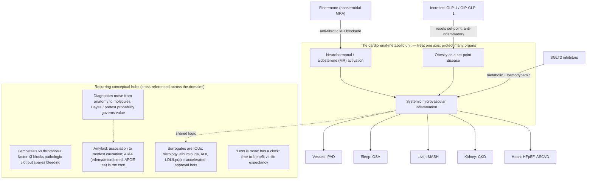

# What changed in internal medicine since residency graduation in 2024

**Coverage window:** January 1, 2024 – July 18, 2026 · **Compiled:** 2026-07-18 · For continuing medical education and clinical awareness. **Not patient-specific medical advice.**

> **Comprehensive but not exhaustive.** Boundary of this review: (1) date range Jan 1 2024–Jul 18 2026 (a few landmark late-2023 trials are included where their *practice impact* — label change, guideline uptake — landed in 2024, and are dated as such); (2) source set = PubMed/MEDLINE, ClinicalTrials.gov, Scite (retraction/citation checking), targeted web fetch of guideline/regulatory bodies (ACC/AHA, ADA, KDIGO, GOLD, USPSTF, ACIP/CDC, FDA), and NEJM/JAMA/Lancet/Annals; (3) **connector limitations this session:** Scite `search_faers`/`get_drug` (FDA adverse-event quantification) were subscription-gated and could not be run, so drug-safety items rest on peer-reviewed pharmacovigilance studies and FDA communications instead; Elicit and CMS Coverage were used sparingly. Every substantive claim below is tied to a source retrieved this session (PMID/DOI/NCT/guideline URL). Retraction/correction status was checked in Scite for the pivotal papers — **none were flagged.**
>
> Bias/scope caveats: this is **US-centric** (USPSTF/ACIP/FDA/CMS framing); most flagship obesity/cardiometabolic trials are **industry-funded** (flagged in the tables); and several headline effects rest on **surrogate endpoints** (histology, albuminuria, AHI, LDL/Lp(a), diagnostic accuracy) rather than hard outcomes — flagged throughout.

---

> **Independent second-pass verification (deep-research adversarial audit).** After the first draft, an independent multi-agent pass (108 agents; parallel search → source fetch → 3-vote adversarial verification, 2-of-3 refutes to kill) re-checked the highest-impact claims against primary sources (FDA labels/press releases, NEJM/Lancet/Nature Medicine/Circulation, ClinicalTrials.gov, official guideline summaries). Of 25 claims verified, **24 confirmed, 1 refuted** — and **every candidate effect size, date, and approval that reached the verified set was CONFIRMED; none required numeric correction.** No retractions/corrections were found for the pivotal papers. Refinements folded into this version:
>
> - **Precise FDA dates (confirmed):** resmetirom (Rezdiffra) accelerated approval **March 14, 2024**; tirzepatide (Zepbound) for OSA — first-ever OSA drug — **Dec 20, 2024**; Shield blood CRC test (PMA P230009) **July 26, 2024**; Cologuard Plus **Oct 4, 2024**; lenacapavir (Yeztugo) PrEP **June 18, 2025** (≥35 kg; PURPOSE 2 ~96% protection); Lumipulse Alzheimer's blood test cleared **May 16, 2025**.
> - **BP guideline detail added:** the 2025 AHA/ACC target is <130/80 **with encouragement to reach SBP <120**, and PREVENT replaces the pooled cohort equations, **recalibrating the high-risk treatment threshold from 10% (PCE) to ≥7.5%** (PREVENT yields lower absolute-risk estimates, so this is a recalibration, not a uniformly lower clinical bar).
> - **New verified enrichments (added to Table A):** in SELECT, semaglutide also reduced a **secondary kidney composite, HR 0.78 (0.63–0.96)** — surrogate-heavy/albuminuria-driven [Colhoun, *Nat Med* 2024; DOI 10.1038/s41591-024-03015-5]; and a **pooled participant-level HFpEF analysis** (SELECT/FLOW/STEP-HFpEF/STEP-HFpEF-DM, n=3,743) showed semaglutide cut CV death or HF events **HR 0.69 (0.53–0.89)** [Kosiborod, *Lancet* 2024; PMID 39222642].
> - **Important SUMMIT caveat:** the HR 0.62 composite was **driven entirely by the worsening-HF component** (which included outpatient diuretic intensification); **CV death alone numerically favored placebo** (HR 1.58, 95% CI 0.52–4.83). Read it as a symptom/HF-event benefit, not a mortality signal.
> - **Lumipulse nuance:** the 91.7% / 97.3% figures are **PPV/NPV in an enriched symptomatic validation cohort — not sensitivity/specificity and not screening performance.** It is a diagnostic aid, not a standalone or screening test.
> - **One refuted item:** the exact BLUE-C performance figures for Cologuard Plus (≈95% CRC sensitivity / 43% advanced-precancer / 94% specificity) **could not be independently re-confirmed from the regulatory/press source** in this pass (the FDA date and ≥45 indication are solid). The figures in Table A come from the peer-reviewed NEJM BLUE-C primary (PMID 38477986); treat the precise percentages with mild caution pending direct confirmation against the primary text.
> - **Coverage caveat:** the audit was budget-capped at the top 25 claims, so many first-pass items (FLOW, ESSENCE, SOUL, STRIDE, colchicine-MI null, factor XI trials, baxdrostat, bempedoic, donanemab, tenecteplase, dupilumab, MINT, IV iron, vaccines, deprescribing) were **not re-examined this round** — they rest on the first-pass PubMed/Scite verification. Absence from the audit is not evidence against them.

---

## Executive summary

If you finished residency in 2024, the single biggest shift is that **the incretin (GLP-1 / GIP–GLP-1) drugs stopped being "diabetes/weight" drugs and became cardiorenal-metabolic organ-protective drugs** with hard-outcome evidence across an expanding list of diseases: cardiovascular events in obesity without diabetes (SELECT), heart failure with preserved ejection fraction (SUMMIT), chronic kidney disease (FLOW), MASH/liver histology (ESSENCE), obstructive sleep apnea (SURMOUNT-OSA), peripheral artery disease walking capacity (STRIDE), and oral formulation cardiovascular benefit (SOUL). Alongside them, **finerenone crossed into HFpEF/HFmrEF (FINEARTS-HF)** and **SGLT2 inhibitors consolidated** — so the "four pillars" language of heart failure now has a cardiorenal-metabolic cousin: SGLT2i + finerenone + GLP-1 RA (± statin) as overlapping organ protection.

**What to update first (highest yield):**
1. **Offer a GLP-1/GIP agent for organ protection, not just glucose or weight** — in ASCVD + obesity, in T2D + CKD, and consider in obesity-related HFpEF and OSA.
2. **Finerenone is now a heart-failure drug** (HFmrEF/HFpEF), not only a diabetic-kidney drug — watch potassium.
3. **A new 2025 AHA/ACC blood-pressure guideline** reaffirms a <130/80 target, adds the **PREVENT** risk equations, pushes single-pill combinations and home monitoring, and — new — treating to SBP <130 to reduce dementia risk.
4. **First-ever MASH drug (resmetirom, FDA March 2024)** plus semaglutide's MASH histology data — hepatology is now something internists prescribe into.
5. **Prevention/vaccine resets:** mammography now **starts at 40** (biennial, USPSTF B); **pneumococcal conjugate age dropped to ≥50**; **RSV vaccine** for all ≥75 and high-risk 60–74; **PCV21** and updated COVID/RSV products.
6. **Alzheimer's became a "diagnose-and-treat" disease for some:** anti-amyloid antibodies (donanemab approved July 2024; lecanemab) and the **first FDA-cleared blood test (plasma p-tau217/Aβ ratio, May 2025)** — with real ARIA risk and modest benefit.

**Genuinely new vs merely better-emphasized.** Genuinely new: incretins for HFpEF/OSA/MASH/PAD; finerenone in HFpEF; the first MASH drug; blood-based Alzheimer's and colorectal diagnostics; twice-yearly lenacapavir PrEP (near-100% protection); a new BP guideline; the factor XI anticoagulant story splitting by indication. Better-emphasized (reinforced, not new): SGLT2 inhibitors everywhere; deprescribing; restrictive-transfusion nuance in MI.

**What stays uncertain / don't overinterpret.** **Colchicine after MI failed** in the large CLEAR SYNERGY/OASIS-9 trial (contradicting earlier enthusiasm). The **factor XI inhibitors are not drop-in DOAC replacements** — asundexian was *worse* than apixaban in AF (OCEANIC-AF). Many incretin outcomes ride **surrogate endpoints**; muscle loss, cost, access, shortages, and **weight regain after stopping** are real. Resmetirom's approval rests on **histology, not hard outcomes yet**. AI tools help in trials but raise **deskilling and equity** questions. COVID vaccine policy is **actively shifting** toward risk-based/shared decisions.

---

## Concept map — how the pieces connect

*Reading guide: the top cluster is the single idea most of this update hangs on — the heart, kidney, liver, sleep, and vasculature behave as one **cardiorenal-metabolic organ**, so drugs that correct the shared upstream drivers (incretins, SGLT2 inhibitors, finerenone) protect all of them at once. The bottom cluster holds the other recurring conceptual **hubs** you'll see cross-referenced throughout the domain sections. This renders as a diagram on GitHub / in the pull request; a plain phone markdown viewer may show it as code.*

---

## 1. High-yield practice update list (ranked)

Each: topic — one-line bottom line — why it matters — confidence — immediate action/caution.

1. **GLP-1 RA for CV protection in obesity without diabetes (SELECT).** Semaglutide 2.4 mg cut MACE ~20% (HR 0.80). *Why:* redefines who "qualifies" for a GLP-1. *Confidence: High.* *Action:* in ASCVD + BMI ≥27 without diabetes, discuss semaglutide for secondary prevention; GI tolerability and cost/access are the limiters.
2. **Finerenone in HFpEF/HFmrEF (FINEARTS-HF).** Nonsteroidal MRA cut worsening-HF events + CV death (RR 0.84). *Why:* first MRA with a positive dedicated HFpEF-spectrum trial. *Confidence: High.* *Action:* consider in LVEF ≥40% HF; monitor K⁺ and renal function.
3. **Tirzepatide in obesity-related HFpEF (SUMMIT).** Composite CV death/worsening HF HR 0.62; large KCCQ gain. *Why:* treats HFpEF by treating obesity. *Confidence: High (small trial).* *Action:* reasonable add-on in obese HFpEF; watch GI side effects.
4. **Semaglutide in CKD + T2D (FLOW).** Major kidney events HR 0.76; all-cause death HR 0.80. *Why:* GLP-1 now a kidney-protective pillar. *Confidence: High.* *Action:* add to SGLT2i/ACEi-ARB in diabetic CKD (eGFR ≥25).
5. **New 2025 AHA/ACC hypertension guideline.** <130/80 target (encourages SBP <120), PREVENT equations (high-risk threshold recalibrated to ≥7.5%), SBP <130 for brain health, single-pill combos. *Why:* first major update since 2017. *Confidence: High (guideline).* *Action:* adopt PREVENT-based decisions and confirm with home BP.
6. **First MASH drug — resmetirom (Rezdiffra), FDA March 2024.** THR-β agonist; histologic benefit in F2–F3. *Why:* a prescribable therapy for a huge silent disease. *Confidence: High for approval; Moderate for benefit (surrogate/accelerated).* *Action:* refer/consider in noncirrhotic MASH with moderate–advanced fibrosis.
7. **Colchicine after MI does NOT help (CLEAR SYNERGY/OASIS-9).** HR 0.99 — flatly null. *Why:* reverses growing routine use. *Confidence: High.* *Caution:* don't start routine post-MI colchicine for secondary prevention.
8. **Mammography starts at 40 (USPSTF 2024, B).** Biennial, ages 40–74. *Why:* changes millions of screening conversations. *Confidence: High.* *Action:* offer biennial screening from age 40.
9. **Pneumococcal age lowered to ≥50; RSV and PCV21 added (ACIP 2024–25).** *Why:* routine adult vaccination expands. *Confidence: High.* *Action:* update your standing orders (PCV20/PCV21 for PCV-naïve ≥50; RSV for ≥75 and high-risk 60–74).
10. **Anti-amyloid antibodies + first Alzheimer's blood test.** Donanemab approved July 2024; plasma p-tau217/Aβ ratio FDA-cleared May 2025. *Why:* diagnosis and disease-modifying therapy enter primary-care orbit. *Confidence: High for approvals; Moderate for clinical magnitude; ARIA is a real harm.* *Action:* know referral pathways, APOE/ARIA caveats; a positive blood test still needs confirmation.
11. **Twice-yearly lenacapavir PrEP (PURPOSE 1/2).** Near-100% HIV protection. *Why:* transformative adherence solution. *Confidence: High.* *Action:* offer as PrEP option (FDA-approved 2025).
12. **Oral semaglutide reduces CV events (SOUL).** MACE HR 0.86 in high-risk T2D. *Why:* a pill GLP-1 with outcome data. *Confidence: High.*
13. **Dupilumab for COPD with type-2 inflammation (BOREAS/NOTUS); GOLD 2025 incorporates it.** *Why:* first biologic for COPD (eos ≥300). *Confidence: High.* *Action:* consider in exacerbating chronic-bronchitis COPD with eosinophilia on triple therapy.
14. **Factor XI inhibitors split by indication.** Asundexian **worse** than apixaban in AF (OCEANIC-AF) but **positive** as antiplatelet add-on after stroke (OCEANIC-STROKE); abelacimab CAT trials halted. *Why:* tempers "bleed-free anticoagulation" hype. *Confidence: High.* *Caution:* not a DOAC replacement.
15. **Liberal transfusion favored in acute MI (MINT + 2025 AABB guideline).** Transfuse to Hb <10 in AMI. *Why:* carves AMI out of the universal restrictive (7 g/dL) rule. *Confidence: Moderate (conditional).* 
16. **Reduced-dose apixaban for extended cancer-associated VTE (API-CAT).** 2.5 mg BID noninferior with less bleeding after 6 months. *Why:* practical de-escalation. *Confidence: High.*
17. **Semaglutide for PAD walking capacity (STRIDE) + baxdrostat for resistant HTN (BaxHTN).** New functional and BP options. *Confidence: High (surrogate/functional endpoints).* 
18. **Deprescribing + safety signals:** Beers 2023 / STOPP-START v3; clozapine REMS removed (2025); semaglutide–NAION ocular signal (hypothesis-generating). *Confidence: High for the guidance; Low–Moderate for the NAION signal.*

---

## 2. Ideation map (organized by clinical force, not chronology)

- **Cardiorenal-metabolic convergence** (the dominant theme)
  - Incretins as organ protectors: SELECT (CV), FLOW (kidney), SUMMIT (HFpEF), ESSENCE (liver), SURMOUNT-OSA (sleep), STRIDE (PAD), SOUL (oral CV)
  - MRA expansion: finerenone into HFpEF/HFmrEF (FINEARTS); finerenone + SGLT2 combination (CONFIDENCE)
  - SGLT2 as connective tissue across heart/kidney (KDIGO 2024: eGFR ≥20)
  - Obesity reframed as chronic, treatable, organ-level disease; muscle-loss and weight-regain counter-currents
  - Lipids: bempedoic acid (LDL benefit ≈ statin per mmol/L); Lp(a) as residual risk (agents pending)
- **Prevention / screening / population health**
  - Threshold shifts earlier: mammography at 40; pneumococcal at 50; RSV for older adults; osteoporosis screening reaffirmed
  - Blood-based early detection: colorectal cfDNA (Shield), plasma p-tau217 for Alzheimer's
  - Vaccine platform expansion (PCV21, updated COVID/RSV) amid shifting COVID policy
- **Hospital medicine & transitions**
  - Transfusion: liberal in AMI (MINT/AABB) vs restrictive elsewhere
  - Perioperative GLP-1 management: continue-not-hold, risk-stratified
  - Anticoagulation nuance: factor XI class; extended reduced-dose apixaban in cancer
- **ID & stewardship**
  - Long-acting PrEP (lenacapavir); doxy-PEP for bacterial STIs
  - Steroids in severe CAP reinforced; measles resurgence context
- **Pulmonary / critical care / sleep**
  - Biologics enter COPD (dupilumab); GOLD 2025 eosinophil-guided escalation + CV-risk emphasis
  - OSA has a drug (tirzepatide)
- **GI & hepatology**
  - MASLD/MASH renaming; first drug (resmetirom); GLP-1 into liver
  - CRC screening menu expands (blood, next-gen stool); ctDNA prognostication (DYNAMIC-III)
- **Heme/onc for GIM**
  - IV iron in HF (hospitalization benefit); CHIP as CV/mortality risk marker; MGUS/light-chain redefinition (iStopMM)
  - Factor XI class; cancer-VTE de-escalation
- **Rheum / immunology / inflammation**
  - IL-6 blockade in PMR (sarilumab); inflammation-as-target enthusiasm checked by colchicine-MI null
- **Neurology for the internist**
  - Anti-amyloid therapy + blood biomarkers; tenecteplase ≈ alteplase (single-bolus convenience)
- **Geriatrics / palliative / deprescribing**
  - Beers 2023 / STOPP-START v3; statin deprescribing evidence; falls prevention (exercise = B)
- **Pharmacology / safety / high-value care**
  - Clozapine REMS removed; GLP-1 NAION signal; colchicine-MI reversal; "treat the surrogate?" caution
- **Digital health / AI / diagnostics / care delivery**
  - LLMs improve clinician reasoning in trials (mostly preprint/simulation); CADe raises adenoma detection but deskilling unknown; first FDA-cleared AD blood test

---

## 3. Domain-by-domain review

### 3.1 Cardiovascular

**Bottom line.** Metabolic drugs are now cardiovascular drugs; a new BP guideline modernizes risk-based treatment; and two "anti-inflammatory" bets (colchicine, spironolactone) failed after MI.

**What changed.** SELECT proved a GLP-1 RA prevents MACE in obesity *without* diabetes. SUMMIT and FINEARTS-HF brought tirzepatide and finerenone into HFpEF/HFmrEF. The **2025 AHA/ACC hypertension guideline** replaced the 2017 version: <130/80 target retained (with **encouragement to reach SBP <120**), **PREVENT** risk equations introduced (replacing the pooled cohort equations and **recalibrating the high-risk treatment threshold from 10% to ≥7.5%**), SBP <130 endorsed to lower dementia risk, single-pill combinations and home BP emphasized, plus new guidance on resistant HTN and renal denervation. Baxdrostat (aldosterone synthase inhibitor) lowered BP in resistant HTN. Bempedoic acid's benefit per unit LDL matched statins. Colchicine and spironolactone each failed after MI (CLEAR SYNERGY/OASIS-9).

**Why it matters.** The internist's cardiovascular toolkit expands "upstream" (obesity, inflammation pathways that did/didn't pan out) and the hypertension workflow is formally risk-calculator-driven.

**Evidence snapshot.**
- SELECT: RCT, 17,604 with ASCVD + overweight/obesity, no diabetes; MACE 6.5% vs 8.0%, **HR 0.80 (0.72–0.90)**; limitation: 16.6% discontinued semaglutide for AEs. (Lincoff, *NEJM* 2023; PMID 37952131; DOI 10.1056/NEJMoa2307563.)
- FINEARTS-HF: RCT, 6,001 HF with LVEF ≥40%; total worsening-HF + CV death **RR 0.84 (0.74–0.95)**; more hyperkalemia. (Solomon, *NEJM* 2024; PMID 39225278; DOI 10.1056/NEJMoa2407107.)
- SUMMIT: RCT, 731 obese HFpEF; composite **HR 0.62 (0.41–0.95)**; small/short. *Caveat (2nd-pass audit):* the composite was driven by the worsening-HF component (incl. outpatient diuretic intensification); CV death alone numerically favored placebo (HR 1.58) — a symptom/HF-event benefit, not a mortality signal. (Packer, *NEJM* 2024; PMID 39555826; DOI 10.1056/NEJMoa2410027.)
- CLEAR SYNERGY/OASIS-9 colchicine: RCT, 7,062 post-MI; primary composite **9.1% vs 9.3%, HR 0.99 (0.85–1.16)**; more diarrhea; CRP fell (surrogate) but no clinical benefit. Spironolactone arm also null. (Jolly, *NEJM* 2024; PMID 39555823 / 39555814; DOI 10.1056/NEJMoa2405922 / 10.1056/NEJMoa2405923.)
- BaxHTN: RCT, 796 uncontrolled/resistant HTN; placebo-corrected SBP **−9.8 mm Hg** (2 mg); K⁺ >6.0 in ~3%. (*NEJM* 2025; PMID 40888730; DOI 10.1056/NEJMoa2507109.)
- Bempedoic (CLEAR Outcomes analysis): major vascular events **HR 0.85 (0.77–0.94)**; per-1-mmol/L LDL HR ~0.75, comparable to statins. (*JACC* 2024; PMID 38960508; DOI 10.1016/j.jacc.2024.04.048.)

**How I would explain this out loud.** "We used to reach for these weight and diabetes drugs to move a number. Now they move outcomes — fewer heart attacks, fewer heart-failure hospitalizations — even in people without diabetes. And the flip side: the trendy anti-inflammatory pill after a heart attack, colchicine, just didn't pan out in the big trial."

**Clinical action or caution.** Adopt PREVENT-based BP decisions; consider GLP-1/GIP and finerenone for the right cardiac phenotypes; watch potassium with finerenone; **stop reflexively adding colchicine after MI.**

**Confidence.** High across the flagship trials and the guideline.

---

### 3.2 Endocrine – diabetes – obesity

**Bottom line.** Incretin therapy is the center of gravity; ADA now recommends organ-protective agents earlier; obesity is framed as a chronic disease with real trade-offs (muscle loss, regain, cost).

**What changed.** Oral semaglutide showed CV benefit (SOUL). Tirzepatide beat semaglutide for weight loss head-to-head (SURMOUNT-5). ADA **Standards of Care 2025/2026** push GLP-1/SGLT2 for cardiorenal indications and MASLD, integrate finerenone, and (2026) favor earlier GLP-1/SGLT2 from diagnosis. Teplizumab data matured (delays/limits type 1 progression). Safety/quality nuances: ~25–34% of incretin weight loss is lean mass, ~10% regain within a year off-drug, and a hypothesis-generating **semaglutide–NAION** ocular signal appeared.

**Why it matters.** Sequencing now starts with "does this patient need organ protection?" rather than "what's the A1c?"

**Evidence snapshot.**
- SOUL: RCT, 9,650 high-risk T2D; MACE 12.0% vs 13.8%, **HR 0.86 (0.77–0.96)**. (*NEJM* 2025; PMID 40162642; DOI 10.1056/NEJMoa2501006.)
- SURMOUNT-5 (head-to-head; via US cost-effectiveness modeling): tirzepatide produced greater weight loss and was cost-saving vs semaglutide — industry-funded model, surrogate/economic. (*J Med Econ* 2026; PMID 42012820; DOI 10.1080/13696998.2026.2646078.)
- STRIDE (PAD): RCT, 792 with PAD + T2D; max walking distance ratio **1.13 (1.06–1.21)** — functional surrogate. (*Lancet* 2025; PMID 40169145; DOI 10.1016/S0140-6736(25)00509-4.)
- Teplizumab PROTECT (new-onset T1D): RCT, 328; C-peptide preserved (surrogate); secondary clinical endpoints not significant. (*NEJM* 2023; PMID 37861217; DOI 10.1056/NEJMoa2308743.)
- Muscle/regain: STEP/SURMOUNT body-composition analyses (lean-mass fraction of loss ~25–34%; function preserved); ~10% regain/yr after stopping (secondary web sources; observational).
- NAION signal: retrospective matched cohort, single center; T2D **HR 4.28 (1.62–11.29)** — referral bias, causality unproven. (*JAMA Ophthalmol* 2024; PMID 38958939; DOI 10.1001/jamaophthalmol.2024.2296.)

**How I would explain this out loud.** "These drugs are now first-line for protecting the heart and kidneys, not an afterthought once sugars are high. But they're not free lunch — you lose some muscle, the weight tends to come back if you stop, and there are cost and supply headaches."

**Clinical action or caution.** Choose the agent by comorbidity (CKD, ASCVD, HFpEF, MASLD); pair with resistance exercise/protein; counsel on chronic-therapy expectation and regain; note the (unconfirmed) NAION signal if a patient reports sudden vision loss.

**Confidence.** High for outcome trials; Moderate for economic/head-to-head modeling; Low–Moderate for NAION.

---

### 3.3 Nephrology (and cardiorenal-metabolic convergence)

**Bottom line.** Diabetic kidney disease now has overlapping pillars — RAS blockade + SGLT2i + GLP-1 RA + finerenone — and KDIGO 2024 operationalizes them.

**What changed.** FLOW established semaglutide's kidney and mortality benefit in T2D CKD. CONFIDENCE showed finerenone + empagliflozin started together reduces albuminuria more than either alone. **KDIGO 2024** recommends SGLT2i for T2D+CKD down to eGFR ≥20 (continue below), emphasizes cystatin-C-augmented eGFR, statins, and point-of-care albumin/creatinine to close access gaps.

**Why it matters.** "Kidney protection" is now a multi-drug, additive strategy an internist can start — not a nephrology-only decision.

**Evidence snapshot.**
- FLOW: RCT, 3,533 T2D+CKD; major kidney events **HR 0.76 (0.66–0.88)**; all-cause death **HR 0.80 (0.67–0.95)**; stopped early for efficacy. (*NEJM* 2024; PMID 38785209; DOI 10.1056/NEJMoa2403347.)
- CONFIDENCE: RCT, ~800 T2D+CKD+albuminuria; UACR reduction 29–32% greater with combination — **surrogate** (albuminuria), 180-day. (*NEJM* 2025; PMID 40470996; DOI 10.1056/NEJMoa2410659.)
- KDIGO 2024 guideline (SGLT2i eGFR ≥20; cystatin C; statins). (kdigo.org/wp-content/uploads/2024/03/KDIGO-2024-CKD-Guideline.pdf)

**How I would explain this out loud.** "For diabetic kidney disease we now stack protections — the ACE inhibitor, the SGLT2, a GLP-1, and finerenone — each one shaving off risk. Expect an early, harmless dip in eGFR when you start them; that's the drug working, not failing."

**Clinical action or caution.** Layer agents; anticipate the initial eGFR "dip"; monitor potassium with finerenone; use cystatin C when creatinine eGFR is borderline for decisions.

**Confidence.** High (FLOW, KDIGO); Moderate for combination (surrogate endpoint).

---

### 3.4 Pulmonary – critical care – sleep

**Bottom line.** COPD got its first biologic and a more inflammation-guided GOLD; OSA got a drug; critical-care steroid/fluid practice consolidated.

**What changed.** Dupilumab reduced exacerbations in COPD with type-2 inflammation (eos ≥300) — BOREAS/NOTUS — and **GOLD 2025** adds dupilumab to triple therapy for that phenotype, formalizes eosinophil-guided escalation (ICS if eos ≥100), and adds a cardiovascular-risk section (high CV/death risk in the week after an exacerbation). Tirzepatide reduced apnea-hypopnea index in obese OSA (SURMOUNT-OSA; FDA-approved for OSA Dec 2024). Corticosteroids for severe CAP (CAPE-COD, 2023) remain reinforcing context.

**Why it matters.** COPD management becomes phenotype-driven (eosinophils, chronic bronchitis), and obesity treatment is now part of OSA care.

**Evidence snapshot.**
- Dupilumab COPD (pooled BOREAS+NOTUS): RCT, 1,874 with eos ≥300 on triple therapy; moderate/severe exacerbation in **36.0% vs 42.1%** of patients, annualized rate significantly reduced (~30%). (*Lancet Respir Med* 2025; PMID 39900091; DOI 10.1016/S2213-2600(24)00409-0.)
- SURMOUNT-OSA: two RCTs, obese moderate-severe OSA; AHI change **−20 to −24 events/hr vs placebo** (P<0.001) — surrogate (AHI), 52 wk. (*NEJM* 2024; PMID 38912654; DOI 10.1056/NEJMoa2404881.)
- GOLD 2025 report (goldcopd.org key-changes).

**How I would explain this out loud.** "If your COPD patient keeps flaring despite the three inhalers and their eosinophils are up, there's now a biologic. And for sleep apnea in someone with obesity, the weight drug meaningfully lowers the apnea count — sometimes enough to change the conversation about CPAP."

**Clinical action or caution.** Check blood eosinophils to guide escalation; consider dupilumab in the right phenotype; consider tirzepatide as adjunct (not replacement for PAP) in obese OSA; treat CV risk aggressively after COPD exacerbations.

**Confidence.** High (COPD, OSA trials and GOLD adoption).

---

### 3.5 Infectious diseases

**Bottom line.** Prevention leapt forward — twice-yearly injectable PrEP and doxy-PEP — while stewardship keeps favoring shorter/simpler.

**What changed.** Lenacapavir (twice-yearly subcutaneous) gave near-complete HIV protection in cisgender women (PURPOSE 1: zero infections) and in men/gender-diverse persons (PURPOSE 2), FDA-approved 2025 (Yeztugo). Doxycycline post-exposure prophylaxis (doxy-PEP) entered CDC guidance for bacterial STI prevention in high-risk MSM/transgender women. Severe-CAP steroids remain supported.

**Why it matters.** A durable, adherence-proof PrEP option can change population HIV incidence; doxy-PEP is a new counseling/prescribing point.

**Evidence snapshot.**
- PURPOSE 1: RCT, adolescent girls/young women; **0 infections** with lenacapavir vs background 2.41/100 PY (IRR ~0.00). (*NEJM* 2024; PMID 39046157; DOI 10.1056/NEJMoa2407001.)
- PURPOSE 2: RCT; lenacapavir 0.10/100 PY vs background 2.37 (IRR 0.04); injection-site reactions common. (*NEJM* 2024; PMID 39602624; DOI 10.1056/NEJMoa2411858.)
- doxy-PEP: CDC clinical guidelines (2024); antimicrobial-resistance surveillance is the key caveat.

**How I would explain this out loud.** "PrEP is no longer a daily-pill adherence problem for everyone — a shot twice a year prevented essentially all infections. And for patients with recurrent bacterial STIs, a single doxycycline dose after sex cuts the rate — with the asterisk that we're watching resistance."

**Clinical action or caution.** Offer lenacapavir as a PrEP option; discuss doxy-PEP in appropriate patients while monitoring resistance; keep steroid use for severe CAP.

**Confidence.** High (PrEP RCTs); Moderate for doxy-PEP durability/resistance.

---

### 3.6 GI & hepatology

**Bottom line.** Fatty-liver disease became prescribable (resmetirom, semaglutide), the nomenclature changed (MASLD/MASH), and colorectal screening/staging diversified (blood, next-gen stool, ctDNA).

**What changed.** Resmetirom (Rezdiffra), a THR-β agonist, became the **first FDA-approved MASH drug (March 2024)** for noncirrhotic F2–F3 fibrosis (accelerated approval on histology). Semaglutide improved MASH histology (ESSENCE). Blood-based CRC screening (Shield/ECLIPSE) and next-generation stool DNA (Cologuard Plus/BLUE-C) gained FDA approval; ctDNA prognostication matured (DYNAMIC-III), though ctDNA-guided *management* isn't standard. The 2024 multisociety **GLP-1 perioperative** guidance shifted from "hold" to risk-stratified continuation.

**Why it matters.** Internists now diagnose and treat (or refer with a plan for) MASH and have more — and more variable — CRC screening tools to counsel on.

**Evidence snapshot.**
- Resmetirom MAESTRO-NASH: phase 3 RCT; both histologic co-primary endpoints (NASH resolution; ≥1-stage fibrosis improvement) met vs placebo at 52 wk — **surrogate/histology**; exact percentages not retrieved this session. (Harrison, *NEJM* 2024; DOI 10.1056/NEJMoa2309000; FDA approval 3/14/2024.)
- ESSENCE (semaglutide MASH): RCT interim (n=800 of 1,197); steatohepatitis resolution **62.9% vs 34.3%**; fibrosis improvement **36.8% vs 22.4%** — surrogate/histology. (*NEJM* 2025; PMID 40305708; DOI 10.1056/NEJMoa2413258.)
- Shield cfDNA (ECLIPSE): prospective accuracy, 7,861 average-risk; CRC sensitivity **83%**, advanced-precancer sensitivity only **13%**, specificity ~90% — **test-performance, not mortality**; FDA-approved 7/2024. (*NEJM* 2024; PMID 38477985; DOI 10.1056/NEJMoa2304714.)
- Cologuard Plus (BLUE-C): CRC sensitivity **94%** vs FIT 67%, lower specificity than FIT; FDA-approved 10/2024. (*NEJM* 2024; PMID 38477986; DOI 10.1056/NEJMoa2310336.)
- DYNAMIC-III: phase 2/3 RCT, 968 stage III colon; ctDNA strongly prognostic (3-yr RFS 87% vs 49%), but de-escalation did **not** meet noninferiority and escalation didn't help — not yet standard. (*Nat Med* 2025; PMID 41115959; DOI 10.1038/s41591-025-04030-w.)
- GLP-1 periop guidance (multisociety 2024). (PMID 39480373 / 39482213.)

**How I would explain this out loud.** "Fatty liver used to be 'lose weight, good luck.' Now there's an approved pill for the scarring stage, and the weight drugs clear inflammation on biopsy. On screening, the blood test is great for catching cancer but poor at catching pre-cancers — so it's a good option for someone who'd otherwise skip screening, not a colonoscopy replacement."

**Clinical action or caution.** Stage MASLD (non-invasive fibrosis scores) and treat/refer F2–F3; frame blood-based CRC screening as an adherence option; individualize (usually continue) GLP-1s perioperatively.

**Confidence.** High for approvals/screening performance; Moderate for MASH clinical (surrogate) and ctDNA-guided management.

---

### 3.7 Heme/onc for the general internist

**Bottom line.** IV iron helps HF hospitalizations, transfusion practice split (liberal in MI), cancer-VTE anticoagulation can be de-escalated, and CHIP/MGUS refine risk.

**What changed.** A large IPD meta-analysis showed IV iron reduces HF hospitalization in HF with iron deficiency (mortality not significantly changed). MINT plus the **2025 AABB guideline** now favor a **liberal** transfusion threshold (Hb <10) in acute MI, carving it out of the general restrictive rule. API-CAT showed reduced-dose apixaban (2.5 mg BID) is noninferior with less bleeding for extended cancer-associated VTE. The **factor XI/XIa class** split: asundexian was worse than apixaban in AF (OCEANIC-AF) but positive as an antiplatelet add-on after stroke (OCEANIC-STROKE); abelacimab's cancer-VTE trials were halted. CHIP emerged as an independent CV/mortality risk marker (especially with inflammation); iStopMM redefined light-chain MGUS (82% fewer diagnoses).

**Why it matters.** Everyday decisions — when to transfuse, how long/what dose to anticoagulate, how to read an incidental clone or CHIP — all shifted.

**Evidence snapshot.**
- IV iron in HF (IPD meta-analysis, 7,175): HF hospitalization/CV death **RR 0.72 (0.55–0.89)** at 12 mo; mortality not significant. (*Nat Med* 2025; PMID 40159279; DOI 10.1038/s41591-025-03671-1.)
- MINT: RCT, 3,504 MI + anemia; composite MI/death 16.9% (restrictive) vs 14.5% (liberal), **RR 1.15 (0.99–1.34)** — favors liberal, not significant. (*NEJM* 2023; PMID 37952133; DOI 10.1056/NEJMoa2307983.) AABB 2025 guideline now suggests liberal in AMI (conditional, low certainty). (*Ann Intern Med* 2025; PMID 40825204; DOI 10.7326/ANNALS-25-00706.)
- API-CAT: RCT, 1,766; recurrent VTE 2.1% vs 2.8% (noninferior); clinically relevant bleeding **12.1% vs 15.6% (SHR 0.75)**. (*NEJM* 2025; PMID 40162636; DOI 10.1056/NEJMoa2416112.)
- OCEANIC-AF: RCT, 14,810; asundexian stroke/SE **HR 3.79 (2.46–5.83)** worse than apixaban, less bleeding; stopped early. (*NEJM* 2024; PMID 39225267; DOI 10.1056/NEJMoa2407105.) OCEANIC-STROKE: add-on to antiplatelet cut recurrent ischemic stroke **HR 0.74**. (*NEJM* 2026; PMID 41985132; DOI 10.1056/NEJMoa2513880.)

**How I would explain this out loud.** "Three practical shifts: give IV iron to your iron-deficient heart-failure patients to keep them out of the hospital; in an active MI, lean toward transfusing to a higher hemoglobin than you would otherwise; and after six months of clot treatment in a cancer patient, you can often drop to the lower apixaban dose."

**Clinical action or caution.** Screen/treat iron deficiency in HF; use liberal transfusion in AMI; de-escalate apixaban after 6 months in cancer VTE; don't expect factor XI inhibitors to replace DOACs; contextualize CHIP/MGUS findings, avoid overdiagnosis.

**Confidence.** High (MINT/API-CAT/OCEANIC-AF/IV-iron); Moderate for AABB (conditional) and CHIP causality.

---

### 3.8 Rheumatology & immunology

**Bottom line.** IL-6 blockade helps steroid-sparing in PMR; "inflammation-as-target" scored a win (PMR) and a loss (colchicine post-MI).

**What changed.** Sarilumab achieved sustained remission and cut cumulative glucocorticoid exposure in relapsing PMR (SAPHYR) — a steroid-sparing option for a common internist problem. Broadly, JAK-inhibitor safety caution (from ORAL Surveillance) persists, and CAR-T for refractory autoimmune disease is an emerging watch-list item (not retrieved in depth this session).

**Why it matters.** PMR is bread-and-butter internal medicine; a validated steroid-sparing biologic changes long taper conversations.

**Evidence snapshot.**
- SAPHYR: RCT, 118 relapsing PMR; sustained remission **28% vs 10%** (diff 18 pts, P=0.02); glucocorticoid 777 vs 2,044 mg; neutropenia with sarilumab. (*NEJM* 2023; PMID 37792612; DOI 10.1056/NEJMoa2303452.)

**How I would explain this out loud.** "For the polymyalgia patient who flares every time you taper steroids, there's now a shot that gets more of them into remission on far less prednisone."

**Clinical action or caution.** Consider IL-6 blockade for glucocorticoid-dependent/relapsing PMR; monitor neutropenia/lipids; maintain JAK-inhibitor caution in older/CV-risk patients.

**Confidence.** Moderate–High (single, modest-size PMR RCT).

---

### 3.9 Neurology for the internist

**Bottom line.** Alzheimer's is now a "test-and-treat" disease for selected patients (anti-amyloid antibodies + a blood test), and tenecteplase is a practical alteplase alternative.

**What changed.** Donanemab (Kisunla) was FDA-approved July 2024 for early symptomatic AD (joining lecanemab); the **first FDA-cleared Alzheimer's blood test** (plasma p-tau217/Aβ42 ratio, Fujirebio Lumipulse) cleared May 2025 as an aid to identify amyloid pathology. Tenecteplase was noninferior to alteplase for acute ischemic stroke (single-bolus convenience).

**Why it matters.** Internists will field questions about amyloid antibodies, order/interpret blood biomarkers, and encounter ARIA monitoring; stroke systems increasingly use tenecteplase.

**Evidence snapshot.**
- Donanemab TRAILBLAZER-ALZ 2 → FDA approval 7/2/2024; benefit is a *slowing* of decline with **ARIA (edema/hemorrhage)** risk, higher with APOE ε4 homozygotes. (FDA/manufacturer; magnitude modest.)
- Plasma p-tau217/Aβ42 ratio (Lumipulse): FDA-cleared 5/16/2025; strong concordance with amyloid status (AUC ~0.9 in studies) — a **triage** test, positives need confirmation. (FDA/Fujirebio; PMID 40582836.)
- Tenecteplase (ORIGINAL): RCT, 1,465; mRS 0–1 at 90 d **72.7% vs 70.3%, RR 1.03 (noninferior)**; sICH 1.2% both. (*JAMA* 2024; PMID 39264623; DOI 10.1001/jama.2024.14721.)

**How I would explain this out loud.** "We can now, for the right early-Alzheimer's patient, confirm amyloid with a blood test and offer an antibody that modestly slows decline — but it requires MRI monitoring for brain swelling and bleeding, and the benefit is real but small. For stroke, the newer clot-buster is a single push instead of an hour-long drip, and it works just as well."

**Clinical action or caution.** Know referral criteria and ARIA/APOE caveats before endorsing anti-amyloid therapy; treat a positive blood biomarker as a step toward confirmation, not a diagnosis; support tenecteplase pathways.

**Confidence.** High for approvals/tenecteplase; Moderate for clinical magnitude of anti-amyloid benefit.

---

### 3.10 Geriatrics & palliative / deprescribing

**Bottom line.** The deprescribing toolkit was refreshed (Beers 2023, STOPP/START v3), falls prevention favors exercise, and stopping statins at end of life appears safe.

**What changed.** AGS **Beers 2023** and **STOPP/START v3** updated potentially-inappropriate-medication and prescribing-omission criteria. USPSTF (2024) gave **exercise a B** for fall prevention and multifactorial interventions a C. A systematic review supported that statin discontinuation near end of life doesn't worsen short-term mortality (observational data are confounded).

**Why it matters.** Polypharmacy management is a daily task; these give defensible, current anchors.

**Evidence snapshot.**
- Beers 2023 (*JAGS* 2023; PMID 37139824; DOI 10.1111/jgs.18372); STOPP/START v3 (190 criteria) (*Eur Geriatr Med* 2023; PMID 37256475).
- USPSTF falls: exercise **B**, multifactorial **C**. (*JAMA* 2024; PMID 38833246; DOI 10.1001/jama.2024.8481.)
- Statin deprescribing SR: EOL RCT no 60-day mortality difference; observational discontinuation associated with higher mortality (confounded). (*JAGS* 2024; PMID 39051828; DOI 10.1111/jgs.19093.)

**How I would explain this out loud.** "Two practical habits: run the med list against the current Beers/STOPP criteria at least yearly, and prescribe exercise as fall prevention — it's the intervention with the best evidence. And it's OK to stop the statin when someone's in their last months."

**Clinical action or caution.** Deprescribe using updated criteria; recommend structured exercise for fall-risk elders; individualize statin continuation by prognosis/goals.

**Confidence.** High for guidance; Moderate for statin-deprescribing generalizability.

---

### 3.11 Preventive medicine / screening / vaccines

**Bottom line.** Screening starts earlier (breast at 40) and vaccination expands (pneumococcal at 50, RSV for older adults, PCV21, updated COVID) — amid shifting COVID policy.

**What changed.** USPSTF: **breast screening biennial from age 40** (B, 2024); **osteoporosis screening** reaffirmed (women ≥65; high-risk postmenopausal <65; men = insufficient, 2025). ACIP: **PCV for all PCV-naïve adults ≥50** (PCV20 or PCV21, or PCV15+PPSV23); **RSV** for all ≥75 and high-risk 60–74 (real-world VE ~80% vs hospitalization); COVID guidance moved from universal toward **risk-based/shared decision-making** with a JN.1-lineage formulation. USPSTF **statin** primary-prevention guidance remains the **2022** version (no in-window final update located).

**Why it matters.** These reset standing orders, quality metrics, and thousands of routine conversations.

**Evidence snapshot.**
- Breast: USPSTF *JAMA* 2024;331(22):1918–1930; PMID 38687503; DOI 10.1001/jama.2024.5534.
- Osteoporosis: USPSTF *JAMA* 2025;333(6):498–508; PMID 39808425; DOI 10.1001/jama.2024.27154.
- RSV ACIP: *MMWR* 2024; PMID 39146277; DOI 10.15585/mmwr.mm7332e1; VE (Payne, *Lancet* 2024) hospitalization VE **80% (71–85)**; PMID 39426837.
- PCV ≥50: *MMWR* 2025;74(1):1–8; PMID 39773952; DOI 10.15585/mmwr.mm7401a1.
- COVID: *MMWR* 2024 (mm7349a2) + 2025 ACIP/FDA policy shift.

**How I would explain this out loud.** "Three quick standing-order changes: start mammograms at 40, give the pneumococcal shot at 50 now, and get the RSV vaccine into your 75-and-up patients — it cut hospitalizations by about 80% in the real world. COVID vaccination is becoming more of a personalized, risk-based decision."

**Clinical action or caution.** Update templates/standing orders; note dense-breast supplemental imaging remains "insufficient evidence"; track evolving COVID coverage/access implications.

**Confidence.** High (USPSTF/ACIP); Moderate for the still-settling COVID policy.

---

### 3.12 Hospital medicine & transitions

**Bottom line.** Transfuse more liberally in MI, individualize (usually continue) GLP-1s perioperatively, and de-escalate cancer-VTE anticoagulation after 6 months.

**What changed.** MINT + AABB 2025 → **liberal transfusion (Hb <10) in acute MI**. Multisociety 2024 guidance → **continue GLP-1s** perioperatively in most, risk-stratified (liquid diet/gastric ultrasound in higher-risk). API-CAT → reduced-dose apixaban for extended cancer VTE. (See 3.1/3.6/3.7 for effect sizes.)

**Why it matters.** These are common inpatient decision points where the default just moved.

**Evidence snapshot.** MINT (PMID 37952133) / AABB (PMID 40825204); GLP-1 periop (PMID 39480373); API-CAT (PMID 40162636). All peer-reviewed, retraction-checked.

**How I would explain this out loud.** "On the wards: in an MI with anemia, don't be shy about transfusing; you usually don't need to stop the weight/diabetes shot before a procedure; and after six months you can lower the clot-drug dose in cancer patients."

**Clinical action or caution.** Apply AMI-specific transfusion threshold; individualize GLP-1 holds; reassess anticoagulation dose/duration at transitions.

**Confidence.** Moderate–High.

---

### 3.13 Pharmacology / medication safety / deprescribing / high-value care

**Bottom line.** Two "reversals" (colchicine after MI failed; clozapine's REMS was removed) and one watch-list safety signal (semaglutide–NAION) define the safety/high-value story.

**What changed.** CLEAR SYNERGY/OASIS-9 → **stop routine post-MI colchicine** (and spironolactone arm null). FDA **removed the clozapine REMS** (2025) — but ANC monitoring per labeling still applies. A single-center cohort raised a **semaglutide–NAION** ocular signal (hypothesis-generating). Beers/STOPP-START anchor deprescribing. High-value-care theme: beware treating **surrogates** (CRP, albuminuria, LDL, AHI, histology) as if they were outcomes.

**Why it matters.** Prevents low-value prescribing and keeps monitoring appropriate as guardrails loosen.

**Evidence snapshot.** Colchicine (PMID 39555823, HR 0.99); clozapine REMS removal (FDA Drug Safety Communication, 2025); NAION (PMID 38958939, HR 4.28, observational).

**How I would explain this out loud.** "Drop the reflex colchicine after MI. Clozapine got easier to prescribe, but keep checking the blood counts. And if a patient on semaglutide reports sudden painless vision loss, keep that rare optic-nerve signal in mind — it's not proven, but worth knowing."

**Clinical action or caution.** Deprescribe/avoid low-value adds; continue clinically indicated monitoring despite REMS removal; report/consider the NAION signal without overreacting.

**Confidence.** High (colchicine, REMS); Low–Moderate (NAION).

---

### 3.14 Digital health / AI / diagnostics / care delivery

**Bottom line.** AI demonstrably helps in trials (reasoning support, adenoma detection, an FDA-cleared Alzheimer's blood test) but raises deskilling, equity, and validation concerns.

**What changed.** A randomized study found LLM assistance improved physician **management reasoning** (and GPT-4 alone ≈ augmented physicians) — but the primary report is a **preprint (medRxiv, not peer-reviewed)**. Real-world **computer-aided detection (CADe)** raised colonoscopy adenoma detection rates, though a cancer-outcome and **deskilling** question remains open. The first FDA-cleared AD blood test (see 3.9) exemplifies AI/assay-driven diagnostics reaching clinic.

**Why it matters.** These tools are arriving in documentation, triage, and endoscopy; internists need a critical-appraisal stance.

**Evidence snapshot.**
- LLM management-reasoning RCT: 92 physicians; LLM arm scored **+6.5% (2.7–10.2)**; **PREPRINT — NOT peer-reviewed.** (Goh, *medRxiv* 2024; PMID 39148822; DOI 10.1101/2024.08.05.24311485; NCT06208423.)
- CADe colonoscopy (VA cluster study): ADR rose **+4.2 percentage points** (OR 1.22); deskilling/cancer impact undetermined. (Dominitz, *Gastroenterology* 2026; PMID 42250891; DOI 10.1053/j.gastro.2026.05.018.)

**How I would explain this out loud.** "AI can genuinely make us better reasoners and catch more polyps — but a lot of the flashy evidence is still preprints and simulations, and we don't yet know whether leaning on it dulls our own skills or works equally well for every patient population."

**Clinical action or caution.** Use AI as augmentation with verification; demand peer-reviewed, outcome-level, bias-audited evidence before over-relying; watch deskilling and equity.

**Confidence.** Moderate (CADe peer-reviewed); Low–Moderate for LLM clinical impact (preprint/simulation).

---

## 4. Cross-domain pattern synthesis

1. **Cardiorenal-metabolic convergence.** *Pattern:* one drug class (incretins) + finerenone + SGLT2i protect heart, kidney, liver, and airway/sleep. *Domains:* CV, endo, nephro, hepatology, pulmonary. *Evidence:* SELECT/FLOW/SUMMIT/ESSENCE/SURMOUNT-OSA/FINEARTS/CONFIDENCE. *Practical meaning:* pick therapy by comorbidity cluster, not single organ. *Overinterpretation risk:* several endpoints are surrogates; effects may not fully stack additively; cost/access gate real-world benefit.

2. **Diagnostic thresholds move earlier and into blood.** *Pattern:* screen/diagnose sooner and less invasively — breast at 40, pneumococcal at 50, blood-based CRC and Alzheimer's tests. *Domains:* prevention, GI, neurology. *Evidence:* USPSTF 2024/25, ACIP, ECLIPSE, p-tau217 clearance. *Practical meaning:* more early detection and more incidental findings to manage. *Risk:* overdiagnosis, false positives, and tests that detect disease but not (yet) improve outcomes.

3. **Inflammation as a target — validated selectively.** *Pattern:* IL-6 blockade wins in PMR; broad anti-inflammation (colchicine) fails post-MI. *Domains:* rheum, CV. *Evidence:* SAPHYR vs CLEAR SYNERGY. *Practical meaning:* mechanism ≠ benefit; demand disease-specific trials. *Risk:* extrapolating one inflammatory win to another disease.

4. **Prevention-first and deprescribing coexist.** *Pattern:* add high-value prevention (vaccines, organ-protective drugs) while subtracting low-value drugs (colchicine, some statins/PIMs). *Domains:* prevention, geriatrics, pharmacology. *Practical meaning:* medication review is bidirectional. *Risk:* polypharmacy from stacking protective agents; hyperkalemia, GI intolerance, cost.

5. **Anticoagulation precision.** *Pattern:* right drug/dose/duration by context — factor XI class splits by indication; reduced-dose apixaban for extended cancer VTE. *Domains:* heme, CV, neuro. *Practical meaning:* don't generalize a mechanism across indications. *Risk:* assuming "less bleeding" equals "as effective."

6. **AI/diagnostics outpace outcome evidence.** *Pattern:* tools improve process/surrogate metrics faster than proven patient outcomes. *Domains:* digital, GI, neuro. *Practical meaning:* adopt with verification and equity checks. *Risk:* deskilling, automation bias, unvalidated populations, preprint-level evidence.

---

## 5. Hypotheses to carry forward

| Hypothesis | Supporting evidence | Counter-evidence | What would change it | Practical implication if correct |
|---|---|---|---|---|
| Incretins become standard organ-protective therapy across ASCVD/CKD/HFpEF/MASH regardless of diabetes | SELECT, FLOW, SUMMIT, ESSENCE, SOUL, STRIDE | Cost/access/shortages; muscle loss; regain off-drug; some surrogate endpoints | Long-term hard-outcome durability + affordable/generic access | Reframe as chronic organ-protective drugs; build adherence/cost pathways |
| "Cardiorenal-metabolic quadruple therapy" (SGLT2i + finerenone + GLP-1 + statin) becomes a named regimen | CONFIDENCE (combination), KDIGO 2024, FINEARTS | Additive benefit unproven on hard outcomes; hyperkalemia/hypotension; pill/injection burden | An outcomes trial of full-stack vs stepped therapy | Protocolize layered initiation with K⁺/eGFR monitoring |
| Blood-based diagnostics (CRC cfDNA, plasma p-tau217) become first-line triage | FDA approvals/clearances; high accuracy | Low precancer sensitivity (CRC); positives need confirmation; equity/access | Mortality-reduction and real-world implementation data | Use as adherence/triage tools, not confirmatory tests |
| Anti-amyloid therapy earns a durable, cost-justified role | Donanemab/lecanemab approvals; blood biomarker | Modest benefit; ARIA harm; infusion/monitoring cost | Larger real-world benefit-risk + subcutaneous/simpler regimens | Build referral + ARIA-monitoring infrastructure |
| Factor XI inhibitors succeed only as antiplatelet add-ons, not DOAC replacements | OCEANIC-STROKE positive; OCEANIC-AF negative | LIBREXIA-AF (milvexian vs apixaban) pending | LIBREXIA-AF result (expected late 2026) | Reserve class for dual-pathway atherothrombosis, await AF data |
| Colchicine's cardiac role collapses to specific niches (e.g., pericarditis), not routine post-MI | CLEAR SYNERGY null | Earlier COLCOT/LoDoCo2 positive | A definitive meta-analysis/subgroup signal | Stop routine post-MI use; keep pericarditis indication |

---

## 6. Practice-changing now vs watch list

**Practice-changing now.** GLP-1/GIP for CV/renal/HFpEF/MASH/OSA (SELECT, FLOW, SUMMIT, ESSENCE, SURMOUNT-OSA, SOUL); finerenone in HFpEF/HFmrEF (FINEARTS); 2025 AHA/ACC BP guideline (PREVENT, <130/80); resmetirom for MASH; mammography at 40; PCV ≥50 / RSV for older adults; donanemab + Alzheimer's blood test; lenacapavir PrEP; dupilumab for eosinophilic COPD (GOLD 2025); liberal transfusion in AMI; reduced-dose apixaban for extended cancer VTE.

**Practice-reinforcing.** SGLT2 inhibitors across CKD/HF; IV iron in HF with iron deficiency; steroids in severe CAP; deprescribing via Beers/STOPP-START; exercise for falls; tenecteplase as alteplase alternative.

**Promising but not ready.** ctDNA-guided adjuvant management (DYNAMIC-III prognostic, not yet directive); Lp(a)-lowering agents (pelacarsen/olpasiran, outcomes pending); baxdrostat (BP surrogate, outcomes pending); CHIP-directed management; LLM clinical decision support (much evidence preprint/simulation).

**Controversial or uncertain.** COVID vaccine policy (risk-based shift); universal blood-based CRC screening positioning; magnitude/cost-worth of anti-amyloid therapy; AI deskilling/equity.

**Watch list.** Factor XI inhibitors in AF (LIBREXIA-AF); oral incretins/triple agonists (orforglipron, retatrutide); CAR-T for autoimmune disease; renal denervation uptake.

**Do not overinterpret.** Colchicine (and spironolactone) after MI = null; factor XI inhibitors are **not** DOAC replacements (OCEANIC-AF worse); surrogate endpoints (histology, albuminuria, AHI, LDL/Lp(a), diagnostic accuracy) are not hard outcomes; the semaglutide–NAION signal is unconfirmed; SURMOUNT-5 head-to-head "superiority" here is via an industry economic model.

---

## 7. Listening version (audio-friendly)

Here's what actually changed in internal medicine since you finished residency in 2024 — the version you can listen to on a drive.

The biggest story is that the weight and diabetes drugs grew up. The GLP-1 medicines — and the dual GIP/GLP-1 drug tirzepatide — stopped being about the scale or the A1c and became organ-protection drugs. In people with heart disease and obesity but no diabetes, semaglutide cut heart attacks and strokes by about a fifth. In diabetic kidney disease, it protected kidneys and even lowered deaths. It helped a specific kind of stiff-heart failure, it cleared inflammation in fatty liver on biopsy, it improved sleep apnea, and it even helped people with poor leg circulation walk farther. So the mental model flips: don't ask "how high is the sugar?" first — ask "does this person's heart, kidney, or liver need protecting?"

Riding alongside that is finerenone, which used to live in the diabetic-kidney world and now has a positive trial in the stiff-heart type of heart failure. Add the SGLT2 inhibitors, which keep proving themselves everywhere, and you get a new phrase to carry around: cardiorenal-metabolic protection. Just remember to watch the potassium.

Blood pressure got its first new national guideline since 2017. The target is still under 130 over 80, but now there's a modern risk calculator called PREVENT, a push for single-pill combinations and home monitoring, and a new reason to get systolic under 130 — it may protect the brain from dementia.

Liver disease became something you actually treat. There's a first-ever approved pill for fatty-liver scarring, resmetirom, and the weight drugs improve the biopsy too. Just know the approval is based on the biopsy improving, not yet on people living longer.

Prevention reset in ways that change your day. Mammograms now start at 40. The pneumococcal vaccine now starts at 50. The RSV vaccine is for everyone 75 and up, and it cut hospitalizations by about 80 percent in the real world. COVID vaccination, meanwhile, is drifting toward a more personalized, risk-based decision.

Alzheimer's crossed a line: there are now antibody treatments that modestly slow decline, and the first blood test that can flag the disease. The benefit is real but small, and the antibodies can cause brain swelling and small bleeds, so it's a careful, shared decision — and a positive blood test still needs confirming.

A few myths got busted. Colchicine after a heart attack — which a lot of us were getting excited about — flatly did not work in the big trial. And the new "bleed-free" anticoagulants, the factor XI blockers, turned out to be worse than apixaban for atrial fibrillation, even though they bled less. Less bleeding isn't worth much if the clot protection is gone. Interestingly, those same drugs did help as an add-on after certain strokes — so it's about using the right tool for the right job.

On the wards: in a heart attack with anemia, lean toward transfusing to a higher hemoglobin. You usually don't need to stop the GLP-1 before surgery. And after six months of treating a cancer-related clot, you can often drop to the lower apixaban dose.

And finally, artificial intelligence is genuinely arriving — it made doctors reason better in studies and catches more polyps on colonoscopy — but a lot of that evidence is still early, and we're watching whether leaning on it dulls our own skills or works fairly for every patient.

If you remember one sentence: treat obesity and its metabolic cousins as organ-protective medicine, prevent earlier, deprescribe the things that don't work, and stay skeptical of shiny numbers that aren't hard outcomes.

---

## 8. Red-team critique of this review

- **Surrogate-endpoint reliance.** Several headline items (resmetirom histology, CONFIDENCE albuminuria, SURMOUNT-OSA AHI, bempedoic/Lp(a) LDL, cfDNA/p-tau217 accuracy, SURMOUNT-5 economic model) are **surrogates or models**, not hard outcomes. *Correction applied:* each is explicitly flagged; hard-outcome trials separated. *Residual uncertainty:* real-world/mortality benefit for these remains unproven.
- **Industry funding.** Most incretin/finerenone/baxdrostat trials are manufacturer-funded, and SURMOUNT-5's "superiority" here came from an industry cost-effectiveness model. *Correction:* funding flagged in tables; economic model labeled. *Residual:* interpretation bias possible.
- **US-centric framing.** USPSTF/ACIP/FDA/CMS orientation. *Correction:* stated in the boundary note. *Residual:* non-US access/coverage/guideline differences not covered.
- **Preprint/again-emerging data.** The LLM management RCT is a **medRxiv preprint**; OCEANIC-STROKE and some 2026 items are very recent. *Correction:* preprint labeled; recency noted. *Residual:* peer-reviewed/replication pending.
- **Specialty coverage gaps.** Thinner on migraine/gepants, MS BTK inhibitors, gout/urate-lowering specifics, lupus/anifrolumab, and detailed sepsis-fluid trials — no in-window primary retrieved this session for several. *Correction:* omissions disclosed; not fabricated. *Residual:* a fuller review would add these.
- **Harms/cost/equity.** Addressed (muscle loss, regain, ARIA, hyperkalemia, GI intolerance, false positives, deskilling, access) but not exhaustively quantified (FAERS quantification unavailable this session). *Residual:* systematic harms/cost-effectiveness analysis beyond scope.
- **Effect-size completeness.** Resmetirom exact percentages and the dupilumab exact rate ratio were not fully retrieved; stated qualitatively rather than invented. *Residual:* verify precise figures against primary text before quoting numerically.
- **"Practice-changing" is a judgment.** Rankings reflect breadth/strength/safety heuristics, not a formal GRADE process. *Residual:* reasonable experts may re-rank.
- **Listenability.** Section 7 is plain-language and uncited by design (no new claims) — a deliberate trade-off between rigor and audio flow.

---

## 9. Supporting evidence tables

> **Wide tables — best viewed in landscape or by opening the file.** These carry the full identifiers/limitations; the on-screen sections above are the readable synthesis.

### Table A — Major updates

| Domain | Topic | Source/Year | Evidence type | Population | Key finding | Effect size / outcome (if retrieved) | Practice implication | Confidence | Limitation | Citation |
|---|---|---|---|---|---|---|---|---|---|---|
| CV/Endo | Semaglutide CV in obesity w/o DM (SELECT) | NEJM 2023 (label 2024) | RCT | 17,604 ASCVD + overweight/obese, no DM | ↓MACE | HR 0.80 (0.72–0.90) | GLP-1 for secondary prevention | High | 16.6% AE discontinuation; industry | PMID 37952131; 10.1056/NEJMoa2307563 |
| CV/Nephro | Semaglutide kidney composite (SELECT secondary; 2nd-pass add) | Nat Med 2024 | RCT secondary | 17,604 obesity+CVD, no DM | ↓kidney composite | HR 0.78 (0.63–0.96) — surrogate (albuminuria-driven) | Reinforces cardiorenal benefit | Moderate | Surrogate-heavy; secondary | DOI 10.1038/s41591-024-03015-5 |
| CV/Endo | Semaglutide in HFpEF (pooled SELECT/FLOW/STEP-HFpEF; 2nd-pass add) | Lancet 2024 | Pooled participant-level | 3,743 with HFpEF history | ↓CV death/HF events | HR 0.69 (0.53–0.89) | Supports GLP-1 in obese HFpEF | Moderate | Post-hoc; HFpEF investigator-reported | PMID 39222642; 10.1016/S0140-6736(24)01643-X |
| CV | Finerenone HFmrEF/HFpEF (FINEARTS-HF) | NEJM 2024 | RCT | 6,001 LVEF ≥40% HF | ↓worsening HF+CV death | RR 0.84 (0.74–0.95) | MRA now for HFpEF spectrum | High | ↑Hyperkalemia; industry | PMID 39225278; 10.1056/NEJMoa2407107 |
| CV/Endo | Tirzepatide obese HFpEF (SUMMIT) | NEJM 2024 | RCT | 731 obese HFpEF | ↓composite; ↑KCCQ | HR 0.62 (0.41–0.95); KCCQ +6.9 | Treat HFpEF via obesity | High | Small/short; industry | PMID 39555826; 10.1056/NEJMoa2410027 |
| Nephro/Endo | Semaglutide CKD+T2D (FLOW) | NEJM 2024 | RCT | 3,533 T2D+CKD | ↓kidney events, death | HR 0.76 (0.66–0.88); death HR 0.80 | GLP-1 kidney pillar | High | Industry; stopped early | PMID 38785209; 10.1056/NEJMoa2403347 |
| Endo/CV | Oral semaglutide CV (SOUL) | NEJM 2025 | RCT | 9,650 high-risk T2D | ↓MACE | HR 0.86 (0.77–0.96) | Oral GLP-1 with outcomes | High | Industry | PMID 40162642; 10.1056/NEJMoa2501006 |
| Hep/Endo | Semaglutide MASH (ESSENCE) | NEJM 2025 | RCT (interim) | 800/1,197 MASH F2–F3 | ↑resolution, ↓fibrosis | Resolution 62.9% vs 34.3%; fibrosis 36.8% vs 22.4% | GLP-1 into hepatology | Moderate | Surrogate/histology; industry | PMID 40305708; 10.1056/NEJMoa2413258 |
| Pulm/Endo | Tirzepatide OSA (SURMOUNT-OSA) | NEJM 2024 | 2 RCTs | Obese mod-severe OSA | ↓AHI | −20 to −24 events/hr vs placebo | Drug adjunct for OSA | High | Surrogate (AHI); industry | PMID 38912654; 10.1056/NEJMoa2404881 |
| CV/PAD | Semaglutide PAD walking (STRIDE) | Lancet 2025 | RCT | 792 PAD+T2D | ↑walking distance | ratio 1.13 (1.06–1.21) | Functional benefit in PAD | High | Functional surrogate; industry | PMID 40169145; 10.1016/S0140-6736(25)00509-4 |
| Nephro | Finerenone+empagliflozin (CONFIDENCE) | NEJM 2025 | RCT | ~800 T2D+CKD | ↓UACR vs monotherapy | 29–32% greater reduction | Start dual therapy | Moderate | Surrogate (albuminuria) | PMID 40470996; 10.1056/NEJMoa2410659 |
| CV | Colchicine post-MI (CLEAR SYNERGY/OASIS-9) | NEJM 2024 | RCT | 7,062 post-MI | No benefit | HR 0.99 (0.85–1.16) | Stop routine post-MI colchicine | High | CRP fell (surrogate) only | PMID 39555823; 10.1056/NEJMoa2405922 |
| CV | Baxdrostat resistant HTN (BaxHTN) | NEJM 2025 | RCT | 796 uncontrolled/resistant | ↓SBP | −9.8 mm Hg placebo-corrected | New resistant-HTN option | High | Surrogate (BP); ↑K⁺ | PMID 40888730; 10.1056/NEJMoa2507109 |
| CV/Lipid | Bempedoic acid per-LDL benefit | JACC 2024 | RCT analysis | 13,970 statin-intolerant | Benefit ≈ statin/mmol/L | Major vascular events HR 0.85 (0.77–0.94) | Statin-intolerant option | High | Analysis of CLEAR | PMID 38960508; 10.1016/j.jacc.2024.04.048 |
| Hep | Resmetirom MASH (MAESTRO-NASH) | NEJM 2024; FDA 3/2024 | RCT + regulatory | Noncirrhotic F2–F3 MASH | Co-primary histology met | % not retrieved (surrogate) | First MASH drug | High (approval)/Mod (benefit) | Accelerated/surrogate | DOI 10.1056/NEJMoa2309000 |
| GI | Shield cfDNA CRC screen (ECLIPSE) | NEJM 2024; FDA 7/2024 | Diagnostic accuracy | 7,861 average-risk | CRC sens 83%; precancer 13% | Specificity ~90% | Adherence option, not colonoscopy-equal | High | Test-performance only; industry | PMID 38477985; 10.1056/NEJMoa2304714 |
| GI | Cologuard Plus (BLUE-C) | NEJM 2024; FDA 10/2024 | Diagnostic accuracy | 20,176 | CRC sens 94% vs FIT 67% | Lower specificity than FIT | Improved stool test | High | Test-performance; industry | PMID 38477986; 10.1056/NEJMoa2310336 |
| Onc/GI | ctDNA-guided adjuvant (DYNAMIC-III) | Nat Med 2025 | RCT (2/3) | 968 stage III colon | Prognostic; mgmt uncertain | 3-yr RFS 87% (ctDNA−) vs 49% (+) | ctDNA prognostic, not directive | High (prognosis)/Mod (mgmt) | De-escalation NI not met | PMID 41115959; 10.1038/s41591-025-04030-w |
| Heme | Reduced-dose apixaban ext. cancer VTE (API-CAT) | NEJM 2025 | RCT | 1,766 cancer VTE >6 mo | NI recurrence, ↓bleeding | VTE 2.1% vs 2.8%; bleed SHR 0.75 | De-escalate after 6 mo | High | — | PMID 40162636; 10.1056/NEJMoa2416112 |
| Heme/CV | Asundexian vs apixaban AF (OCEANIC-AF) | NEJM 2024 | RCT | 14,810 AF | Worse efficacy | Stroke/SE HR 3.79 (2.46–5.83) | Not a DOAC replacement | High | Stopped early | PMID 39225267; 10.1056/NEJMoa2407105 |
| Neuro/Heme | Asundexian add-on post-stroke (OCEANIC-STROKE) | NEJM 2026 | RCT | 12,327 noncardioembolic stroke/TIA | ↓recurrent ischemic stroke | HR 0.74 (0.65–0.84) | Dual-pathway option (pending approval) | High | Not DOAC replacement | PMID 41985132; 10.1056/NEJMoa2513880 |
| Heme/CV | IV iron in HF (IPD meta-analysis) | Nat Med 2025 | Meta-analysis | 7,175 HF + iron deficiency | ↓HF hosp/CV death | RR 0.72 (0.55–0.89) at 12 mo | Treat iron deficiency in HF | High | Mortality NS | PMID 40159279; 10.1038/s41591-025-03671-1 |
| Hosp/Heme | Liberal transfusion in AMI (MINT/AABB) | NEJM 2023 / Ann Intern Med 2025 | RCT + guideline | 3,504 MI + anemia | Favors liberal (Hb<10) | RR 1.15 (0.99–1.34) | Transfuse liberally in AMI | Moderate | Conditional; NS primary | PMID 37952133 / 40825204 |
| ID | Lenacapavir PrEP women (PURPOSE 1) | NEJM 2024; FDA 2025 | RCT | Adolescent girls/young women | 0 infections | IRR ~0.00 vs background | Long-acting PrEP | High | Injection-site reactions | PMID 39046157; 10.1056/NEJMoa2407001 |
| ID | Lenacapavir PrEP men/GD (PURPOSE 2) | NEJM 2024 | RCT | Men/gender-diverse | Near-total protection | 0.10 vs 2.37/100 PY (IRR 0.04) | Long-acting PrEP | High | — | PMID 39602624; 10.1056/NEJMoa2411858 |
| Pulm | Dupilumab COPD (BOREAS+NOTUS pooled) | Lancet Respir Med 2025 | RCT pooled | 1,874 eos ≥300 on triple | ↓exacerbations | 36.0% vs 42.1% pts; ~30% rate ↓ | Biologic for eos COPD (GOLD 2025) | High | Phenotype-restricted; industry | PMID 39900091; 10.1016/S2213-2600(24)00409-0 |
| Neuro | Tenecteplase vs alteplase (ORIGINAL) | JAMA 2024 | RCT | 1,465 AIS ≤4.5 h | Noninferior | mRS 0–1 72.7% vs 70.3% | Single-bolus alternative | High | Open-label; China | PMID 39264623; 10.1001/jama.2024.14721 |
| Rheum | Sarilumab in PMR (SAPHYR) | NEJM 2023 | RCT | 118 relapsing PMR | ↑remission, ↓steroid | 28% vs 10% (diff 18 pts) | Steroid-sparing option | Moderate | Small; neutropenia; industry | PMID 37792612; 10.1056/NEJMoa2303452 |
| Endo | Teplizumab new-onset T1D (PROTECT) | NEJM 2023 | RCT | 328 new-onset T1D | β-cell preserved | C-peptide diff +0.13 pmol/mL | Disease-modifying immunotherapy | Moderate | Surrogate; 2° NS | PMID 37861217; 10.1056/NEJMoa2308743 |
| Prev | Breast screening from 40 (USPSTF) | JAMA 2024 | Guideline | Women ≥40 average risk | Biennial 40–74 (B) | Moderate net benefit | Start mammography at 40 | High | Overdiagnosis/false + | PMID 38687503; 10.1001/jama.2024.5534 |
| Prev | Osteoporosis screening (USPSTF) | JAMA 2025 | Guideline | Adults ≥40 | Women ≥65 + high-risk <65 (B); men I | Reduced fractures | Screen per criteria | High | Men insufficient | PMID 39808425; 10.1001/jama.2024.27154 |
| Prev/ID | RSV vaccine older adults (ACIP + VE) | MMWR 2024 / Lancet 2024 | Recommendation + observational | ≥75 all; 60–74 high-risk | High real-world VE | Hosp VE 80% (71–85) | Vaccinate ≥75 & high-risk | High | GBS signal watch | PMID 39146277 / 39426837 |
| Prev/ID | Pneumococcal age ≥50 (ACIP) | MMWR 2025 | Recommendation | PCV-naïve ≥50 | PCV20/PCV21 or PCV15+PPSV23 | Policy expansion | Update standing orders | High | Cost-effectiveness debated | PMID 39773952; 10.15585/mmwr.mm7401a1 |
| Geri | Beers 2023 / STOPP-START v3 | JAGS 2023 / Eur Geriatr Med 2023 | Consensus criteria | Adults ≥65 | Updated PIM/PPO criteria | Tool (no effect size) | Annual deprescribing review | High | US/EU derivation | PMID 37139824 / 37256475 |
| Geri | Falls prevention (USPSTF) | JAMA 2024 | Guideline | ≥65 at risk | Exercise B; multifactorial C | Moderate/small net benefit | Prescribe exercise | High | Pooled estimates NR | PMID 38833246; 10.1001/jama.2024.8481 |
| Pharm | Clozapine REMS removed | FDA 2025 | Regulatory | Clozapine users | REMS eliminated | — | Keep ANC monitoring | High | Monitoring adherence risk | FDA DSC 2025 |
| Pharm | Semaglutide–NAION signal | JAMA Ophthalmol 2024 | Retrospective cohort | Neuro-ophthalmology referrals | ↑NAION assoc. | HR 4.28 (1.62–11.29) | Awareness only | Low–Mod | Referral bias; observational | PMID 38958939; 10.1001/jamaophthalmol.2024.2296 |
| Neuro | Alzheimer's blood test (p-tau217/Aβ) | FDA 5/2025 | Regulatory/dx | Symptomatic ≥55 | First cleared AD blood test | AUC ~0.9 vs amyloid | Triage, confirm positives | High (clear.)/Mod (use) | Not confirmatory | PMID 40582836 |
| Neuro | Donanemab approval (Kisunla) | FDA 7/2024 | Regulatory | Early symptomatic AD | Slows decline; ARIA | Modest; ARIA risk | Referral + ARIA monitoring | High (appr.)/Mod (magnitude) | ARIA; APOE ε4 | FDA 7/2/2024 |
| Digital | CADe colonoscopy ADR | Gastroenterology 2026 | Cluster study | VA colonoscopies | ↑ADR | +4.2 pts (OR 1.22) | Adjunct with oversight | Moderate | Deskilling/outcomes unknown | PMID 42250891; 10.1053/j.gastro.2026.05.018 |
| Digital | LLM management reasoning RCT | medRxiv 2024 (PREPRINT) | RCT (simulation) | 92 physicians | LLM ↑performance | +6.5% (2.7–10.2) | Augment with verification | Low–Mod | NOT peer-reviewed; vignettes | PMID 39148822; 10.1101/2024.08.05.24311485 |

### Table B — Triage

| Update | Clinical impact | Evidence strength | Guideline status | Bedside relevance | Safety concern | Final category |
|---|---|---|---|---|---|---|
| GLP-1 for organ protection (SELECT/FLOW/SOUL/STRIDE) | Very high | High (hard outcomes) | ADA/KDIGO endorse | Very high | GI, muscle loss, cost | Practice-changing now |
| Finerenone HFpEF (FINEARTS) | High | High | Guideline uptake | High | Hyperkalemia | Practice-changing now |
| Tirzepatide HFpEF (SUMMIT) | High | High (small) | Emerging | High | GI | Practice-changing now |
| 2025 AHA/ACC BP guideline | High | High | Formal guideline | Very high | Over-treatment/hypotension | Practice-changing now |
| Resmetirom MASH | High | Moderate (surrogate) | FDA approved | High | Hepatic/GI; long-term unknown | Practice-changing now |
| Colchicine post-MI | High (negative) | High | Reverses trend | High | Diarrhea; low-value | Do not overinterpret (null) |
| Mammography at 40 | High | High | USPSTF B | Very high | Overdiagnosis | Practice-changing now |
| PCV ≥50 / RSV older adults | High | High | ACIP | Very high | GBS watch (RSV) | Practice-changing now |
| Donanemab + AD blood test | Moderate–High | High (appr.)/Mod (benefit) | FDA | Moderate | ARIA; false + | Practice-changing now (selected) |
| Lenacapavir PrEP | High | High | FDA approved | Moderate–High | Injection reactions | Practice-changing now |
| Dupilumab COPD | Moderate–High | High | GOLD 2025 | Moderate | Phenotype-limited | Practice-changing now |
| Liberal transfusion AMI | Moderate | Moderate (conditional) | AABB 2025 | High | Volume/TACO | Practice-reinforcing/changing |
| Reduced-dose apixaban cancer VTE | Moderate | High | Pending guideline | High | Recurrence vs bleed | Practice-changing now |
| Factor XI inhibitors | High (conceptual) | High | None | Moderate | Efficacy loss in AF | Watch list / do not overinterpret |
| ctDNA-guided adjuvant | Moderate | Mixed | Not standard | Moderate | Under/over-treatment | Promising, not ready |
| Lp(a)-lowering / baxdrostat outcomes | High (potential) | Surrogate | Pending | Low now | TBD | Watch list |
| LLM decision support | Uncertain | Low–Mod (preprint) | None | Growing | Deskilling/equity | Promising/controversial |
| Semaglutide–NAION | Low–Mod | Low (observational) | None | Low | Ocular (rare) | Watch list |
| COVID vaccine policy shift | Moderate | Policy | ACIP/FDA evolving | High | Access/coverage | Controversial/uncertain |

### Table C — Red-team fixes

| Risk in the review | Why it matters | Correction applied | Residual uncertainty |
|---|---|---|---|
| Surrogate endpoints read as outcomes | Overstates benefit | Each surrogate flagged; hard vs surrogate separated | Long-term/mortality benefit unproven for several |
| Industry-funded flagship trials | Interpretation bias | Funding noted in tables; economic model labeled | Publication/analysis bias possible |
| US-centric guidance | Limits generalizability | Boundary note; USPSTF/ACIP/FDA framing disclosed | Non-US practice differs |
| Preprint (LLM RCT) treated as evidence | Not peer-reviewed | Labeled preprint; confidence lowered | Replication pending |
| Missing subspecialty items (migraine, MS, gout, lupus, sepsis fluids) | Coverage gap | Omissions disclosed, not invented | Fuller review would add |
| Incomplete effect sizes (resmetirom %, dupilumab RR) | Precision | Stated qualitatively; not fabricated | Verify numbers vs primary text |
| Colchicine/factor XI over-enthusiasm | Low-value/harm | "Do not overinterpret" bucket + null results emphasized | Niche roles may persist |
| Harms/cost/equity under-quantified | Real-world impact | Addressed qualitatively; FAERS unavailable | Formal cost/harm analysis out of scope |
| SUMMIT composite driven by soft HF component | Could be over-read as mortality/hard benefit | 2nd-pass caveat added: worsening-HF-driven; CV death favored placebo (HR 1.58) | True CV-death effect unknown (underpowered) |
| Exact BLUE-C figures (Cologuard Plus) not re-confirmed in 2nd pass | Precise sensitivity/specificity drive screening choice | Flagged; figures rest on NEJM primary (PMID 38477986); regulatory source did not re-confirm | Verify exact % against NEJM primary text |
| SELECT "kidney benefit" could be over-read as hard renal outcome | Surrogate vs hard-outcome distinction | Added with explicit surrogate/albuminuria-driven flag (HR 0.78) | Hard renal-outcome benefit in non-diabetic obesity unproven |

---

*Prepared as a CME/clinical-awareness synthesis. Verify dosing, contraindications, coverage, and the latest guideline text before applying to individual patients. All pivotal citations were retrieved and retraction-checked this session; items marked "not retrieved" were not verified numerically and should be confirmed against the primary source before quoting figures.*
