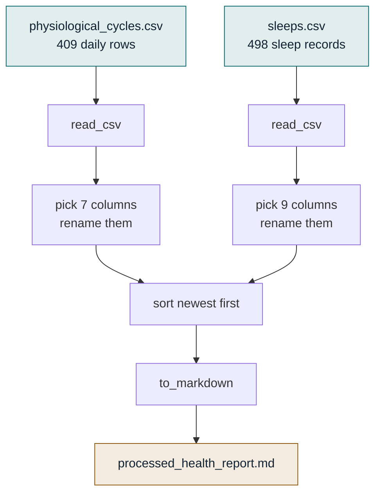

# Week 01 — Read Your Own Code

**Specimen:** `specimen.py` — 73 lines, copied unchanged from `skill/scripts/process_health_data.py`.
**Data:** 409 days of WHOOP physiology and 498 sleep records, Apr 2024 → Mar 2026. Yours.
**Time:** three sittings, ~40 minutes each. Not one long one.

---

## The rule

> You may ask an AI to **explain any line**. You may not ask it to **rewrite the file**.

If you get stuck, the question is *"what does line 33 do and why is it there"* — never *"fix this for me."* The moment a model hands you a working file, the week is over and you learned nothing. That single constraint is the whole intervention.

**And it is enforced, not requested.** A rule stated once in a README is a rule that gets acknowledged and then quietly dropped ten thousand tokens later — the same way a patient who was told about their medication at discharge is not actually on it. So this one lives in the harness instead of in prose: `.claude/hooks/protect-specimen.py` is a `PreToolUse` gate that **refuses** any write to `specimen.py` or `check.py` from Claude Code, in this and every future `week-*` directory.

| Claude can still | Claude is refused |
|---|---|
| read the file, explain any line | `Write` / `Edit` on it |
| run `specimen.py` and `check.py` | `sed -i`, redirects, `cp`/`mv` onto it |
| `cat`, `grep`, `diff` it | `git checkout` to revert your edit |

`check.py` is protected for the same reason: a grader a model can rewrite is not a grader. Both are yours to edit, in your own editor — the gate only binds the assistant.

To turn it off, delete `.claude/settings.json`. 28 tests covering it are in `.claude/hooks/test_protect_specimen.py`.

---

## Before anything else — this repository is public

`faraazxxx-ui/claude-` is set to **public visibility**. It already contains, readable by anyone:

- `health_analysis/physio_clean.csv` — 409 days of your HRV, resting HR, recovery, respiratory rate
- `health_analysis/sleeps_clean.csv` — 498 sleep records with onset and wake times
- `health_analysis_v2/medication_adherence.json`, `life_events.csv`, `symptom_correlations.json`
- `autonomic_intelligence_v3/` — medication adherence and GLP-1 readiness
- `legal-endeavors/` and `skills/apex-legal-strategy/references/` — active federal litigation material

That is a medical record and a litigation file on the open internet. It also directly contradicts your own orchestrator rule 2, which puts medical and Apex litigation material at Confidential-or-higher and local-only.

**This week's `data/` directory is gitignored and staged locally by `setup.sh`.** Nothing new is published. The material already there is a separate decision, and it's yours to make — see the PR description.

---

## Setup

```bash
cd week-01-read-your-own-code
bash setup.sh
```

Creates a local virtual environment with `pandas` and `tabulate`, and copies your two CSVs into `data/` from `health_analysis/`. Nothing touches your system Python; nothing in `data/` is committed.

---

## What this script is supposed to do



Read CSVs, keep the columns worth looking at, rename them to something human, sort newest first, write two markdown tables to a file. That's it. Everything below is about the gap between *supposed to* and *does*.

---

## Sitting 1 — Watch it lie to you

Run it exactly as it is. Change nothing.

```bash
python3 specimen.py
```

**What actually happens** (verified, not predicted):

```
Processed health report generated at: /home/ubuntu/work/processed_health_report.md
```

Exit code **0**. Success. It even created the directory `/home/ubuntu/work/` out of nothing to put the file in.

Now open that file:

```
# Processed Health Data Report

## Physiological Cycles (Daily Summary)

_Physiological data file not found._

## Sleep Details

_Sleep data file not found._
```

**Sit with this for a minute.** The script reported success. It exited clean. It wrote a report with your title on it and a sentence claiming it "consolidates the latest raw data." The report contains no data. Nothing in the output told you that.

This is a lab that reports *normal* because the sample was never run. Not a crash — a plausible, well-formatted, completely empty result. That is the failure mode you cannot catch by reading the output, only by reading the code.

**Find the three lines that cause it.** They're at lines 6, 7, and 33–34. Two of them point at a machine that no longer exists. The third is the one that matters — find what `except FileNotFoundError:` does, and ask yourself why someone wrote it that way.

**Your change:** make lines 6 and 7 point at real places on your machine. The data is in `data/`. Then run it again.

---

## Sitting 2 — Watch it crash honestly

After your fix, it stops lying and starts crashing. This is an improvement.

```
KeyError: "['Cycle start time'] not in index"
```

Exit code **1**.

A crash is a script telling the truth. It asked your CSV for a column called `Cycle start time`; your CSV doesn't have one. It has `date`. The script was written against raw WHOOP exports; the files you have are the cleaned versions, and cleaning renamed that column.

**What you're learning here:** a script carries hidden assumptions about the *shape* of its input — not just where the file is, but what's inside it. Those assumptions are invisible until they break. Nobody wrote them down. They're implied by lines 18 and 41.

**Your change:** line 18 and line 41. One word each.

---

## Sitting 3 — The column that doesn't exist

Fix those and you hit a second `KeyError`, on `In bed duration (min)`. This one is different, and it's the reason this week is worth your time.

That column is not renamed. **It does not exist in your data at all.** Nothing to point at.

So you have to decide, and it's a clinical decision about your own record, not a programming one:

| Option | What it costs |
|---|---|
| Delete it from the list | Lose time-in-bed entirely. Sleep efficiency stops being interpretable. |
| Reconstruct it: `Asleep duration + Awake duration` | Reconciles with your recorded sleep efficiency to within ~1% on 7 of 8 sampled nights — but one night was off by 4.3%. |

I checked the reconstruction against your own data so you don't have to take it on faith:

```
      date   asleep  awake   reconstructed   implied eff   recorded eff
2024-04-06      256     36             292          87.7             92   ← 4.3 off
2024-04-07      280     57             337          83.1             82
2024-04-08      172    136             308          55.8             56
2024-04-09      316     30             346          91.3             91
```

Either answer is defensible. **Pick one and be able to say why.** That sentence — "I reconstructed in-bed time as asleep plus awake, which reconciles to about a percent, and here's the night it didn't" — is the thing you currently cannot say about any number in any of your four health reports.

---

## Check yourself

```bash
python3 check.py
```

Grades your edited `specimen.py` pass/fail per line. It does **not** show you the answer, and it doesn't care how you got there.

---

## The thing you'll find on your own

When you get it running, look at the sleep table around **2024-04-06**. There are three rows for that one date.

The script sorts by date and writes them all out as if each row were a day. Your data has naps and fragmented sleep in it — which for someone with POTS and Long COVID is signal, not noise. Every downstream script in this repo that treats "one row = one day" is quietly wrong about your worst nights.

You will have found that by reading code. Write it down.

---

## Done when

`python3 specimen.py` runs clean, and `processed_health_report.md` contains two tables with real numbers from your own 409 days.

Then answer these three out loud, without looking:

1. Why did the original script report success while producing nothing?
2. What does a `KeyError` actually mean about the relationship between a script and its input?
3. What did you decide about in-bed time, and what's the argument against your decision?

If you can answer those, Week 1 worked. The next file is `legal-endeavors/scripts/deadline_tracker.py` — 173 lines, no pandas, pure date arithmetic on a domain you already know cold.
